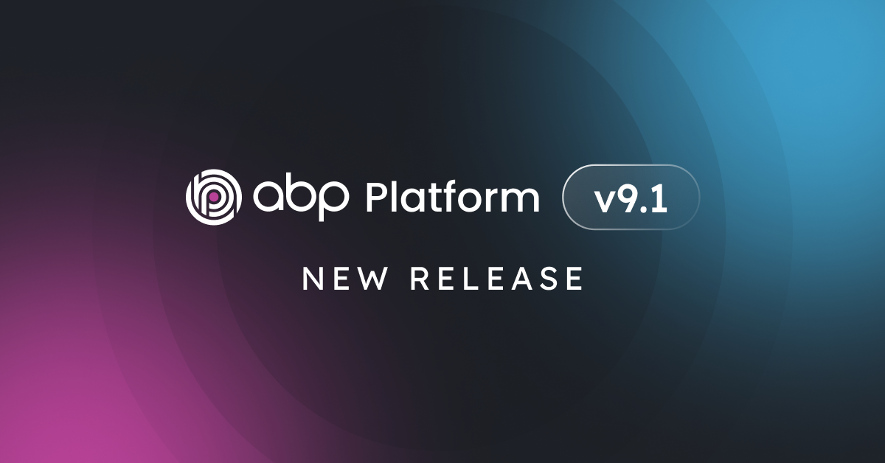

# ABP Platform 9.1 RC Has Been Released

We are happy to release [ABP](https://abp.io) version **9.1 RC** (Release Candidate). This blog post introduces the new features and important changes in this new version.

Try this version and provide feedback for a more stable version of ABP v9.1! Thanks to you in advance.

## Get Started with the 9.1 RC

You can check the [Get Started page](https://abp.io/get-started) to see how to get started with ABP. You can either download [ABP Studio](https://abp.io/get-started#abp-studio-tab) (**recommended**, if you prefer a user-friendly GUI application - desktop application) or use the [ABP CLI](https://abp.io/docs/latest/cli).

By default, ABP Studio uses stable versions to create solutions. Therefore, if you want to create a solution with a preview version, first you need to create a solution and then switch your solution to the preview version from the ABP Studio UI:

## Migration Guide

There are no breaking changes in this version that would affect your application.

## What's New with ABP v9.1?

In this section, I will introduce some major features released in this version.
Here is a brief list of titles explained in the next sections:

* Angular 19 Upgrade
* OpenIddict v6.0 Update
* New Blazor WASM Bundling System
* Improved Distributed Event Handler Performance
* Lazy Expandable Documentation Feature
* Idle Session Warning Feature

### Angular 19 Upgrade

We've upgraded the Angular templates and packages to Angular 19. This upgrade brings the latest features and improvements from the Angular ecosystem to ABP-based applications, including better performance and development experience.

### OpenIddict v6.0 Update

The OpenIddict integration has been updated to version 6.0, bringing enhanced security features and improved authentication capabilities. This update ensures your applications stay current with the latest security standards and best practices.

### New Blazor WASM Bundling System

We've implemented a new bundling system for Blazor WebAssembly applications that significantly improves the application loading performance and development experience. This new system provides better control over asset management and optimizes the delivery of your Blazor WASM applications.

### Improved Distributed Event Handler Performance

We've enhanced the distributed event handling system to avoid global blocking scenarios. This improvement allows for better scalability and performance in distributed systems by implementing a more efficient event handling mechanism that reduces bottlenecks in high-load scenarios.

### Lazy Expandable Documentation Feature

A new lazy expandable feature has been added to the documentation system, making it easier to navigate through large documentation sections. This feature improves the user experience by allowing readers to expand and collapse sections as needed, making documentation more manageable and easier to read.

### Idle Session Warning Feature

We've introduced a new idle session warning feature that helps manage user sessions more effectively. This feature alerts users when their session is about to expire due to inactivity, allowing them to take action to maintain their session, enhancing the user experience and security of your applications.

### Others

Some other highlights from this release:

* Updated Iyzico NuGet packages to the latest version, which is used in the [ABP's Payment Module](https://abp.io/docs/latest/modules/payment#payment-module-pro).
* Removed optional _secondaryIds_ from path. See: [#21307](https://github.com/abpframework/abp/pull/21307)
* [CMS Kit Pro](https://abp.io/docs/latest/modules/cms-kit-pro): Added automatic deletion of comments when a blog post is deleted - comments are now automatically removed when their associated blog post is deleted.

## Community News

### New ABP Community Articles

There are exciting articles contributed by the ABP community as always. I will highlight some of them here:

* [Integrating ABP Modules in Your ASP.NET Core Web API Project. A Step-by-Step Guide](https://abp.io/community/articles/integrating-abp-modules-in-your-asp.net-core-web-api-project.-a-stepbystep-guide-jtbyosnr) by [Sajankumar Vijayan](https://abp.io/community/members/connect)
* [ABP Framework: Background Jobs vs Background Workers](https://abp.io/community/articles/abp-framework-background-jobs-vs-background-workers-when-to-use-which-t98pzjv6) — When to Use Which? by [Alper Ebiçoğlu](https://twitter.com/alperebicoglu)
* [The new Unit Test structure in ABP application](https://abp.io/community/articles/the-new-unit-test-structure-in-abp-application-4vvvp2oy) by [Liming Ma](https://github.com/maliming)
* [How to Use OpenAI API with ABP Framework](https://abp.io/community/articles/how-to-use-openai-api-with-abp-framework-rsfvihla) by [Berkan Şaşmaz](https://github.com/berkansasmaz) 

Thanks to the ABP Community for all the content they have published. You can also [post your ABP-related (text or video) content](https://abp.io/community/posts/submit) to the ABP Community.

## Conclusion

This version comes with some new features and a lot of enhancements to the existing features. You can see the [Road Map](https://abp.io/docs/9.1/release-info/road-map) documentation to learn about the release schedule and planned features for the next releases. Please try ABP v9.1 RC and provide feedback to help us release a more stable version.

Thanks for being a part of this community!