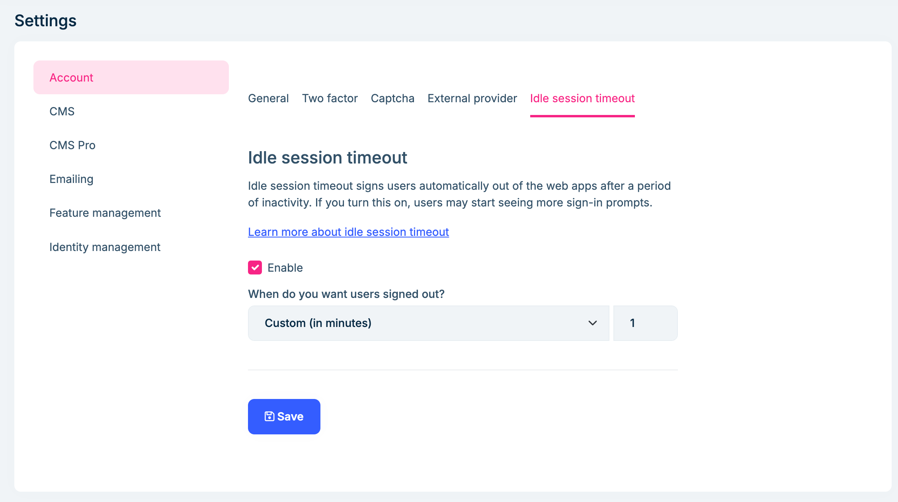
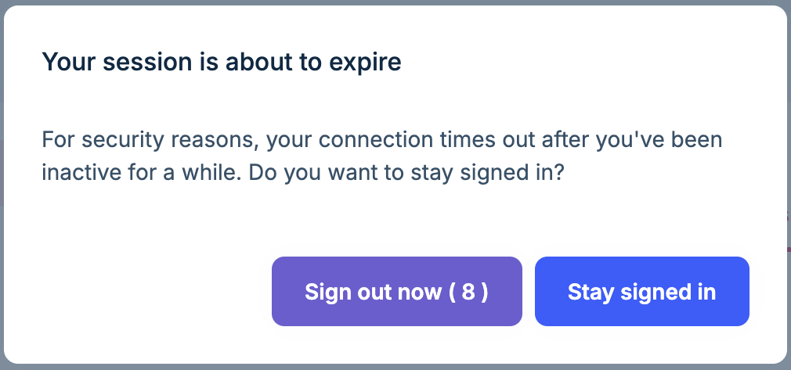
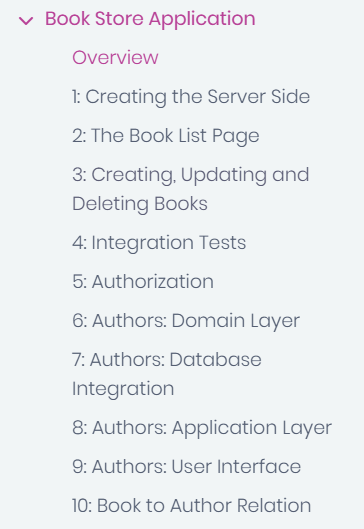

# ABP Platform 9.1 RC Has Been Released

We are happy to release [ABP](https://abp.io) version **9.1 RC** (Release Candidate). This blog post introduces the new features and important changes in this new version.

Try this version and provide feedback for a more stable version of ABP v9.1! Thanks to you in advance.

## Get Started with the 9.1 RC

You can check the [Get Started page](https://abp.io/get-started) to see how to get started with ABP. You can either download [ABP Studio](https://abp.io/get-started#abp-studio-tab) (**recommended**, if you prefer a user-friendly GUI application - desktop application) or use the [ABP CLI](https://abp.io/docs/latest/cli).

By default, ABP Studio uses stable versions to create solutions. Therefore, if you want to create a solution with a preview version, first you need to create a solution and then switch your solution to the preview version from the ABP Studio UI:


## Migration Guide

There are no breaking changes in this version that would affect your application. Only you might need to update some constant names due to the OpenIddict 6.0 upgrade, which is explained in the [OpenIddict 6.0 migration guide](https://abp.io/docs/9.1/release-info/migration-guides/openiddict5-to-6).

## What's New with ABP v9.1?

In this section, I will introduce some major features released in this version.
Here is a brief list of titles explained in the next sections:

* Upgraded to Angular 19
* Upgraded to OpenIddict 6.0
* New Blazor WASM Bundling System
* Idle Session Warning
* Lazy Expandable Feature for Documentation

### Upgraded to Angular 19

We've upgraded the Angular templates and packages to **Angular 19**. This upgrade brings the latest features and improvements from the Angular ecosystem to ABP-based applications, including better performance and development experience.

### Upgraded to OpenIddict 6.0

OpenIddict 6.0 has been released and we've upgraded the OpenIddict packages to version 6.0 in ABP 9.1. This brings enhanced security features and improved authentication capabilities. The migration is straightforward and mainly involves updating some constant names:

- `OpenIddictConstants.Permissions.Endpoints.Logout` is now `OpenIddictConstants.Permissions.Endpoints.EndSession`
- `OpenIddictConstants.Permissions.Endpoints.Device` is now `OpenIddictConstants.Permissions.Endpoints.DeviceAuthorization`

If you're using IdentityModel packages directly, you'll need to upgrade them to the latest stable version (8.3.0). This update ensures your applications stay current with the latest security standards and best practices.

> Please refer to the [OpenIddict 6.0 migration guide](https://abp.io/docs/9.1/release-info/migration-guides/openiddict5-to-6) for more information.    

### New Blazor WASM Bundling System

We've implemented a new bundling system for Blazor WebAssembly applications that eliminates the need to manually run the `abp bundle` command. This system automatically handles JavaScript and CSS file bundling at runtime, significantly improving both development experience and application loading performance.

**Key improvements include:**

- Automatic bundling of JavaScript and CSS files without manual intervention
- Dynamic file generation through the host application
- Better integration with the ABP module system
- Improved asset management through virtual file system

The new system is particularly beneficial for modular applications, as it allows modules to contribute their assets automatically to the global bundles. This results in a more maintainable and efficient asset management system for Blazor WebAssembly applications.

> Please refer to [this documentation](https://abp.io/docs/9.1/framework/ui/blazor/global-scripts-styles) for more information. 

### Idle Session Warning

We've introduced a new idle session warning feature for the [Account (Pro) Module](https://abp.io/docs/latest/modules/account-pro) that helps manage user sessions more effectively. This security enhancement automatically monitors user activity and manages session timeouts in a user-friendly way.



The feature can be easily configured through the administration interface, where administrators can:

- Enable/disable the idle session timeout
- Set custom timeout duration in minutes
- Configure when users should be signed out

When a user becomes inactive for the configured duration, they'll receive a warning dialog:



**Key features and behaviors:**

- Tracks real user activity (mouse movements, keyboard presses) across all tabs
- Works on a per-browser session basis - affects all tabs of the same session
- Maintains session if user is active in any tab of the application
- Provides a countdown timer before automatic sign-out
- Offers options to "Stay signed in" or "Sign out now"

This feature significantly improves application security while maintaining a smooth user experience by preventing unexpected session expirations and data loss.

### Lazy Expandable Feature for Documentation

We've introduced a new lazy expandable feature to the documentation system that significantly improves navigation through large documentation sections. This enhancement addresses common challenges when dealing with extensive documentation hierarchies by introducing smart menu management.

**Key benefits and features:**

- **Cleaner Navigation:** The menu stays concise by hiding sub-items until they're needed, reducing visual clutter
- **Better Performance:** Reduces the initial load of the navigation tree by loading sub-items on demand
- **Improved Search Experience:** Makes filtering documentation items more efficient by showing only relevant top-level items
- **Context-Aware Expansion:** Automatically expands relevant sections when viewing specific documentation pages

The feature works by marking certain documentation sections as "lazy expandable" in the navigation configuration. When users navigate to a document within a lazy expandable section, the system automatically expands the relevant menu items while keeping other sections collapsed.

This improvement is particularly valuable for complex documentation areas like tutorials, solution templates, and extensive module documentation, where having all navigation items visible at once could be overwhelming.

An example of lazy expandable feature from the [ABP's BookStore Tutorial](https://abp.io/docs/latest/tutorials/book-store/part-01):

```json
        {
          "text": "Book Store Application",
          "isLazyExpandable": true,
          "path": "tutorials/book-store",
          "items": [
            {
              "text": "Overview",
              "path": "tutorials/book-store",
              "isIndex": true
            },
            //other items...
          ]
        }
```



### Others

Some other highlights from this release:

* Updated Iyzico NuGet packages to the latest version, which is used in the [ABP's Payment Module](https://abp.io/docs/latest/modules/payment#payment-module-pro).
* Removed optional _secondaryIds_ from path. See: [#21307](https://github.com/abpframework/abp/pull/21307)
* [CMS Kit Pro](https://abp.io/docs/latest/modules/cms-kit-pro): Added automatic deletion of comments when a blog post is deleted - comments are now automatically removed when their associated blog post is deleted.
* Avoiding global blocking in distributed event handlers (See [#21716](https://github.com/abpframework/abp/pull/21716)).

## Community News

### New ABP Community Articles

There are exciting articles contributed by the ABP community as always. I will highlight some of them here:

* [Integrating ABP Modules in Your ASP.NET Core Web API Project. A Step-by-Step Guide](https://abp.io/community/articles/integrating-abp-modules-in-your-asp.net-core-web-api-project.-a-stepbystep-guide-jtbyosnr) by [Sajankumar Vijayan](https://abp.io/community/members/connect)
* [ABP Framework: Background Jobs vs Background Workers](https://abp.io/community/articles/abp-framework-background-jobs-vs-background-workers-when-to-use-which-t98pzjv6) — When to Use Which? by [Alper Ebiçoğlu](https://twitter.com/alperebicoglu)
* [The new Unit Test structure in ABP application](https://abp.io/community/articles/the-new-unit-test-structure-in-abp-application-4vvvp2oy) by [Liming Ma](https://github.com/maliming)
* [How to Use OpenAI API with ABP Framework](https://abp.io/community/articles/how-to-use-openai-api-with-abp-framework-rsfvihla) by [Berkan Şaşmaz](https://github.com/berkansasmaz) 

Thanks to the ABP Community for all the content they have published. You can also [post your ABP-related (text or video) content](https://abp.io/community/posts/submit) to the ABP Community.

## Conclusion

This version comes with some new features and a lot of enhancements to the existing features. You can see the [Road Map](https://abp.io/docs/9.1/release-info/road-map) documentation to learn about the release schedule and planned features for the next releases. Please try ABP v9.1 RC and provide feedback to help us release a more stable version.

Thanks for being a part of this community!
