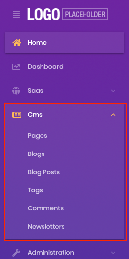

One of the most exciting announcements of the ABP Framework 4.3 release was the initial version of the CMS Kit module. The team had been working hard to release the initial version for months.

For those who didn't read the [ABP Framework 4.3 release post](https://blog.abp.io/abp/ABP-Framework-4.3-RC-Has-Been-Published), the CMS Kit module adds CMS (Content Management System) capabilities to your application. Some of the CMS Kit features are [open source](https://github.com/abpframework/abp/tree/dev/modules/cms-kit) and free, while others are only available with the [ABP Commercial](https://commercial.abp.io/modules/Volo.CmsKit.Pro). Here, a list of CMS Kit features with the initial version:

* [**Page**](https://docs.abp.io/en/abp/latest/Modules/Cms-Kit/Pages) management system to manage dynamic pages with dynamic URLs.
* [**Blogging**](https://docs.abp.io/en/abp/latest/Modules/Cms-Kit/Blogging) system to create publish blog posts with multiple blog support.
* [**Tagging**](https://docs.abp.io/en/abp/latest/Modules/Cms-Kit/Tags) system to tag any kind of resource, like a blog post.
* [**Comment**](https://docs.abp.io/en/abp/latest/Modules/Cms-Kit/Comments) system to add comments feature to any kind of resource, like blog post or a product review page.
* [**Reaction**](https://docs.abp.io/en/abp/latest/Modules/Cms-Kit/Reactions) system to add reactions (smileys) feature to any kind of resource, like a blog post or a comment.
* [**Rating**](https://docs.abp.io/en/abp/latest/Modules/Cms-Kit/Ratings) system to add rating feature to any kind of resource.
* [**Newsletter**](https://docs.abp.io/en/commercial/latest/modules/cms-kit/newsletter) system to allow users to subscribe to newsletters (ABP Commercial only).
* [**Contact form**](https://docs.abp.io/en/commercial/latest/modules/cms-kit/contact-form) system to allow users to write message to you (ABP Commercial only).

## Installation

CMS Kit module comes installed with [ABP Commercial](https://commercial.abp.io/) startup templates when you create the solution with the public website option. You can run the following command and create a solution with a public website. 

```bash
abp new MyProject --with-public-website
```

If you're not using the ABP Commercial or adding the module to an existing solution, [ABP CLI](https://docs.abp.io/en/abp/latest/CLI) allows adding a module to a solution using `add-module` command.

You can run the following command (in the root folder of the solution) to add the module to an existing solution:

```bash
abp add-module Volo.CmsKit --skip-db-migrations true
```

If you're using the ABP Commercial, run the following command to install the pro version of the module:

```bash
abp add-module Volo.CmsKit.Pro --skip-db-migrations true
```

After adding the module to the solution, you need to configure global features provided this module. The CMS Kit module uses the [global feature](https://docs.abp.io/en/abp/latest/Global-Features) system for all features, which means you can enable or disable features individually. To enable the features in the CMS Kit module, open the `GlobalFeatureConfigurator` class in the `Domain.Shared` project and add the following code to the `Configure` method to enable all features in the CMS kit module.

 ```csharp
GlobalFeatureManager.Instance.Modules.CmsKit(cmsKit =>
{
    cmsKit.EnableAll();
});
 ```

If you want to enable specific features, you can change the configuration like:

````csharp
GlobalFeatureManager.Instance.Modules.CmsKit(cmsKit =>
{
    cmsKit.Tags.Enable();
    cmsKit.Comments.Enable();
});
````

If you're using the ABP Commercial, you need to enable CMS Kit Pro features as well:

```csharp
GlobalFeatureManager.Instance.Modules.CmsKitPro(cmsKitPro =>
{
    cmsKitPro.EnableAll();
});
```

> If you are using Entity Framework Core, do not forget to add a new migration and update your database after configuring the features.

We've completed the installation step. Run the project, and you will see the CMS menu item in the main menu:



> CMS Kit's initial release only supports the MVC UI. We're planning to add Angular and Blazor support in upcoming releases.

## More

We've covered the initial features, installation and configuration steps in this post. You can see the [open-source](https://docs.abp.io/en/abp/latest/Modules/Cms-Kit/Index) and [commercial](https://docs.abp.io/en/commercial/latest/modules/cms-kit/index) documentation to get further information about features and the CMS Kit module. CMS Kit's initial version contains lots of features that you can easily integrate and use in your applications. We're planning to improve the existing features, fixing bugs and adding new features in upcoming releases. If you want to give some feedback or have a feature request, please reach out to us from [GitHub](https://github.com/abpframework/abp). We will be happy to plan the CMS Kit module's future together.

Thank you!