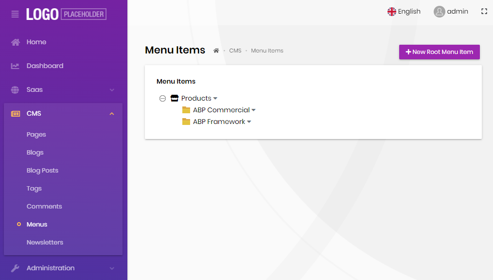
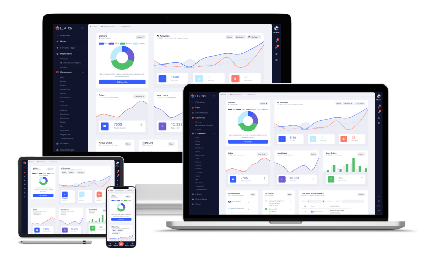

Today, we have released the [ABP Framework](https://abp.io/) and the [ABP Commercial](https://commercial.abp.io/) version 4.4 RC (Release Candidate). This blog post introduces the new features and important changes in this new version.

> **The planned release date for the [4.4.0 final](https://github.com/abpframework/abp/milestone/53) version is July 27, 2021**.

## Get Started with the 4.4 RC

If you want to try the version 4.4.0 today, follow the steps below;

1) **Upgrade** the ABP CLI to the version `4.4.0-rc.2` using a command line terminal:

````bash
dotnet tool update Volo.Abp.Cli -g --version 4.4.0-rc.2
````

**or install** if you haven't installed before:

````bash
dotnet tool install Volo.Abp.Cli -g --version 4.4.0-rc.2
````

2) Create a **new application** with the `--preview` option:

````bash
abp new BookStore --preview
````

See the [ABP CLI documentation](https://docs.abp.io/en/abp/latest/CLI) for all the available options.

> You can also use the *Direct Download* tab on the [Get Started](https://abp.io/get-started) page by selecting the **Preview checkbox**.

### Migration Notes

There is **no breaking change** with this version. However, if you are using Entity Framework Core, you will need to run the `Add-Migration` command to add a new **database migration** since some changes done in the module database mappings.

## What's new with the ABP Framework 4.4

### Removed EntityFrameworkCore.DbMigrations Project

With this version, we are doing an important change in the application startup solution template. The startup solution was containing an `EntityFrameworkCore.DbMigrations` project that contains a separate `DbContext` class which was responsible to unify the module database mappings and maintain the code-first database migrations. With the v4.4, we've removed that project from the solution. In the new structure, the `EntityFrameworkCore` integration project will be used for database migrations as well as on runtime.

We'd published [a community article](https://community.abp.io/articles/unifying-dbcontexts-for-ef-core-removing-the-ef-core-migrations-project-nsyhrtna) about that change. Please see the article to understand the motivation behind the change.

Beside the `DbContext` unification, we've also used the new `ReplaceDbContext` attribute and [replaced](https://github.com/abpframework/abp/blob/ea2205f0855f52015152ae066a5c239af4b8511f/templates/app/aspnet-core/src/MyCompanyName.MyProjectName.EntityFrameworkCore/EntityFrameworkCore/MyProjectNameDbContext.cs#L18-L19) the `IIdentityDbContext` and `ITenantManagementDbContext` interfaces to make it possible to perform join queries over repositories for these modules easily. In the next days, we will publish another community article to explain the problem and the solution. However, most of times, you don't need to know these details.

### Dynamic Menu Management for the CMS Kit Module

CMS Kit is a set of reusable *Content Management System* features packaged as an ABP application module. We had published the first usable version with the previous release. With this release, we are adding another feature to the CMS Kit module: You can now dynamically arrange the main menu on the UI, which is an essential feature for any kind of content management system. In this way, you can add pages or any kind of arbitrary URLs to the main menu from the UI.

A screenshot from the menu management page (from the CMS Kit admin side):



And the items rendered in a public website:


Note that this feature is also available with the open source [CMS Kit module](https://docs.abp.io/en/abp/4.4/Modules/Cms-Kit/Index) (while the screenshots have been taken from the ABP Commercial).

### Razor Engine Support for Text Templating

[Text Templating](https://docs.abp.io/en/abp/4.4/Text-Templating) is a system to generate content on runtime by using a model (data) and a template. It was running on the [Scriban](https://github.com/scriban/scriban) templating engine. Beginning from this version, we have a second option: We can use the familiar **razor syntax** to build and render the templates. See the text templating [razor integration document](https://docs.abp.io/en/abp/4.4/Text-Templating-Razor) to get started with the new engine!

### New Customization Points for DbContext/Entities

Two new extension methods are added to `ObjectExtensionManager.Instance` to override EF Core mappings of [pre-built application modules](https://docs.abp.io/en/abp/latest/Modules/Index).

**Example: Change mappings for the `IdentityDbContext` to override mappings for the `IdentityUser` entity**

````csharp
ObjectExtensionManager.Instance.MapEfCoreDbContext<IdentityDbContext>(modelBuilder =>
{
    modelBuilder.Entity<IdentityUser>(b =>
    {
        b.ToTable("MyUsers");
        b.Property(x => x.Email).HasMaxLength(300);
    });
});
````

The startup template contains a class, like `YourProjectNameEfCoreEntityExtensionMappings`, that can be used to place that code.

### New ABP CLI Commands

There are new [ABP CLI](https://docs.abp.io/en/abp/4.4/CLI) commands introduced with the v4.4:

* `abp install-libs` command is used for MVC / Razor Pages and Blazor Server applications to restore the `wwwroot/libs` folder. Previously we were running the `yarn` and `gulp` commands to restore that folder. While the `install-libs` command still uses yarn (if available), it is no longer needed to use `gulp`.
* `abp prompt` command can be used to open a prompt for the ABP CLI and run multiple commands without needing to specify the `abp` command every time. For example, if you run `abp prompt`, then you can directly run `install-libs` instead of `abp install-libs`. Use `exit` to quit from the ABP prompt.
* `abp batch` command can be used to run multiple ABP commands with one command. Prepare a text file, write each command as a line (without the `abp` command prefix), then execute `abp batch <batch-file>` (ex: `abp batch your_commands.txt`) command to execute all the commands in that file.

### appsettings.secrets.json

Added `appsettings.secrets.json` to the startup template that can be used to set your sensitive/secret configuration values. You can ignore this file from source control (by adding to `.gitignore` if you're using git) and keep it only in developer/production machines.

### Other ABP Framework Improvements

* [#9350](https://github.com/abpframework/abp/pull/9350) Extracted `IRemoteServiceConfigurationProvider` to get remote service configurations. You can replace this service to get the configuration from any source.
* [#8829](https://github.com/abpframework/abp/pull/8829) Implemented error handler and retry for distributed event bus.
* [#9288](https://github.com/abpframework/abp/issues/9288) Use default CORS policy instead of a named one in the startup template. It is suggested to update your own solutions to make it simpler.
* Translated the framework and module localization strings to Hindi, Italian (thanks to Emanuele Filardo), Finnish, French and Slovak (thanks to [Michal Čadecký](https://www.m2ms.sk/)) languages.

Beside these, there are a lot of enhancements and bug fixes. See the [4.4-preview milestone](https://github.com/abpframework/abp/milestone/52?closed=1) for all issues and pull requests closed with this version.

## What's new with the ABP Commercial 4.4

### New Features for the SaaS Module

We've implemented some important features to the [SaaS module](https://commercial.abp.io/modules/Volo.Saas):

* Integrated to the [Payment module](https://commercial.abp.io/modules/Volo.Payment) and implemented **subscription system** for the SaaS module.
* Allow to make a **tenant active/passive**. In this way, you can take a tenant to passive to prevent the users of that tenant from using the system. In addition, you can set a date to automatically make a tenant passive when the date comes.
* Allow to **limit user count** for a tenant.
* Allow to set **different connection strings** for a tenant for each database/module, which makes possible to create different databases for a tenant for each microservice in a microservice solution.

### New ABP Suite Code Generation Features

There are many improvements done for for [ABP Suite](https://commercial.abp.io/tools/suite), including CRUD page generation for the **[microservice solution](https://docs.abp.io/en/commercial/latest/startup-templates/microservice/index) template**.

### Angular UI: Two Factor Authentication for the Resource Owner Password Flow

In the previous version, we had implemented the resource owner password authentication flow for the Angular UI, which makes the login process easier for simpler applications. With this release, we've implemented two-factor authentication for that flow. Authorization code flow already supports 2FA.

### Other ABP Commercial Improvements

* Added web layers to microservices in the microservice solution. You can use them to create modular UI or override existing pages/components of pre-built modules (e.g. Identity and SaaS).
* ABP Commercial license code has been moved to `appsettings.secrets.json` in the new startup templates.

Beside these, there are many minor improvements and fixes done in the modules and themes.

## Other News

In this section, I will share some news that you may be interested in.

### New Article: Using Elsa Workflow with ABP Framework

We have been frequently asked how to use [Elsa Workflows](https://elsa-workflows.github.io/elsa-core/) with the ABP Framework. Finally, we have [created an article](https://community.abp.io/articles/using-elsa-workflow-with-the-abp-framework-773siqi9) to demonstrate it.


You can [check it](https://community.abp.io/articles/using-elsa-workflow-with-the-abp-framework-773siqi9) to see how to integrate Elsa into an ABP based solution easily.

### Free E-Book: Implementing Domain Driven Design

We've published a free e-book for the ABP Community in the beginning of June. This is a practical guide for implementing Domain Driven Design (DDD). While the implementation details are based on the ABP Framework infrastructure, the basic concepts, principles and models can be applied to any solution, even if it is not a .NET solution.


Thousands of copies are already downloaded. If you haven't seen it yet, [click here to get a free copy of that e-book](https://abp.io/books/implementing-domain-driven-design).

### The LeptonX Theme

We have been working on a new ABP theme, named the *LeptonX*, for a long time. The theme will be available for ABP Framework (free - lite version) and ABP Commercial (pro version). It is being finalized in the next weeks and we will release the first version in a short time.



See [this blog post](https://volosoft.com/blog/introducing-the-lepton-theme-next-generation) to learn more about that project.

### Volosoft & .NET Foundation

[Volosoft](https://volosoft.com/), the company leads the ABP Framework project, has been a corporate sponsor of the [.NET Foundation](https://dotnetfoundation.org/). We are happy by taking our place among other great sponsors!


We will continue to contribute to and support open source! See this [blog post for the announcement](https://volosoft.com/blog/Volosoft-Announces-the-NET-Foundation-Sponsorship).

### Looking for Developer Advocate(s)

We are actively looking for professional developer advocates for the ABP.IO platform. If you want to create content and touch to the ABP community, please check our [job post](https://github.com/volosoft/vs-home/issues/13).

## About the Next Version

The next version will be a major version: 5.0, which will be based on .NET 6.0. We are planning to release it in the end of 2021, short time after the .NET 6.0 release. We will release multiple preview/beta versions before the RC version. See the [road map](https://docs.abp.io/en/abp/latest/Road-Map) for details of the planned works for the version 5.0.
