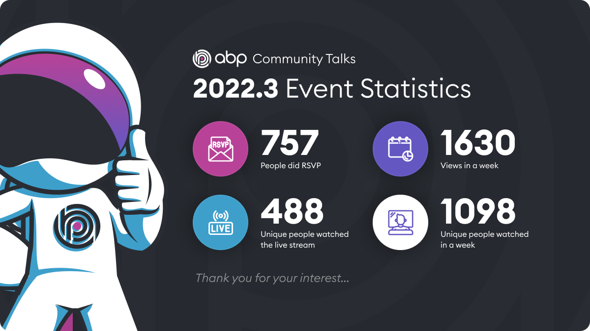

 ABP Community Talks is the event where we gather as ABP Framework’s Community members to talk, and share ideas on a monthly basis. Before the talks, we collect ideas from our contributors, trending topics in the industry, ABP Platform’s news and updates, and more, to select the topics that will be talked about in every episode. After the topics are certain, we announce them on our social media and community channels.
 
 You are always welcome and encouraged to join, ask questions, make suggestions, or even be in the talks to make presentations about the topics that you think would be beneficial for the ABP Community.
 
###### ABP Community Talks Facts:
 * ABP Community Talks are scheduled to be held on a monthly basis.
 * ABP Community Talks are and always will be completely free to attend. Everyone is welcome to join, ask questions and make suggestions before, during and after the event.
 * ABP Community Talks are created and announced on [Kommunity](https://kommunity.com/volosoft/events).
 * ABP Community Talks are announced regularly on [ABP Framework Twitter Account](https://twitter.com/abpframework), [Volosoft LinkedIn account](https://www.linkedin.com/company/volosoft), [Volosoft Facebook Account](https://www.facebook.com/volosoftcompany), [ABP Community Discord Server](https://discord.gg/CrYrd5vcGh). We highly encourage everyone to follow us and make suggestions.
 * ABP Community Talks are available to watch after the event on YouTube. See [ABP Community Talks YouTube Playlist](https://www.youtube.com/playlist?list=PLsNclT2aHJcOsPustEkzG6DywiO8eh0lB).
 
# ABP Community Talks 2022.3
 
> [WATCH FULL ABP Community Talks 2022.3](https://www.youtube.com/watch?v=lB3iXQccaV4)
 
 This was the 4th episode of ABP Community Talks in which [Jon Galloway](https://twitter.com/jongalloway), [Lee Richardson,](https://twitter.com/lprichar) and [Anto Subash](https://twitter.com/antosubash) being present as speakers! We talked about [ABP 5.2 Release](https://blog.abp.io/abp/ABP-IO-Platform-5-2-Final-Has-Been-Released), Domain-Driven Design, [Mastering ABP Framework Book](https://www.packtpub.com/product/mastering-abp-framework/9781801079242), the [EventHub solution](https://www.openeventhub.com/).
 

 
 Special thanks to our sponsors [.Net Foundation](https://dotnetfoundation.org/) and [Packt Publishing](https://www.packtpub.com/).
 
# The EventHub Solution
 EventHub solution is an open-source reference application for implementing Domain Driven Design with the ABP Framework where you can reach from [EventHub’s GitHub Page](https://github.com/volosoft/eventhub). It is created for the ABP Framework book, therefore, its source code is explained in the Mastering ABP Framework Book.
 
 Since it is thought of as a real-world, live application, it is accessible from [here](https://www.openeventhub.com/) and configured to run with Kubernetes & Project Tye. It consists of two applications. The first is Main Website to be used by end-users, built with ASP.NET Core Razor Pages, and Admin Application built with Blazor WASM. There is also an authentication server that is built with the IdentityServer 4. Additionally, Two API endpoints (one for each web application), and Background Service.
 
 You can use the EventHub solution to create actual events like Meet Ups or bigger events where people can register, see your previous and upcoming events, you can arrange reminder emails, and do much more!
 
 If you would like to use the EventHub solution, you can take a look at the source code from [EventHub’s Github Page](https://github.com/volosoft/eventhub). For in depth information, you can [buy the Mastering ABP Framework Book](https://www.packtpub.com/product/mastering-abp-framework/9781801079242).
 
# Mastering the ABP Book
 The Mastering ABP Book can be referenced for every detail. The book takes you from the beginning, explaining all the concepts and features and correct order and gives you a good understanding of ABP Framework and its philosophy. It also discussed dot.net and general software development perspectives, alternatives approaches and minimal.

###### Table of Content:
**Part 1** Introduction
 1. Modern Software Development and ABP Framework
 2. Getting Started with ABP Framework
 3. Step-By-Step Application Development
 4. Understanding the Reference Solution
 
**Part 2** Fundamentals of ABP Framework
 5. Exploring the ASP.NET Core and ABP Infrastructure
 6. Working with the Data Access Infrastructure
 7. Exploring Cross-Cutting Concerns
 8. Using the Features and Services of ABP
 
**Part 3** Implementing Domain-Driven Design
 9. Understanding Domain-Driven Design
 10. DDD — The Domain Layer
 11. DDD — The Application Layer
 
**Part 4** User Interface and API Development
 12. Working with MVC/Razor Pages
 13. Working with the Blazor WebAssembly UI
 14. Building HTTP APIs and Real-Time Services
 
**Part 5** Miscellaneous
 15. Working with Modularity
 16. Implementing Multi-Tenancy
 17. Building Automated Tests
 
# How to purchase the Mastering ABP Framework book
You can have 25% off on Mastering ABP Framework paperback with “**25ABP**” Discount Code
* Discount is valid between April 7-May 7, 2022 to [purchase in Packt Publishing](https://www.packtpub.com/product/mastering-abp-framework/9781801079242) with 25% off,
* Discount is valid between April 7-April 21, 2022 to [purchase in Amazon US](https://www.amazon.com/gp/mpc/A2945M1X0HIWNL) with 25% off using “**25ABP**” Discount code.

