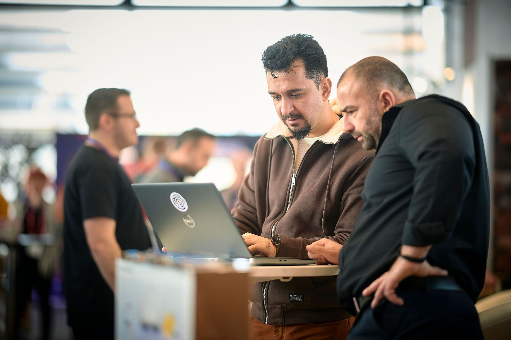
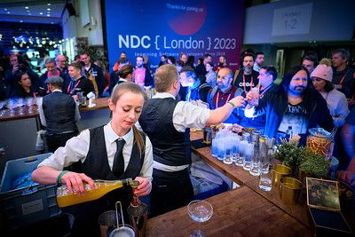
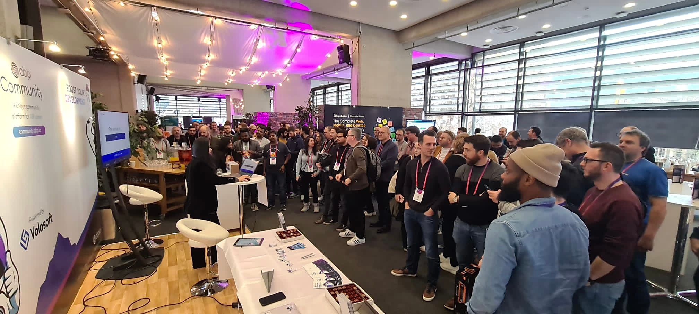

#### **Recap & Impressions🌟**


Last week, we were just back from [NDC {London} ](https://ndclondon.com)after had a blast at Queen Elizabeth II Centre in the center of Westminster, London, UK, with holding a stand on Level 3 during the 3-day conference (24 Jan. - 27 Jan.) introducing about the [ABP.IO](https://abp.io) platform.




We were proud and glad to be a presenting partner of the conference for the 4th time in NDC London, and was able to meet up with other global companies, top experts with their specialties, and the impressive count of attendees.








It was a no-brainer that our team would attend again as we had an absolute blast meeting and chatting with a global group of passionate developers and talented speakers.






Our lead developers *[Halil](https://twitter.com/hibrahimkalkan)* and *[Alper](https://twitter.com/alperebicoglu)* presented the ABP.IO platform modules and features were quite busy enjoying their presenting work with latest version of demos.


We introduced **[ABP Framework](https://abp.io)**, community-driven open-source web application framework, and **[ABP Commercial](https://commercial.abp.io)**, our enterprise-ready web development platform that is built on top of the open-source ABP Framework.






We were pleased with the traffic coming by our booth all the time.


On the conference, we chatted with [@Nick Chapsas](https://twitter.com/nickchapsas) in person. It was great to talk and discuss out of screen with him for ABP.IO this time. Hope to see more chemistry in our collaborations!






#### **SWAGGIE👀**


For this year NDC London conference, we definitely brought really cool swags for the attendees:






And I have to say, we’ve got lots of loving feedbacks from the folks on the venue!


#### **NDC Party🍾**


Another impression we’ve got from NDC London 2023 is the Thursday Night Party including an amazing music show. Check out the pictures below for feeling the dope live atmosphere!










#### **Drawing RAFFLE🎁**


We ended up our last day of the conference with the exciting Raffle - META QUEST II !




Under the eyes of everyone's great expectation, the winner turned out to be a very cute girl-developer from Poland. I bet she was the happiest one departed from the conference.




It was an absolutely amazing week in NDC London. We had so much fun meeting all of you with pressure! Thanks to all enthusiasts developers and organizers who made the conference days shining inspiring!




We see you on the next one! Cheers!