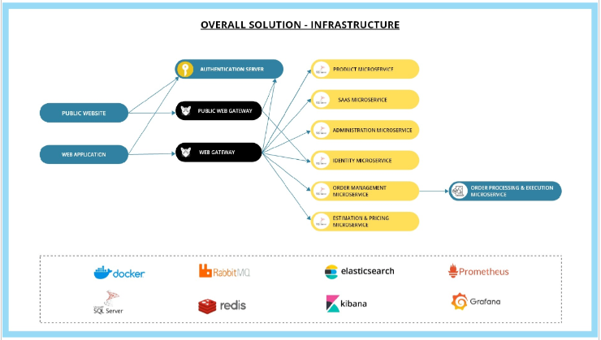

Hello and gratitudes, ABP.IO Community!


We are happy to share the success of the ABP.NET Conference 2023, which captivated overwhelmingly interested live viewers from all over the world. ABP .NET Conference 2023, besides being the first full-day ABP Community event experience, it was also a remarkable one. The intense engagement and attention shown by the community towards the amazing line up of 13 talented speakers was worth mentioning. Join me as we give thanks for the outstanding support and explore the fascinating conversations that took place during this truly global .NET event.


The virtual nature of our conference allowed us to transcend geographical boundaries, bringing together individuals from diverse cultures and up to 59 different countries. The map below showcases the countries of the live viewers, with darker shades indicating higher minutes viewed. It is an incredible feeling for us to reach this amount of global audience and see the impact of our conference.


The success of ABP .NET Conference 2023 would not have been possible without the invaluable contributions of our talented speakers. These 13 great line up of speakers which include .NET experts and Microsoft MVPs delivered captivating talks that resonated with the audiences. Each of the talk attracted great amount interest and a lot of questions, sparking curiosity in the attendees. We extend our deepest appreciation to each speaker for their valuable insights and for igniting the curiosity throughout the ABP .NET Conference 2023. Let’s remember them and their talk titles:

* 🎙️[Halil Ibrahim Kalkan, Co-Founder at Volosoft / Lead Architect and Developer of ABP Framework](https://twitter.com/hibrahimkalkan), 
 
* 🎙️[Cecil Phillip, Developer Advocate at Stripe](https://twitter.com/cecilphillip),

* 🎙️[Daniel Marbach, Software Engineer at Particular Software](https://twitter.com/danielmarbach),

* 🎙️[Gleidson Nascimento, SRE/Cloud Advisor at Urvin Finance](https://twitter.com/slaterx),

* 🎙️[Isaac Levin, .NET Developer Advocate at Amazon Web Services](https://twitter.com/isaacrlevin),

* 🎙️[Jimmy Engström, Microsoft MVP / Developer at Erik Penser Bank / Azm dev](https://twitter.com/EngstromJimmy),

* 🎙️[Joseph Guadagno, JosephGuadahno.NET, LLC](https://twitter.com/jguadagno),

* 🎙️[Melissa Houghton, Lead Software Engineer and Developer Relations at Azenix](https://twitter.com/meliss_houghton),

* 🎙️[Nicolas Frankel, Head of Developer Advocacy at Apache APISIX](https://twitter.com/nicolas_frankel),

* 🎙️[Shaun Walker, CTO and Professional Services at Cognizant](https://twitter.com/sbwalker),

* 🎙️[Simon Painter, Senior Software Developer at Mueller Dairies](https://twitter.com/madSimonJ),

* 🎙️[Taswar Bhatti, Azure GTM Manager for CEMA at Microsoft EMEA](https://twitter.com/taswarbhatti),

* 🎙️[Todd Gardner, CEO at Request Metrics](https://twitter.com/toddhgardner)


We are grateful to the each live viewers who dedicated their time and actively participated in ABP .NET Conference 2023. Your presence and engagement made ABP .NET Conference the success it achieved. The image representing your countries serves as a vivid reminder of the collective enthusiasm and passion that raised from each corner of the world. We are humbled by your support and inspired by the connections forged through shared knowledge.


The interactive nature of ABP .NET Conference 2023 provided an ideal platform for attendees to engage with the speakers. The depth of the subjects presented and the multitude of questions asked during the Q&A sessions showed the intellectuality of the audience. Each question provided a base for engaging discussions and enriched the experience for everyone. The exchange of ideas and the diverse perspectives brought the beauty of the inclusiveness of the ABP .NET Conference 2023.


For a special thank to our not only a sponsor but also a great partner of ABP Commercial - [Wai Technologies](https://waiin.com/). Besides the impactful contribution of Wai Technologies to the success of our event, we would like to highlight their solid service to the customers. One of their remarkable achievements was assisting a large enterprise-grade logistics company in completely revamping their legacy sales and order management platform.


Wai Technologies played a crucial role in enabling the logistics company to achieve over 50% acceleration in taking their product to market. They implemented practical solutions that significantly improved application usability, management, and scaling for the company.


How Wai Technologies refactored the monolithic application to the Micro-

services Architecture:


The technology stack utilized by Wai Technologies included the following:

-ABP Commercial Micro-services

-Angular Frontend

-SQL/Mongo DB

-Azure BLOB Storage

-Azure App Insights

-Docker, Azure Kubernetes Service (AKS)

-Elsa.Net for Workflows

-Elsa Visual workflow Designer


We are grateful to our partner, Wai Technologies, for their invaluable contributions and expertise. It’s been always a great partnership between ABP Commercial & Wai Technologies.


Special thanks to our other sponsors [ApiX-Drive](https://apix-drive.com/), [Decision Tree](https://decisiontree.tech/), [DM Consulting](https://www.dmconsulting.it/), [.NET Foundation](https://dotnetfoundation.org/), [Microsoft](https://www.microsoft.com/), [Packt Publishing](https://www.packtpub.com/).