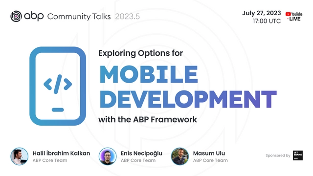

[ABP Framework](https://abp.io/) and [ABP Commercial](https://commercial.abp.io/) 7.3 versions have been released today.

## What's New With Version 7.3?

All the new features were already explained in detail in the [7.3 RC Announcement Post](https://blog.abp.io/abp/ABP.IO-Platform-7-3-RC-Has-Been-Published), so no need to go over them again. Check it out for more details. 

## Getting Started with 7.3

### Creating New Solutions

You can create a new solution with the ABP Framework version 7.3 by either using the `abp new` command or generating the CLI command on the [get started page](https://abp.io/get-started).

> See the [getting started document](https://docs.abp.io/en/abp/latest/Getting-Started) for more.

### How to Upgrade an Existing Solution

#### Install/Update the ABP CLI

First of all, install the ABP CLI or upgrade it to the latest version.

If you haven't installed it yet:

```bash
dotnet tool install -g Volo.Abp.Cli
```

To update the existing CLI:

```bash
dotnet tool update -g Volo.Abp.Cli
```

#### Upgrading Existing Solutions with the ABP Update Command

[ABP CLI](https://docs.abp.io/en/abp/latest/CLI) provides a handy command to update all the ABP related NuGet and NPM packages in your solution with a single command:

```bash
abp update
```

Run this command in the root folder of your solution.

## Migration Guides

There are breaking changes in this version that may affect your application. 
Please see the following migration documents, if you are upgrading from v7.2:

* [ABP Framework 7.2 to 7.3 Migration Guide](https://docs.abp.io/en/abp/7.3/Migration-Guides/Abp-7_3)

## Community News

### ABP Community Talks 2023.5: Mobile Development with the ABP Framework



In this episode, we'll talk about Exploring Options for Mobile Development with the ABP Framework. 

> Join us to explore the options for Mobile Development in ABP Framework on July 27, 2023, at 17:00 UTC. You can register from [here](https://kommunity.com/volosoft/events/abp-community-talks-20235-mobile-development-with-the-abp-framework-68e64e59).

### New ABP Community Posts

There are exciting articles contributed by the ABP community as always. I will highlight some of them here:

* [Video: ABP Framework Entity Framework Core](https://community.abp.io/videos/abp-framework-entity-framework-core-z0eyf1yy) by [Hamza Albreem](https://twitter.com/st_braim)
* [Image Compression and Resize with ABP Framework](https://community.abp.io/posts/image-compression-and-resize-with-abp-framework-4v2gpb7g) by [Engincan Veske](https://twitter.com/EngincanVeske)
* [Manage Quartz with SilkierQuartz](https://community.abp.io/posts/manage-quartz-with-silkierquartz-xb4ovbj9) by [Jadyn](https://community.abp.io/members/Jadyn)
* [ABP Helper Methods](https://community.abp.io/posts/abp-helper-methods-04dk74cq) by [Engincan Veske](https://twitter.com/EngincanVeske)
* [How to replace SwaggerUI with RapiDoc](https://community.abp.io/posts/how-to-replace-swaggerui-with-rapidoc-hw7pktmz) by [Jadyn](https://community.abp.io/members/Jadyn)

Thanks to the ABP Community for all the content they have published. You can also [post your ABP-related (text or video) content](https://community.abp.io/articles/submit) to the ABP Community.

## About the Next Version

The next feature version will be 7.4. You can follow the [release planning here](https://github.com/abpframework/abp/milestones). Please [submit an issue](https://github.com/abpframework/abp/issues/new) if you have any problems with this version.
