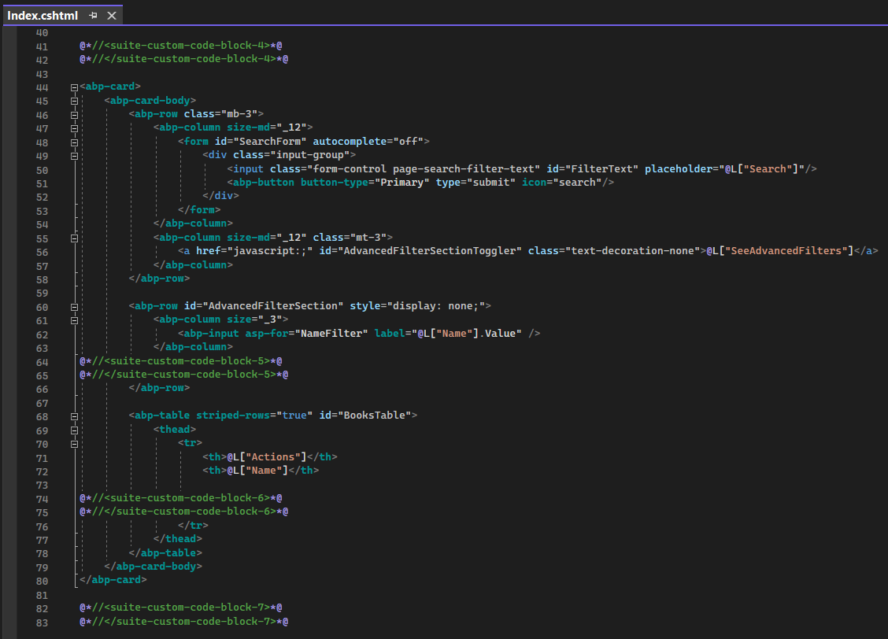
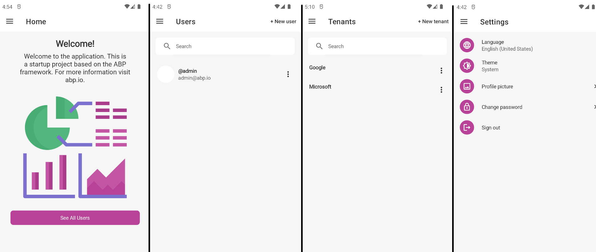
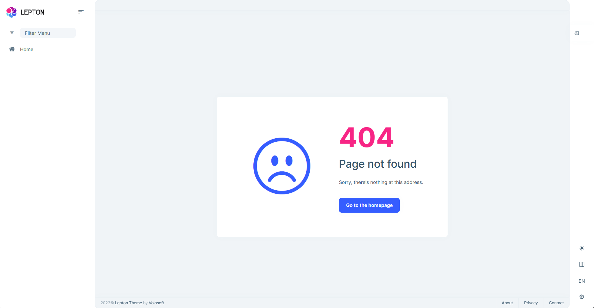
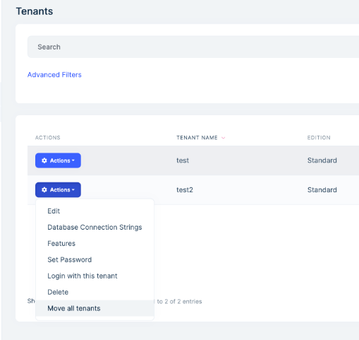
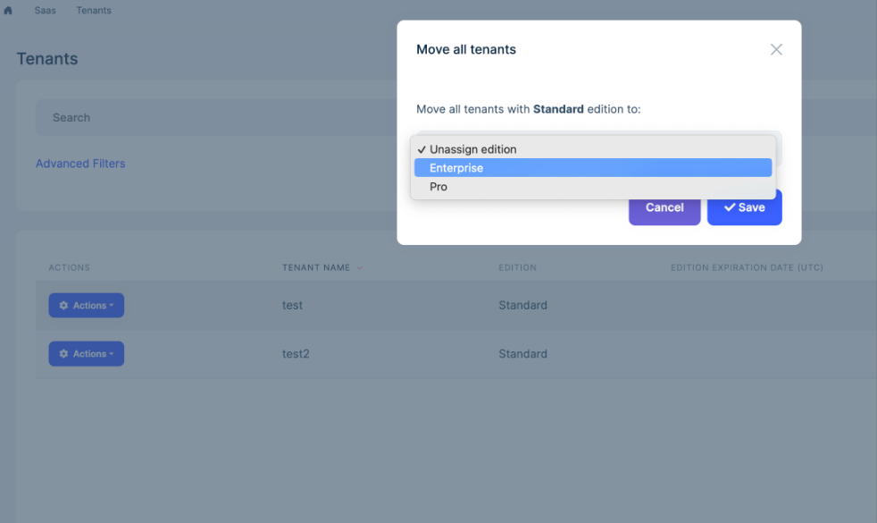
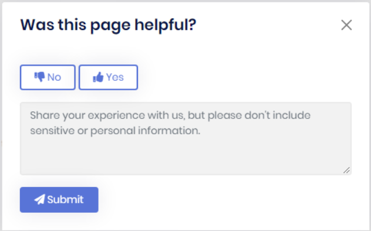
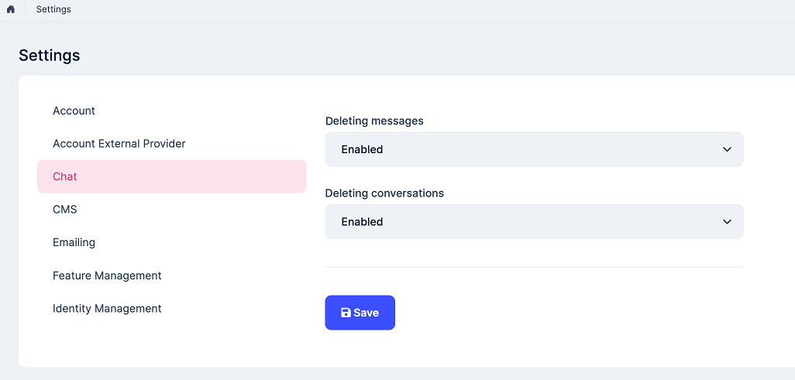
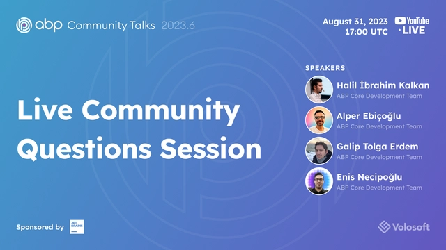
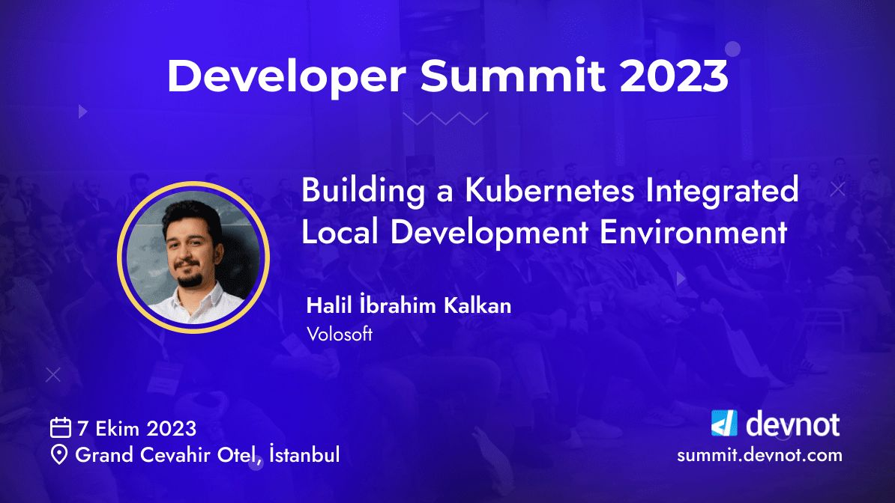

Today, we are happy to release the [ABP Framework](https://abp.io/) and [ABP Commercial](https://commercial.abp.io/) version **7.4 RC** (Release Candidate). This blog post introduces the new features and important changes in this new version.

Try this version and provide feedback for a more stable version of ABP v7.4! Thanks to all of you.

## Get Started with the 7.4 RC

Follow the steps below to try version 7.4.0 RC today:

1) **Upgrade** the ABP CLI to version `7.4.0-rc.5` using a command line terminal:

````bash
dotnet tool update Volo.Abp.Cli -g --version 7.4.0-rc.5
````

**or install** it if you haven't before:

````bash
dotnet tool install Volo.Abp.Cli -g --version 7.4.0-rc.5
````

2) Create a **new application** with the `--preview` option:

````bash
abp new BookStore --preview
````

See the [ABP CLI documentation](https://docs.abp.io/en/abp/latest/CLI) for all the available options.

> You can also use the [Get Started](https://abp.io/get-started) page to generate a CLI command to create a new application.

You can use any IDE that supports .NET 7.x, like [Visual Studio 2022](https://visualstudio.microsoft.com/downloads/).

## Migration Guides

There are a few breaking changes in this version that may affect your application.
Please see the following migration documents, if you are upgrading from v7.3 or earlier:

* [ABP Framework 7.3 to 7.4 Migration Guide](https://docs.abp.io/en/abp/7.4/Migration-Guides/Abp-7_4)
* [ABP Commercial 7.3 to 7.4 Migration Guide](https://docs.abp.io/en/commercial/7.4/migration-guides/v7_4)

## What's New with ABP Framework 7.4?

In this section, I will introduce some major features released in this version. Here is a brief list of the titles that will be explained in the next sections:

* Dynamic Setting Store
* Introducing the `AdditionalAssemblyAttribute`
* `CorrelationId` Support on Distributed Events
* Database Migration System for EF Core
* Other News

### Dynamic Setting Store

Prior to this version, it was hard to define settings in different microservices and centrally manage all setting definitions in a single admin application. To make that possible, we used to add project references for all the microservices' service contract packages from a single microservice, so it can know all the setting definitions and manage them. 

In this version, ABP Framework introduces the Dynamic Setting Store, which is an important feature that allows you to collect and get all setting definitions from a single point and overcome the setting management problems on microservices.

> *Note*: If you are upgrading from an earlier version and using the Setting Management module, you need to create a new migration and apply it to your database because a new database table has been added for this feature.

### Introducing the `AdditionalAssemblyAttribute`

In this version, we have introduced the `AdditionalAssemblyAttribute` to define additional assemblies to be part of a module. ABP Framework automatically registers all the services of your module to the [Dependency Injection System](https://docs.abp.io/en/abp/latest/Dependency-Injection). It finds the service types by scanning types in the assembly that define your module class. Typically, every assembly contains a separate module class definition and modules depend on each other using the `DependsOn` attribute.

In some rare cases, your module may consist of multiple assemblies and only one of them defines a module class, and you want to make the other assemblies parts of your module. This is especially useful if you can't define a module class in the target assembly or you don't want to depend on that module's dependencies.

In that case, you can use the `AdditionalAssembly` attribute as shown below:

```csharp
[DependsOn(...)] // Your module dependencies as you normally would do
[AdditionalAssembly(typeof(IdentityServiceModule))] // A type in the target assembly (in another assembly)
public class IdentityServiceTestModule : AbpModule
{
    ...
}
```

With the `AdditionalAssembly` attribute definition, ABP loads the assembly containing the `IdentityServiceModule` class as a part of the identity service module. Notice that in this case, none of the module dependencies of the `IdentityServiceModule` are loaded. Because we are not depending on the `IdentityServiceModule`, instead we are just adding its assembly as a part of the `IdentityServiceTestModule`.

> You can check the [Module Development Basics](https://docs.abp.io/en/abp/7.4/Module-Development-Basics) documentation to learn more.

### `CorrelationId` Support on Distributed Events

In this version, `CorrelationId` (a unique key that is used in distributed applications to trace requests across multiple services/operations) is attached to the distributed events, so you can relate events with HTTP requests and can trace all the related activities.

ABP Framework generates a `correlationId` for the first time when an operation is started and then attaches the current `correlationId` to distributed events as an additional property. For example, if you are using the [transactional outbox or inbox pattern provided by ABP Framework](https://docs.abp.io/en/abp/latest/Distributed-Event-Bus#outbox-inbox-for-transactional-events), you can see the `correlationId` in the extra properties of the `IncomingEventInfo` or `OutgoingEventInfo` classes with the standard `X-Correlation-Id` key.

> You can check [this issue](https://github.com/abpframework/abp/issues/16773) for more information.

### Database Migration System for EF Core

In this version, ABP Framework provides base classes and events to migrate the database schema and seed the database on application startup. This system works compatibly with multi-tenancy and whenever a new tenant is created or a tenant's database connection string has been updated, it checks and applies database migrations for the new tenant state.

This system is especially useful to migrate databases for microservices. In this way, when you deploy a new version of a microservice, you don't need to manually migrate its database.

You need to take the following actions to use the database migration system:

* Create a class that derives from `EfCoreRuntimeDatabaseMigratorBase` class, override and implement its `SeedAsync` method. And lastly, execute the `CheckAndApplyDatabaseMigrationsAsync` method of your class in the `OnPostApplicationInitializationAsync` method of your module class.
* Create a class that derives from `DatabaseMigrationEventHandlerBase` class, override and implement its `SeedAsync` method. Then, whenever a new tenant is created or a tenant's connection string is changed then the `SeedAsync` method will be executed.

### Other News

* [OpenIddict](https://github.com/openiddict/openiddict-core/tree/4.7.0) library has been upgraded to **v4.7.0**. See [#17334](https://github.com/abpframework/abp/pull/17334) for more info.
* ABP v7.4 introduces the `Volo.Abp.Maui.Client` package, which is used by the MAUI mobile application in ABP Commercial. See [#17201](https://github.com/abpframework/abp/pull/17201) for more info.
* In this version, the `AbpAspNetCoreIntegratedTestBase` class gets a generic type parameter, which expects either a startup class or an ABP module class. This allows us to use configurations from an ABP module or old-style ASP.NET Core Startup class in a test application class and this simplifies the test application project. See [#17039](https://github.com/abpframework/abp/pull/17039) for more info.

## What's New with ABP Commercial 7.4?

We've also worked on [ABP Commercial](https://commercial.abp.io/) to align the features and changes made in the ABP Framework. The following sections introduce new features coming with ABP Commercial 7.4.

### Dynamic Text Template Store

Prior to this version, it was hard to create text templates in different microservices and centrally manage them in a single admin application. For example, if you would define a text template in your ordering microservice, then those text templates could not be seen on the administration microservice because the administration microservice would not have any knowledge about that text template (because it's hard-coded in the ordering microservice).

For this reason, in this version, the Dynamic Text Template Store has been introduced to make the [Text Template Management module](https://docs.abp.io/en/commercial/latest/modules/text-template-management) compatible with microservices and distributed systems. It allows you to store and get all text templates from a single point. Thanks to that, you can centrally manage the text templates in your admin application.

> *Note*: If you are upgrading from an earlier version and are using the Text Template Management module, you need to create a new migration and apply it to your database.

To enable the dynamic template store, you just need to configure the `TextTemplateManagementOptions` and set the `IsDynamicTemplateStoreEnabled` as true in your module class:

```csharp
Configure<TextTemplateManagementOptions>(options =>
{
    options.IsDynamicTemplateStoreEnabled = true;
});
```

Notice this is only needed in the microservice where you centrally manage your text template contents. So, typically you would use the configuration above in your administration microservice. Other microservices automatically save their text template contents to the central database.

### Suite: Custom Code Support

In this version, we have implemented the custom code support in Suite. This allows you to customize the generated code-blocks and preserve your custom code changes in the next CRUD Page Generation in Suite. ABP Suite specifies hook-points to allow adding custom code blocks. Then, the code that you wrote to these hook points will be respected and will not be overridden in the next entity generation.



To enable custom code support, you should check the *Customizable code* option in the crud page generation page. When you enable the custom code support, you will be seeing some hook-points in your application. 

For example, on the C# side, you'll be seeing some abstract classes and classes that derive from them (for entities, application services, interfaces, domain services, and so on...). You can write your custom code in those classes (`*.Extended.cs`) and the next time when you need to re-generate the entity, your custom code will not be overridden (only the base abstract classes will be re-generated and your changes on Suite will be respected):

Folder structure             |  Book.Extended.cs
:-------------------------:|:-------------------------:
  |  

> *Note*: If you want to override the entity and add custom code, please do not touch the code between `<suite-custom-code-autogenerated>...</suite-custom-code-autogenerated>` placeholders, because the constructor of the entity should be always re-generated in case of a new property added.

On the UI side, you can see the *comment placeholders* on the pages for MVC & Blazor applications. These are hook-points provided by ABP Suite and you can write your custom code between these comment sections:

Folder structure             |  Books/Index.cshtml
:-------------------------:|:-------------------------:
  |  

### MAUI & React Native UI Revisions

In this version, we have revised MAUI & React Native mobile applications and added new pages, functionalities and made improvements on the UI side.



For example, in the MAUI application, we have implemented the following functionalities and changed the UI completely:

* **User Management Page**: Management page for your application users. You can search, add, update, or delete users of your application.
* **Tenants**: Management page for your tenants. 
* **Settings**: Management page for your application settings. On this page, you can change **the current language**, **the profile picture**, **the current password**, or/and **the current theme**.

Also, we have aligned the features on both of these mobile options (MAUI & React Native) and showed them in the ["ABP Community Talks 2023.5: Exploring the Options for Mobile Development with the ABP Framework"](https://community.abp.io/events/mobile-development-with-the-abp-framework-ogtwaz5l).

> If you have missed the event, you can watch from 👉 [here](https://www.youtube.com/watch?v=-wrdngeKgZw).

### New LeptonX Theme Features

In the new version of LeptonX Theme, which is v2.4.0-rc.1, there are some new features that we want to mention.

#### Mobile Toolbars

The [Toolbar System](https://docs.abp.io/en/abp/latest/UI/AspNetCore/Toolbars) is used to define *toolbars* on the user interface. Modules (or your application) can add items to a toolbar, then the UI themes can render the toolbar on the layout.

LeptonX Theme extends this system even further and introduces mobile toolbars with this version. You can create a component and add it as a mobile toolbar as below:

```csharp
public class MyToolbarContributor : IToolbarContributor
{
    public Task ConfigureToolbarAsync(IToolbarConfigurationContext context)
    {
        if (context.Toolbar.Name == LeptonXToolbars.MainMobile)
        {
            context.Toolbar.Items.Add(new ToolbarItem(typeof(ShoppingCardToolbarComponent)));
        
            //other mobile toolbars...
        }

        return Task.CompletedTask;
    }
}
```

Then, the LeptonX Theme will render these mobile toolbars like in the figure below:



> **Note**: The Angular UI hasn't been completed yet. We aim to complete it as soon as possible and include it in the next release. 

#### New Error Page Designs

In this version, we have implemented new error pages. Encounter a fresh look during error situations with the 'New Error Page Designs,' providing informative and visually appealing error displays that enhance user experience:



#### Fluid Layout

In this version, LeptonX Theme introduces the fresh-looking **Fluid Layout**, which is a layout that lets you align elements so that they automatically adjust their alignment and proportions for different page sizes and orientations.



> You can visit [the live demo of LeptonX Theme](https://x.leptontheme.com/side-menu) and try the Fluid Layout now!

### Check & Move Related Entities on Deletion/Demand

In application modules, there are some entities that have complete relationships with each other such as role-user relations. In such cases, it's a typical requirement to check & move related entities that have a relation with the other entity that is about to be deleted.

For example, if you need to delete an edition from your system, you would typically want to move the tenant that is associated with that edition. For this purpose, in this version, ABP Commercial allows you to move related entities on deletion/demand.



Currently, this feature is implemented for SaaS and Identity Pro modules and for the following relations:

* Edition - Tenant
* Role - User
* Organization Unit - User

Also, it's possible to move the related associated-records before deleting the record. For example, you can move all tenants from an edition as shown in the figure below:

"Move all tenants" action  |  "Move all tenants" modal
:-------------------------:|:-------------------------:
  |  

### CMS Kit Pro: Page Feedback

In this version, the **Page Feedback** feature has been added to the [CMS Kit Pro](https://docs.abp.io/en/commercial/latest/modules/cms-kit/index) module. This feature allows you to get feedback from a page in your application. 

This is especially useful if you have content that needs feedback from users. For example, if you have documentation or a blog website, it's a common requirement to assess the quality of the articles and get feedback from users. In that case, you can use this feature:



### Chat Module: Deleting Messages & Conversations

In this version, the [Chat Module](https://docs.abp.io/en/commercial/latest/modules/chat) allows you to delete individual messages or a complete conversation. 

You can enable or disable the message/conversation deletion globally on your application:



> **Note**: The Angular UI hasn't been completed yet. We aim to complete it as soon as possible and include it in the next release. 

### Password Complexity Indicators

In this version, ABP Framework introduces an innovative ["Password Complexity Indicator"](https://docs.abp.io/en/commercial/7.4/ui/angular/password-complexity-indicator-component) feature, designed to enhance security and user experience. This feature dynamically evaluates and rates the strength of user-generated passwords, providing real-time feedback to users as they create or update their passwords. By visually indicating the complexity level, users are guided toward crafting stronger passwords that meet modern security standards.



You can check the [Password Complexity Indicator Angular documentation](https://docs.abp.io/en/commercial/7.4/ui/angular/password-complexity-indicator-component) to learn more.

> **Note**: Currently, this feature is only available for the Angular UI, but we will be implemented for other UIs in the next version.

## Community News

### ABP Community Talks 2023.6: Live Community Questions Session



In this episode, the core ABP team will do a Live Q&A session **on August 31, 2023, at 17:00 UTC**. This is your chance to ask the team anything about ABP. Whether it's about features, best practices, or upcoming releases... We want to hear from you!

You can do either of the following things to send your questions:

* Reply to this tweet: [https://twitter.com/abpframework/status/1692157154692595817](https://twitter.com/abpframework/status/1692157154692595817)
* Send us an email at [marketing@volosoft.com](mailto:marketing@volosoft) with **"ABP Community Talks Live Q&A"** in the subject line
* Or simply, be there at the live session in the chat.

> Register to listen and ask your questions now 👉 [https://kommunity.com/volosoft/events/abp-community-talks-20236-live-community-questions-session-1a545496](https://kommunity.com/volosoft/events/abp-community-talks-20236-live-community-questions-session-1a545496).

### DevNot Developer Summit 2023



We are thrilled to announce that the co-founder of [Volosoft](https://volosoft.com/) and Lead Developer of the ABP Framework, Halil Ibrahim Kalkan will give a speech about "Building a Kubernetes Integrated Local Development Environment" in the [Developer Summit 2023 event](https://summit.devnot.com/) on the 7th of October.

### New ABP Community Posts

There are exciting articles contributed by the ABP community as always. I will highlight some of them here:

* [ABP Commercial - GDPR Module Overview](https://community.abp.io/posts/abp-commercial-gdpr-module-overview-kvmsm3ku) by [Engincan Veske](https://twitter.com/EngincanVeske)
* [Video: ABP Framework Data Transfer Objects](https://community.abp.io/videos/abp-framework-data-transfer-objects-qwebfqz5) by [Hamza Albreem](https://github.com/braim23)
* [Video: ABP Framework Essentials: MongoDB](https://community.abp.io/videos/abp-framework-essentials-mongodb-gwlblh5x) by [Hamza Albreem](https://github.com/braim23)
* [ABP Modules and Entity Dependencies](https://community.abp.io/posts/abp-modules-and-entity-dependencies-hn7wr093) by [Jack Fistelmann](https://github.com/nebula2)
* [How to add dark mode support to the Basic Theme in 3 steps?](https://community.abp.io/posts/how-to-add-dark-mode-support-to-the-basic-theme-in-3-steps-ge9c0f85) by [Enis Necipoğlu](https://twitter.com/EnisNecipoglu)
* [Deploying docker image to Azure with yml and bicep through Github Actions](https://community.abp.io/posts/deploying-docker-image-to-azure-with-yml-and-bicep-through-github-actions-cjiuh55m) by [Sturla](https://community.abp.io/members/Sturla)

Thanks to the ABP Community for all the content they have published. You can also [post your ABP-related (text or video) content](https://community.abp.io/articles/submit) to the ABP Community.  

## Conclusion

This version comes with some new features and a lot of enhancements to the existing features. You can see the [Road Map](https://docs.abp.io/en/abp/7.4/Road-Map) documentation to learn about the release schedule and planned features for the next releases. Please try ABP v7.4 RC and provide feedback to help us release a more stable version.

Thanks for being a part of this community!
