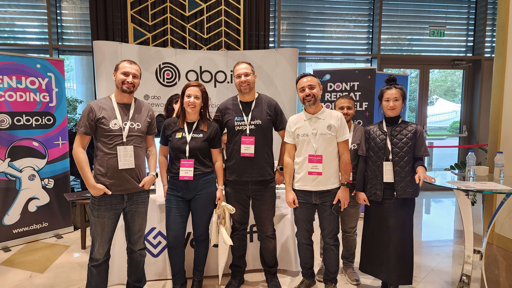
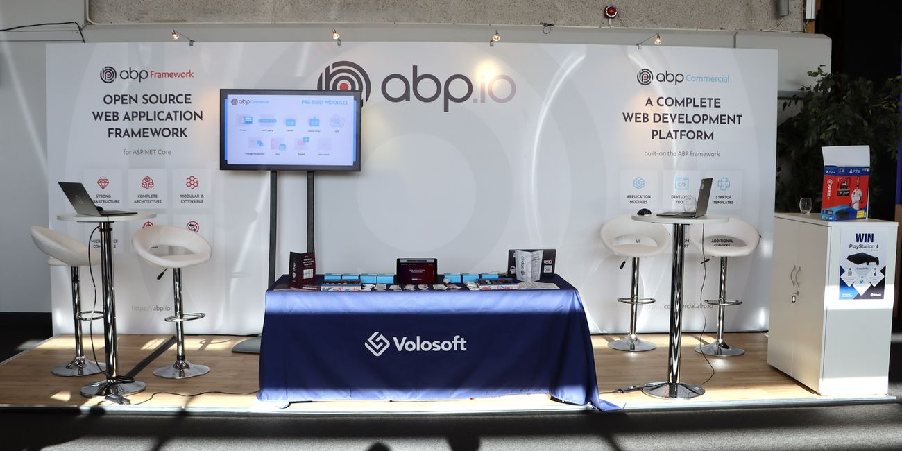
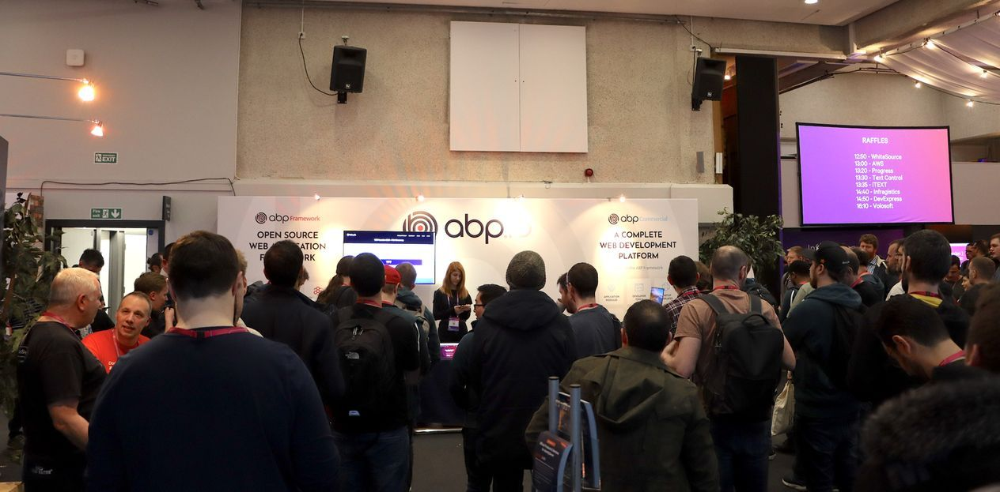
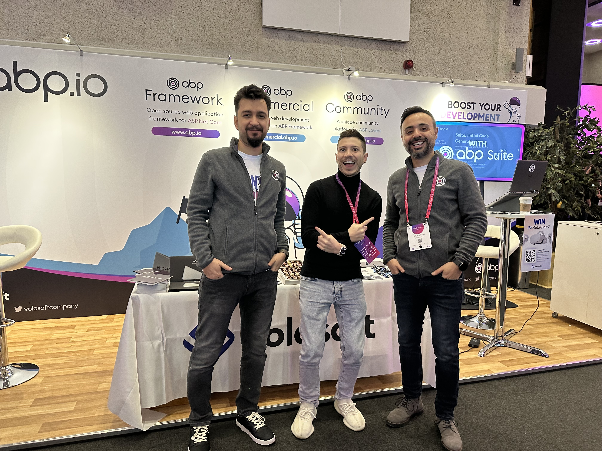
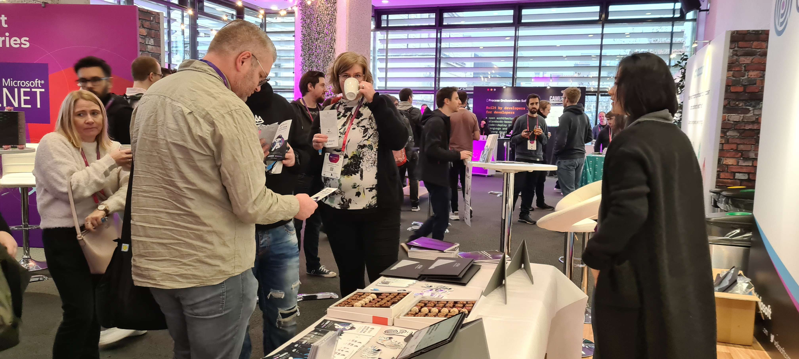
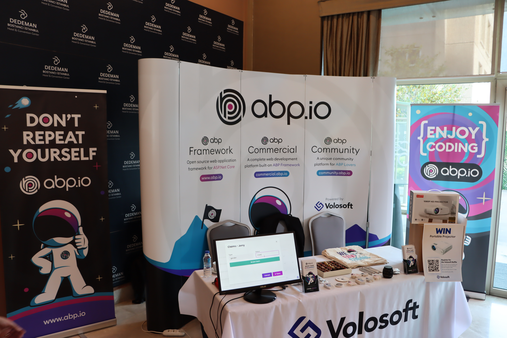
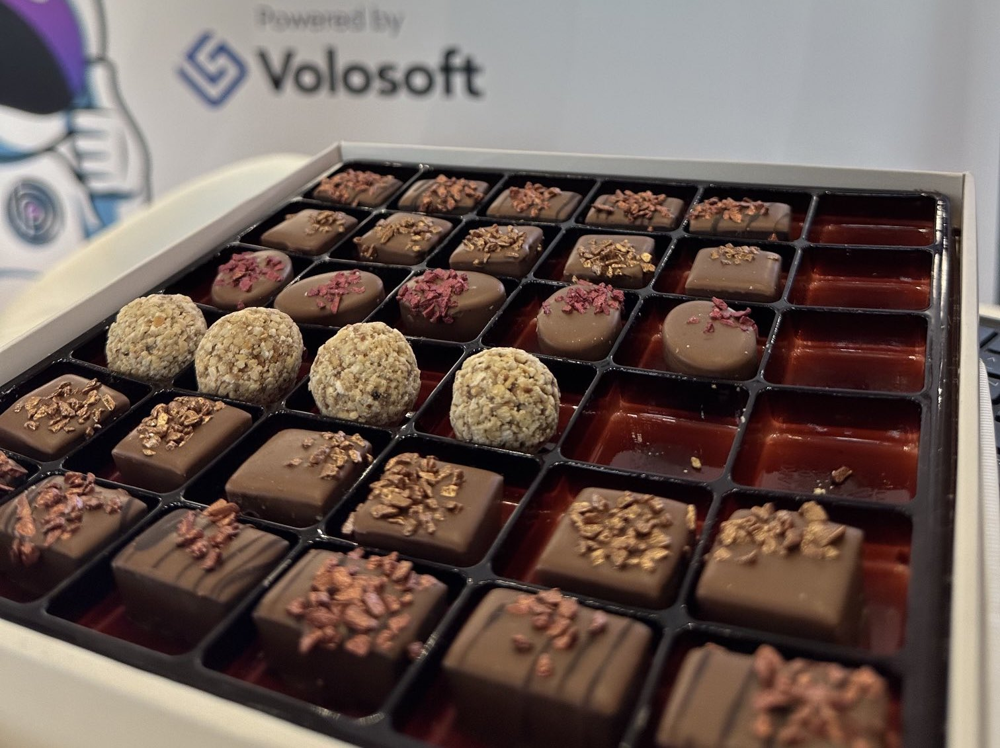

We are thrilled to announce that ABP.IO will be sponsoring [BASTA! Mainz 2023](https://basta.net/mainz-en/)! We are always eager to support the software development community, and this time, it's in Mainz, Germany.

BASTA! is a renowned conference for software developers that delves into a plethora of topics in the software development realm. It gathers experts from all corners of the globe to disseminate their knowledge and insights on cutting-edge technologies and industry best practices. This year, the event will take place from September 25 to 29, 2023, at the Rheingoldhalle Mainz.

We take immense pride in sponsoring such pivotal events and supporting the software development community. Conferences like BASTA! Mainz are perfect for developers to learn, network, and keep up with the evolving trends in the domain.

Here are some previews from the events we sponsored before, so you know what to expect in BASTA! Mainz 2023: 
### DevNot Summit 2022:


### NDC London 2020:




### NDC London 2023:




### DevNot DotNet 2023:


As is customary, we have some delightful surprises in store for attendees at our booth. Swing by to grab one of our exclusive swag kits and join our raffles for a chance to win exciting prizes. And, delicious hand-made chocolates all the way from Turkey. here is a sneak peak at what they look like:


The [ABP.IO](https://abp.io/) Team is eagerly anticipating our participation in BASTA! Mainz 2023. We are keen on forging connections with other professionals in the software development industry. Keep an eye out for more updates on our engagement in the conference from [ABP Framework Twitter account](https://twitter.com/abpframework).

For those keen on learning more about Volosoft and our software development offerings, or if you're curious about our SaaS product, [ABP Commercial](https://commercial.abp.io/), which is built on our [ABP Framework](https://abp.io/), do visit us at our booth. We're always up for a chat about your software development requirements and how we can assist.

Meet us at BASTA! Mainz 2023!