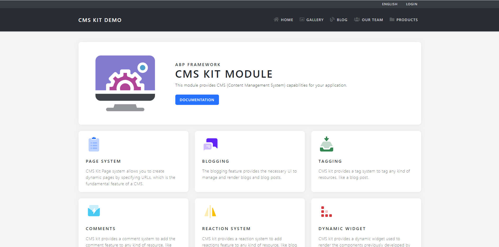
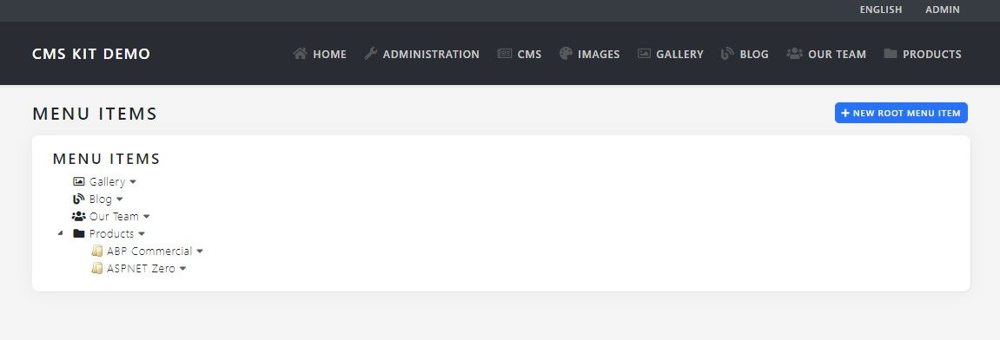
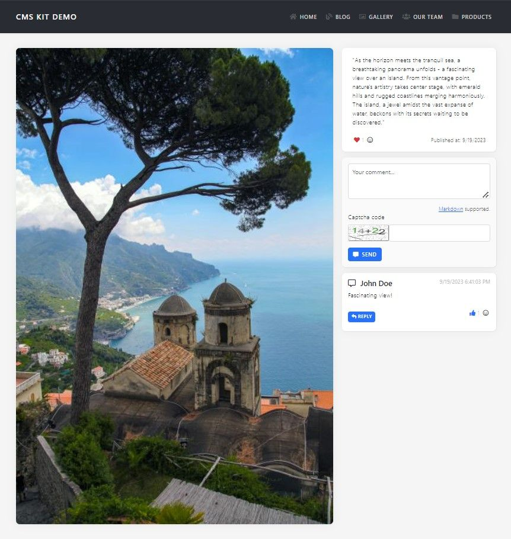
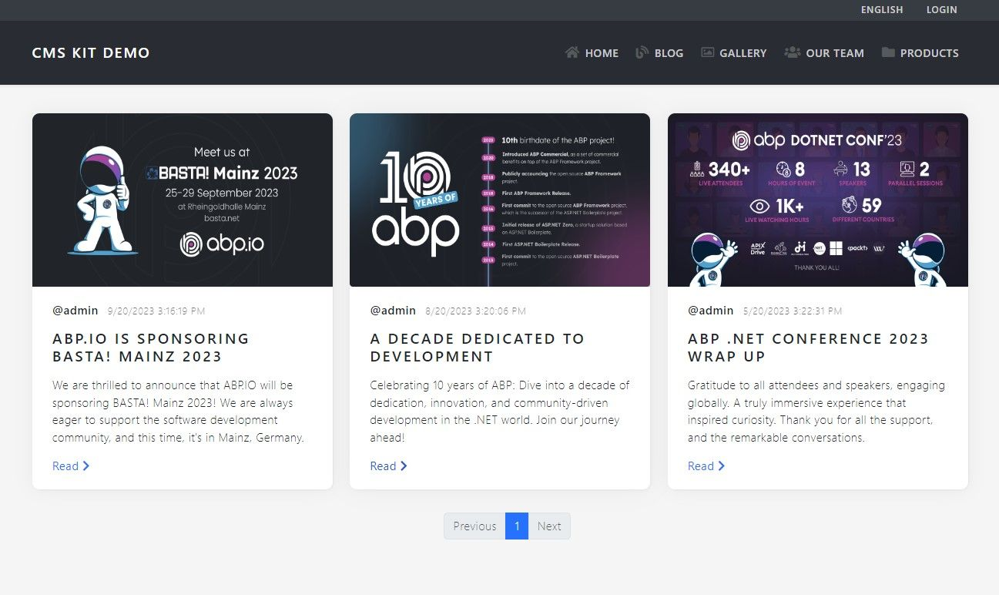
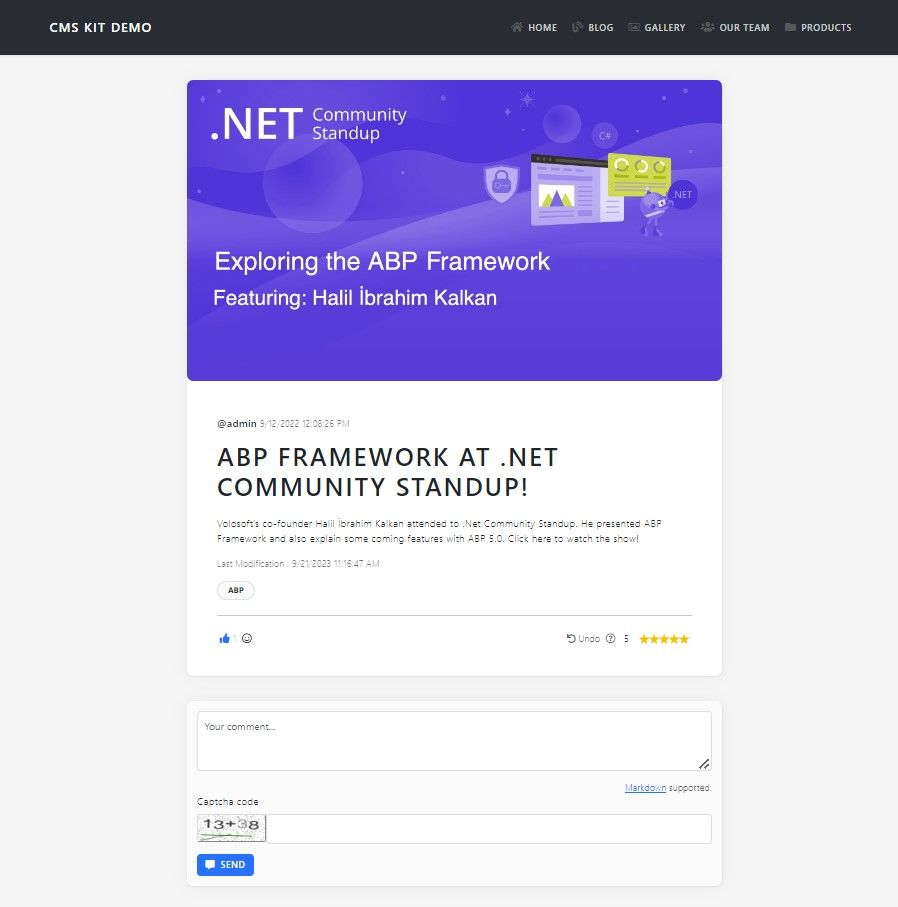
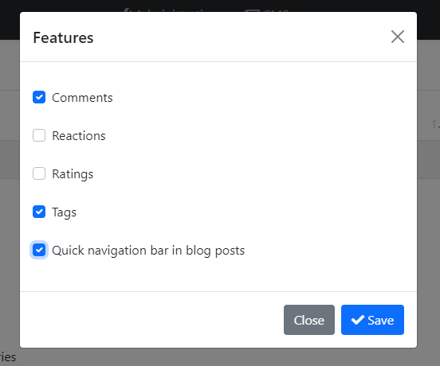
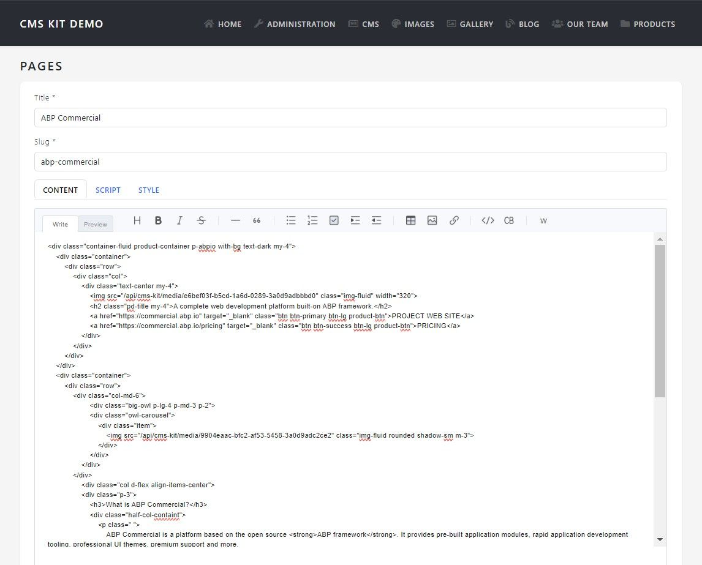
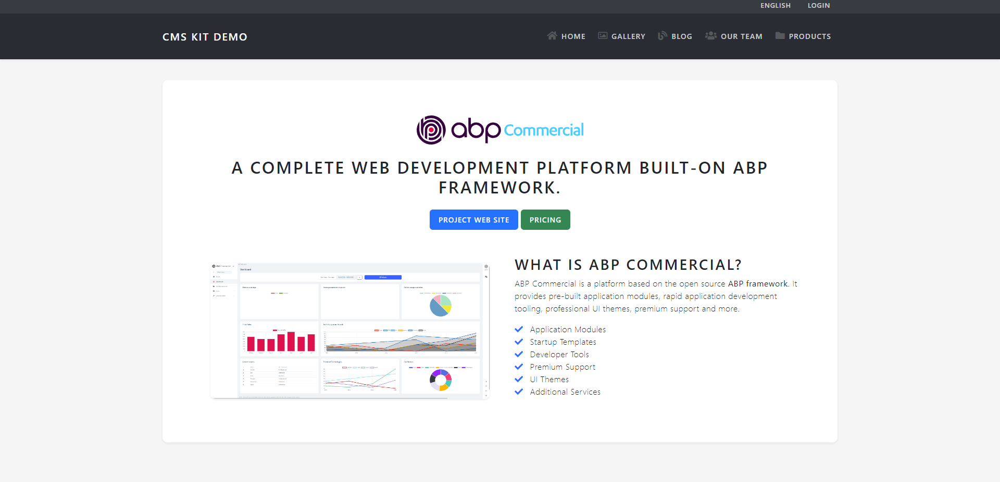

We're excited to introduce to you [ABP](https://abp.io/)'s [CMS Kit Module](https://docs.abp.io/en/abp/latest/Modules/Cms-Kit/Index) – a versatile module that empowers you to build your own dynamic content website with ease. In this introductory blog post, we'll first take a look at the **CMS Kit Module** and then we'll take you on a journey through our **CMS Kit Demo Application**, showcasing the incredible capabilities of this feature-rich module.

## ABP Community Talks 2023.7: Build Your Content Management System with .NET

We as the ABP team organized the [**ABP Community Talks 2023.7: Build Your Content Management System with .NET**](https://community.abp.io/events/build-your-own-cms-with-.net-a-first-look-at-abps-content-management-system-kit-3nfvm9ix) event to explore the depths of the CMS Kit Module and its real-world applications. The talk delved into the intricacies of the CMS Kit Module, providing valuable insights into its features and functionalities. Attendees had the opportunity to witness the module in action through live demonstrations and interactive Q&A sessions. 

For those who missed the live session, you can catch up on all the enriching discussions and demonstrations by watching the record below 👇:

<iframe width="560" height="315" src="https://www.youtube.com/embed/S9__Hnu29tI?si=vrLWLI3NQX2eaSMD" title="YouTube video player" frameborder="0" allow="accelerometer; autoplay; clipboard-write; encrypted-media; gyroscope; picture-in-picture; web-share" allowfullscreen></iframe>

## Overview of the CMS Kit Module

At the heart of ABP's CMS Kit Module is a robust Content Management System (CMS) designed to simplify content creation and management. With the CMS Kit, you have the tools to build your own dynamic content website, complete with a range of features tailored to your specific needs. It provides core **building blocks** and fully working sub-systems to create your own website with the CMS features or use the building blocks in your websites for any purpose.

### CMS Kit: The Building Blocks (a.k.a Features)

The following features are currently available and ready to use:

* **Blogging**: Create your blog and publish posts (with markdown / HTML support)
* **Dynamic Pages**: Create pages with dynamic URLs (with markdown / HTML support)
* **Dynamic Menu**: Manage your application’s main menu on the fly
* **Tagging**: Tag any kind of content, like a blog post
* **Comments**: Allow users to comment and discuss in your application
* **Reactions**: Allow users to react to your content using simple smileys
* **Rating**: Reusable component to rate other contents
* **Global Resources**: Dynamically add CSS / JavaScript to your pages or blog posts
* **Dynamic Widgets**: Build widgets and use them in dynamic content, like blog posts

> For more information, please check the [CMS Kit Module documentation](https://docs.abp.io/en/abp/latest/Modules/Cms-Kit/Index). In the documentation, you can see descriptions for each feature, learn how to install & configure the module, and much more...

### CMS Kit Pro: The Building Blocks (a.k.a Features)

CMS Kit Pro is a part of [ABP Commercial](https://commercial.abp.io/) and provides additional features. The following features are provided by the CMS Kit Pro Module: 

* **Contact Form**: Easily add a «contact us» form to your website
* **Newsletter**: Allow users to subscribe to your newsletter (with multiple categories)
* **URL Forwarding**: Create short URLs or redirect users to other pages (for example: [abp.io/dapr](https://abp.io/dapr))
* **Poll**: Create quick polls for your users
* **Page Feedback**: Collect feedbacks from users for your content

> For more information, check the [CMS Kit Pro Module documentation](https://docs.abp.io/en/commercial/latest/modules/cms-kit/index).

## Explore the CMS Kit Demo Application

As the core ABP development team, we've created a sample application to showcase the incredible capabilities of the ABP's CMS Kit Module. You can explore the source code of the application on our [GitHub repository](https://github.com/abpframework/cms-kit-demo) to get a deeper understanding of how the CMS Kit works under the hood. While developing the application, we aimed to build a real-world application and use almost all of the CMS Kit Features.

In the next sections, we will provide a detailed walkthrough of the application and highlight each CMS Kit feature that has been incorporated into it.

### Dynamic Menu Creation with CMS Kit's Menu System

One of the standing out features of the CMS Kit is its [Menu System](https://docs.abp.io/en/abp/latest/Modules/Cms-Kit/Menus), which allows for the creation and dynamic ordering of application menu items. Say goodbye to static menus; with CMS Kit, you have the power to tailor your menu structure according to your evolving content needs.

You can see the homepage of the application in the following figure:



The application menu items in the navbar are **created & ordered dynamically** with the [CMS Kit's Menu System](https://docs.abp.io/en/abp/latest/Modules/Cms-Kit/Menus):



### Custom Implementations with Comment & Reaction Features

Our demo application goes a step further by demonstrating custom implementations, such as an **image gallery**, seamlessly integrated with CMS Kit's [Comment](https://docs.abp.io/en/abp/latest/Modules/Cms-Kit/Comments) & [Reaction](https://docs.abp.io/en/abp/latest/Modules/Cms-Kit/Reactions) Features:

| Gallery | Detail Page  |
|------------------------ |-----------------------|
|  |   |

It's pretty easy to integrate CMS Kit Features such as Comments & Reactions into your existing pages. You can check the [source code of the application](https://github.com/abpframework/cms-kit-demo/blob/main/src/CmsKitDemo/Pages/Gallery/Detail.cshtml) and see how to integrate the features.

### Robust Blogging Capabilities

Blogging has never been easier! With the CMS Kit's [Blogging Feature](https://docs.abp.io/en/abp/latest/Modules/Cms-Kit/Blogging), you can effortlessly manage your blog content, complete with [Ratings](https://docs.abp.io/en/abp/latest/Modules/Cms-Kit/Ratings), [Comments](https://docs.abp.io/en/abp/latest/Modules/Cms-Kit/Comments), [Tags](https://docs.abp.io/en/abp/latest/Modules/Cms-Kit/Tags), and [Reactions](https://docs.abp.io/en/abp/latest/Modules/Cms-Kit/Reactions) features as enabled:

| Blog | Blog Post  |
|------------------------ |-----------------------|
|  |  |

You can enable/disable CMS Kit Features per blog on the admin side easily:



### Dynamic Pages with Style and Script Integration

*Products* pages showcase the flexibility of the CMS Kit's [Pages Feature](https://docs.abp.io/en/abp/latest/Modules/Cms-Kit/Pages), allowing for dynamic content creation, style customization, and script integration. Your website can now truly reflect your unique brand and content style.

You can create pages with dynamic URLs on the admin side:



After you have created the page, you can access it via `/{slug}` URL on the public-web side:



## What's Next?

Please try the CMS Kit Module now and provide [feedback](https://github.com/abpframework/abp) to help us build a more effective content management kit!

## Resources

* [CMS Kit Demo: Source Code](https://github.com/abpframework/cms-kit-demo)
* [cms-kit-demo.abp.io](https://cms-kit-demo.abp.io/) (will be live soon)
* [CMS Kit Module documentation](https://docs.abp.io/en/abp/latest/Modules/Cms-Kit/Index)
* [CMS Kit Pro Module documentation](https://docs.abp.io/en/commercial/latest/modules/cms-kit/index)
* [ABP Community Talks 2023.7: Build Your Content Management System with .NET](https://www.youtube.com/watch?v=S9__Hnu29tI)