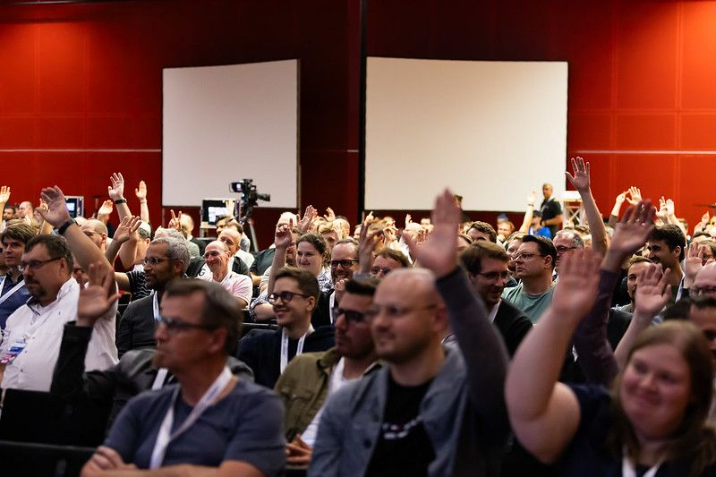

BASTA! Mainz 2023 has wrapped up, and what an extraordinary journey it has been! We can’t wait to share our impressions, highlights, and the incredible impact it had on the tech community in Germany and beyond.

### A Glance Back at BASTA! Mainz 2023

We just came back from the[ BASTA! Conference 2023](https://basta.net/), which is an incredible .NET event with over 600 in-person attendees and an additional 200+ tuning in virtually from across the globe. The buzz of excitement and anticipation in the air was undeniable, setting the stage for an unforgettable event for [ABP.IO](https://abp.io/).

As one of the proud sponsors, we set up our booth, engaged with attendees, and delved into a wide range of sessions, workshops, and keynotes to absorb the latest software development trends.

### Engaging with Enthusiastic Minds

As the lead developers of ABP Core Team, *[Alper](https://twitter.com/alperebicoglu)* and *[Ismail](https://twitter.com/ismcagdas)* presented the ABP.IO platform modules and features were quite busy enjoying their presenting work with latest version of demos. Alper also gave a great speech on “Building Multi-tenant ASP.NET Core Application & the ABP Framework” at the BASTA! Mainz conference.

We introduced **[ABP Framework](https://abp.io/)**, community-driven open-source web application framework, and **[ABP Commercial](https://commercial.abp.io/)**, our enterprise-ready web development platform that is built on top of the open-source ABP Framework to the crowds.

Apart from that, we were thrilled to give away the **[ABP Commercial Licenses](https://commercial.abp.io/pricing)** to the eager attendees on the venue, including the Raffle prize, **Meta Quest 2**, on our last day in BASTA! Conference.

We are profoundly satisfied with the huge interest and engagement shown by the attendees. The sense of community, collaboration, and shared passion for .NET solutions was palpable throughout the event.

### A Great Partnership with LIS GmbH

At BASTA! Mainz 2023, we were particularly thrilled to celebrate our collaboration with ***LIS GmbH***, a leading software solutions provider. This partnership added a unique dimension to the conference, brought us a fresh perspective to the conference, fostering innovation and opening up new avenues for attendees.

### A Big Thank-You from ABP Team

Now, a shout-out to BASTA! Mainz 2023. We want to thank to everyone who contributed to the success of this event – attendees, speakers, sponsors, and partners.The conference may have ended, but the knowledge gained, connections formed, and inspiration ignited will continue to shape the tech landscape for years to come.

Until next time!
