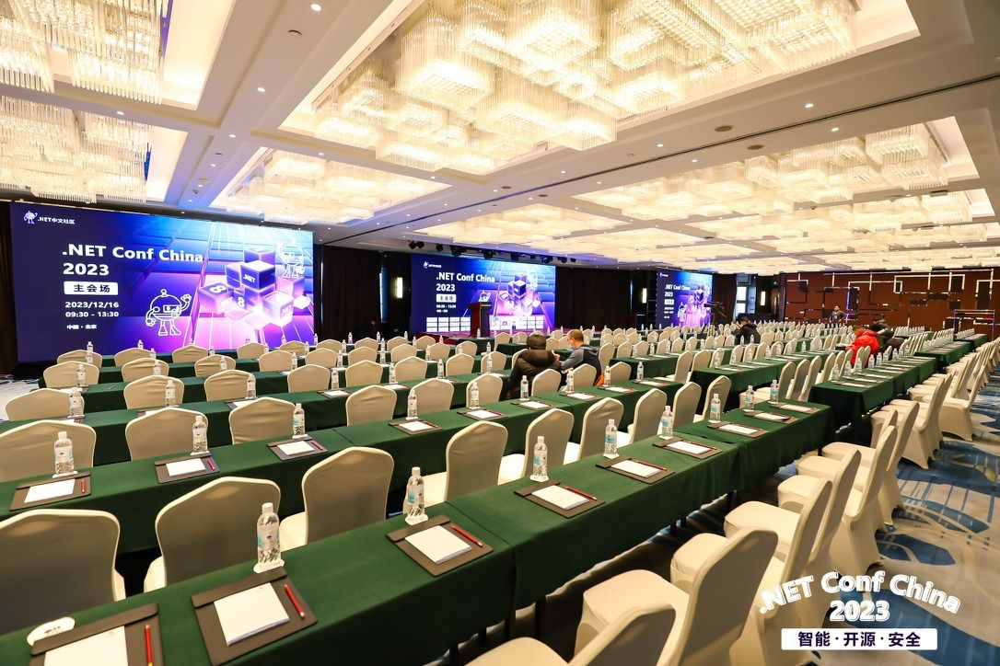
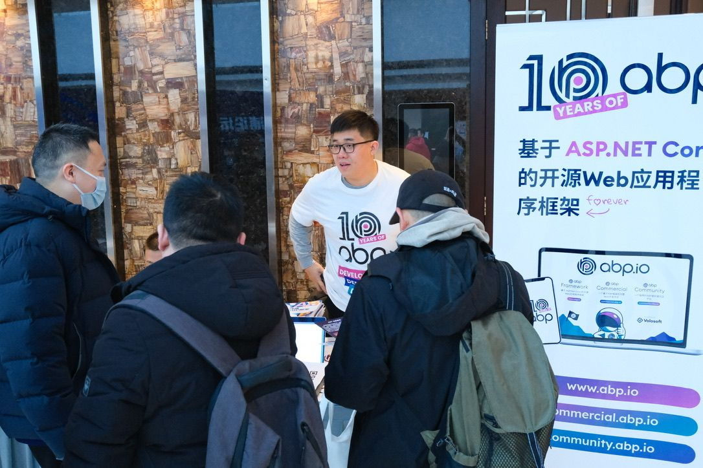
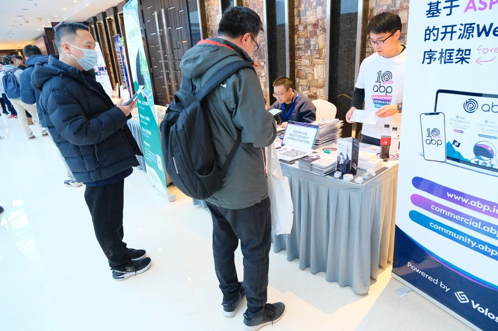
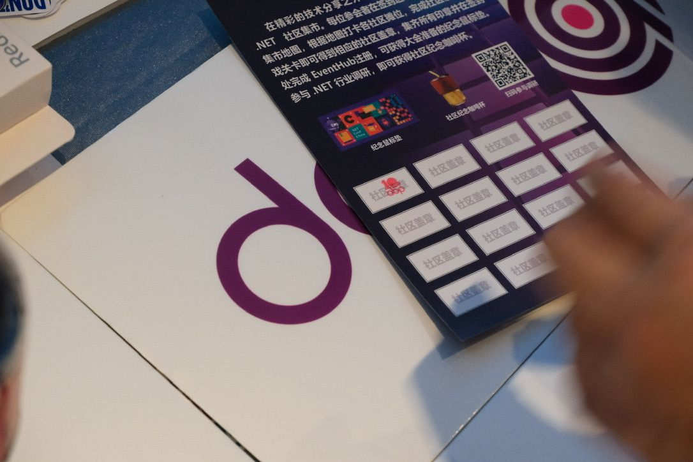
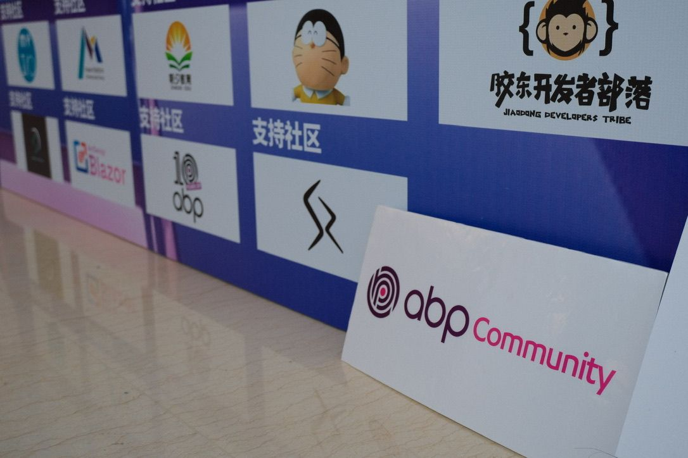

### .NET Conf China 2023

China's most influential .NET event officially kicked off on December 16, 2023. Although a heavy snowfall a few days ago impacted traffic, It did not stop the enthusiastic developers.

  The conference has invited 30+ technical experts from various fields to share the new features of .NET 8, full-stack Blazor, AI and .NET MAUI and other trend-setting technology highlights, focusing on the theme of Intelligent · Open Source · Security. In-depth discussion of artificial Intelligence, web development, front-end & security and other hot technical topics, and more .NET technical experts shared their valuable practical experience over the past year.






### As one of the community partners of .NET Conf China 2023

Our ABP.IO China team arrived at the venue much earlier than it started and was carefully prepared to welcome the developers.

At the event, we showed developers the latest news and related updates on ABP.IO. We also held face-to-face interactive conversations with multiple developers, including senior ABP developers, framework fans and ABP Commercial customers. We listened to everyone's feedback and discussed how to make ABP.IO better serve developers.








### As always, we have a raffle.

Including ABP Commercial's TEAM and PERSONAL licenses, [Halil İbrahim Kalkan](https://halilibrahimkalkan.com/)'s latest book **Mastering ABP Framework**, the ABP community's popular **Implementing Domain Driven Design** book, Bluetooth headset and other ABP peripheral brochures, stickers...






### Through this event,

We gained a lot and felt the enthusiasm and support of the developers community for ABP.IO. We will continue to work hard to provide better services for developers and contribute to the development of ABP.IO.

### See you at the next community event!


