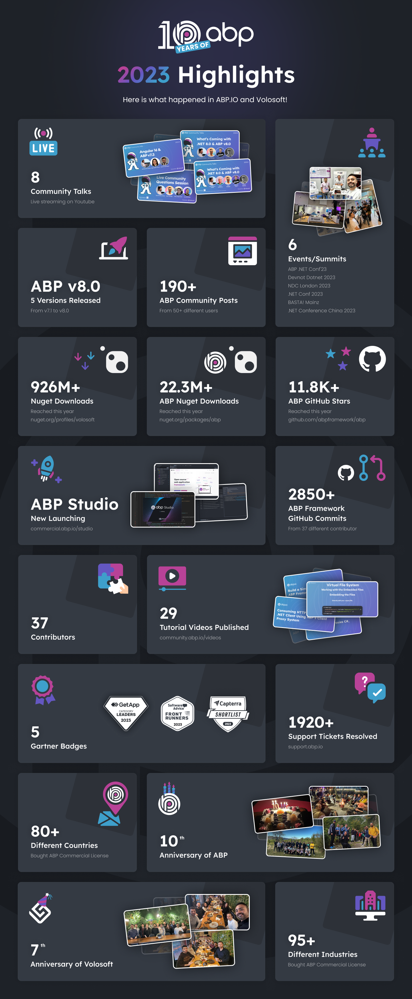

ABP.IO is a comprehensive platform that includes the open-source ABP Framework based on ASP.NET Core and its commercial solution designed on the .NET ecosystem. ABP.IO's purpose is to provide a robust infrastructure for developers to create modern web applications efficiently. As ABP.IO Core Team, we came to this day and are excited for the upcoming days thanks to the ever expanding ABP Community members.


We are grateful for ABP Community including the team members who put effort into making ABP what it is today and the community members for all their amazing support. On top of the achievements in 2022 we summed up in [ABP Year Review 2022 Wrap Up](https://blog.abp.io/abp/ABP-Year-Review-2022-Wrap-Up) blog post for 2022, we, as ABP, achieved even more great successes in 2023 with and thanks to all of you ABP Community members. This year, we remained transparent and committed to our values for trying to help the developers build their web applications efficiently with ABP Framework based on ASP.NET Core.


We will look into ABP.IO Platform 2023 milestones and wrap the year up in this blog post. Before we hop on to the ABP's recap, we'd like to mention the major highlights in .NET ecosystem which is the **release of .NET 8**. In ABP, it's worth mentioning before all that 2023 was the year we celebrated the **10th Year of ABP** and the first year ever we organized a full conference-**ABP .NET Conf'23**! Let's have a look at them and more.




### Anniversary


This year was a special year in which we celebrated the **10th Birthday of the ABP**! Looking back, a decade passed till the very first day of the ABP journey. Words are simply not nearly enough to describe our excitement and how surprised we are since it now feels like a blink aside from all the bitter and sweet moments of our journey. Take a look at the milestones we overcame with you and how the last decade went in [Celebrating ABP's DDD: A Decade Dedicated to Development](https://blog.abp.io/abp/Celebrating-ABP%2527s-DDD%253A-A-Decade-Dedicated-to-Development). We dedicated a full 3-day weekend to celebrate the 10th birthday of ABP with our team. [Take a peak at the 1-minute-video from that weekend](https://youtube.com/embed/LxMqIVNHKOk).

In addition to our celebration, we created ABP Framework swag shop that includes a limited-time swag items that have ABP's special 10th Year logo on them.

If you would like to get your Limited-time ABP 10th Year Swag from


* European Union Store, [visit ABP Framework EU Store](https://abpframework-eu.myspreadshop.net)

* United States Store, [visit ABP Framework US Store](https://abpframework-us.myspreadshop.com)


It was the **7th birthday of Volosoft**, the company behind the ABP platform. We are proud and excited for the many years to come with the amazing team and many more valuable people to come and join to our team!


### Events


We give significant importance to giving back .NET and the overall software development industry. This year was our most active year in the events part of it, because, we not only sponsored to events this year but also **organized** one.


* **[ABP .NET Conf'23](https://abp.io/conference/2023)** ABP .NET Conference 2023 took place online on May 10, 2023 and each talk is published in [ABP DOTNET Conf'23 Playlist](https://www.youtube.com/playlist?list=PLsNclT2aHJcPTA3D4fIF10fsbhbckEbBC) publicly available on YouTube. Anyone was invited to the event as we mentioned in our [You Are Invited to ABP .NET Conf'23!](https://blog.abp.io/abp/You-Are-Invited-to-ABP-dotNET-Conf23) along with our excitement. It was a truly remarkable experience we got to taste for the first time and got a significant interest. You can read all the statistics in [ABP .NET Conference 2023 Wrap Up](https://blog.abp.io/abp/ABP-.NET-Conference-2023-Wrap-Up) along with our gratitude. Here is a known secret: we plan to do it on a yearly basis!


In addition to organizing our own .NET event, we, of course, also sponsored 5 events in 2023. Here is the list of the events we sponsored:


* **[NDC London](https://ndclondon.com/)** is an event we have sponsored almost every year they have organized since 2018. This year, we announced we will sponsor NDC London again in [this announcement blog post](https://blog.abp.io/abp/ABP.IO-is-sponsoring-NDC-London-2023) and a [Recap of the NDC London 2023 here](https://blog.abp.io/abp/What%E2%80%99s-NEW-in-NDC-London-2023).

* **[Devnot Dotnet 2023](https://dotnet.devnot.com/)** is an event we sponsored as Volosoft Company, you can find how it went in [this blog post](https://volosoft.com/Blog/Reflecting-on-Devnot-Dotnet-Conference-2023).

* **[BASTA! Mainz 2023](https://basta.net/mainz-en/)** is the event we sponsored for the first time this year. We were so excited and published a blog post announcing [ABP.IO is sponsoring BASTA! Mainz](https://blog.abp.io/abp/ABP.IO-is-sponsoring-BASTA!-Mainz-2023) and a [Recap of BASTA! Mainz](https://volosoft.com/blog/BASTA-Mainz-2023-What-a-Blast-in-Germany) from our perspective of this amazing event.

* **[.NET Conf 2023](https://www.dotnetconf.net/)** was another online blast we experienced this year to be a sponsor of. We were happy to give ABP Commercial gifts as a form of our thanks to the biggest virtual .NET Conference audience.

* **[DOTNET Conf China 2023](https://chinaevent.microsoft.com/events/details/5f625a2b-206c-4838-b2af-079b3ea27270)** in another part of the usual .NET Conferences but is offering an in-person, therefore, as much amazing platform as the virtual one as a conference. This year, we sponsored .NET Conference China and had a great time there. You can read about the Recap of [ABP at China .NET Conf 2023](https://blog.abp.io/abp/ABP-at-China-NET-Conf-2023).


### Community Talks


[ABP Community Talks](https://community.abp.io/events#abp-community-talks) is the monthly live event where we gather to talk and share ideas about the latest news about ABP Framework and overall .NET-related topics in an hour with ABP Community members and a spontaneous appearance of famous .NET names such as Jon Galloway, Joseph Guadagno, Steve Sanderson, etc. This year, we organized **8 ABP Community Talks episodes** about several topics and shared some insights while being interactive with the ABP Community. [Watch ABP Community Talks from its YouTube Playlist](https://www.youtube.com/playlist?list=PLsNclT2aHJcOsPustEkzG6DywiO8eh0lB) and don't forget to [subscribe to our YouTube Channel](https://www.youtube.com/@volosoft) and open the alerts to learn about the upcoming episodes. While you are at it, you are more than welcome to take a look at the resourceful videos we published, as well. 🙂


### NuGet Downloads


NuGet is a package manager designed specifically for the .NET ecosystem. It simplifies the process of creating and consuming packages, thanks to the NuGet client tools. By using these tools, developers can easily manage their project dependencies and improve their workflow.

In 2023, [ABP Core NuGet package](https://www.nuget.org/packages/Volo.Abp.Core/6.0.2) reached more than **22.3 million** of downloads!

On the other hand, overall [Volosoft NuGet Profile](https://www.nuget.org/profiles/volosoft) reached **almost a billion** downloads!


Thank you all for your interest and support towards ABP and overall Volosoft Packages.


### ABP Community Posts


[ABP Community](https://community.abp.io/) is a hub for ABP Framework, .NET and software development. There are articles, videos, events and many more within ABP Community resources. In 2023, only the articles reached up to **almost 200 posts** on top of the videos and events. You can find each resources from the given links below.


* [ABP Community Events](https://community.abp.io/events)

* [ABP Community Articles](https://community.abp.io/posts)

* [ABP Community Videos](https://community.abp.io/videos)

* [ABP Community Raffles](https://community.abp.io/raffles)


### ABP Framework on GitHub


This year was yet another year we shine with [ABP Framework GitHub Repository](https://github.com/abpframework/abp)'s **11.8k stars**!

We appreciate **precisely 100 different [ABP contributors](https://github.com/abpframework/abp/graphs/contributors)** dedicated their valuable time to contribute to make ABP Framework better. In 2023, ABP Framework got **[more than 2850 commits](https://github.com/abpframework/abp/graphs/commit-activity) from 37 different contributors**. Your hard work and effort worth a million thanks, if nothing! We are grateful for each and every one of you and embrace more ten thousands of stars we will gain together with more hundreds of ABP Framework Contributors in the near future.


### ABP.IO Platform Version Releases


ABP Framework released 5 versions from 7.1 to 8.0 in 2023. You can check the release logs from [ABP Framework Release Logs](https://github.com/abpframework/abp/releases).


The most important milestone in these releases is that we upgraded ABP Framework to .NET 8 in [ABP v8.0](https://blog.abp.io/abp/abp-8-0-stable-release-with-dotnet-8-0).


### Video Tutorials


In 2023, we published **29 tutorial videos** on top of the 48 videos from last year. We gathered them in [ABP.IO Video Courses](https://abp.io/video-courses) for you to watch free on ABP.IO to learn more about the ABP Framework Essentials and simplify your ABP Platform Journey according to your interests. You can find more videos on [Volosoft's YouTube Channel](https://www.youtube.com/c/@volosoft).


### ABP Commercial


2023 was the year for ABP Commercial to shine along with ABP Framework in which more than **80 countries** in the world bought a license which cumulated the customer base of ABP Commercial up to **more than 120 countries**! With this math, it's now safe to say that ABP Commercial is helping streamline the application development processes of businesses from **more than half of the world**!


* This year, businesses that are active in **more than 95 different industries from more than from 80 countries** accelarated their app development with ABP Commercial

* We performed **293 hours** of [Live ABP Training](https://commercial.abp.io/trainings) to help ABP Framework and ABP Commercial users to perfect their development skills

* Our talented support team solved **more than 1920 support tickets** in 2023.


#### New launch: ABP Studio


We were preparing [ABP Studio](https://commercial.abp.io/studio) as a whole new launch for more than a year. 2023 was the year we matured it enough to finally share it with you and share our excitement with all of you! It was a thrill for our Co-Founder [Halil İbrahim Kalkan](https://github.com/hikalkan) to mention about it for the first time in [ABP .NET Conf'23](https://abp.io/conference/2023) with his talk on [Kubernetes Integrated Microservice Development with ABP Studio](https://youtu.be/XiPRcIHJ3NE?si=3FlfJRbbi5D15s9U). Then, we prepared [ABP Studio's dedicated page](https://commercial.abp.io/studio) and shared its details for you to check out and test it out in the Beta version which is AVAILABLE NOW. You can [visit ABP Studio page and request a Beta Access from there](https://commercial.abp.io/studio). Here are some key resources for ABP Studio aside from its page:


* [ABP Studio Documentation](https://docs.abp.io/en/commercial/latest/studio/index)

* [ABP Community Talks 2023.8: What's Coming with ABP 8 & .NET 8 - ABP Studio Part](https://www.youtube.com/watch?v=yo2L1xGa2pM&amp;t=3250s)

* [Demo: Running and Developing Microservice Applications with ABP Studio Kubernetes Integration](https://www.youtube.com/watch?v=CeUq2ysz-mQ)

* [Demo: Running and Developing Microservice Applications with ABP Studio Solution Runner](https://www.youtube.com/watch?v=sSCxyccoHqE)

* [Kubernetes Integrated Microservice Development with ABP Studio \| ABP \.NET Conference 2023](https://youtu.be/XiPRcIHJ3NE?si=3FlfJRbbi5D15s9U)


## Gartner Badges


[Gartner](https://www.gartner.com/en) is a research and consultant company for IT industry, one of the biggest companies in their area. You might have heard Magic Quadrant, Capterra, GetApp, etc. Those are all Gartner's works. This year, we earned **5 Gartner badges** for ABP Commercial which makes us more successful than 2022 in which we earned 2 badges([Application Development Front Runner of Software Advice](https://blog.abp.io/abp/abpcommercial-2022-front-runner-in-app-development-category) and [Application Develompent Category Leader of GetApp](https://blog.abp.io/abp/abpcommercial-2022-category-leader-in-app-development-category)) from Gartner.


* Capterra Shortlist 2023 in App Building Category

* GetApp Category Leader 2023 in App Building Category

* GetApp Category Leader 2023 in Application Development Category

* Software Advice Front Runner 2023 in App Building Category

* Software Advice Front Runner 2023 in App Development Category

    You can learn more about the each Gartner Badges in our recently published blog post, [ABP Commercial Won 5 Recognitions from Gartner in 2023](https://blog.abp.io/abp/ABP-Commercial-Won-5-Recognitions-from-Gartner-in-2023).


To show our appreciation, we generated a set of links that rewards your review for ABP Commercial product in your local Amazon Store!


* [Leave a review for ABP Commercial & ](https://reviews.capterra.com/products/new/8b6f9777-574b-42c6-9902-c045b585ab7c/07a1ac5a-4658-4552-a87d-5f4e1089fee9?lang=en)**[get $10 gift card](https://reviews.capterra.com/products/new/8b6f9777-574b-42c6-9902-c045b585ab7c/07a1ac5a-4658-4552-a87d-5f4e1089fee9?lang=en)**

* [Leave a review for ABP Commercial & ](https://reviews.capterra.com/products/new/8b6f9777-574b-42c6-9902-c045b585ab7c/30b5d7f2-d0c5-4b38-b968-2dc5601aa196?lang=en)**[get £10 gift card](https://reviews.capterra.com/products/new/8b6f9777-574b-42c6-9902-c045b585ab7c/30b5d7f2-d0c5-4b38-b968-2dc5601aa196?lang=en)**

* [Leave a review for ABP Commercial & ](https://reviews.capterra.com/products/new/8b6f9777-574b-42c6-9902-c045b585ab7c/8fd7b0e8-e4e1-487a-96d6-88f70c14128c?lang=en)**[get €10 gift card](https://reviews.capterra.com/products/new/8b6f9777-574b-42c6-9902-c045b585ab7c/8fd7b0e8-e4e1-487a-96d6-88f70c14128c?lang=en)**

* [Leave a review for ABP Commercial & ](https://reviews.capterra.com/products/new/8b6f9777-574b-42c6-9902-c045b585ab7c/f6ee291b-f48f-4821-ac3a-606b7e6af005?lang=en)**[get 1500.0¥](https://reviews.capterra.com/products/new/8b6f9777-574b-42c6-9902-c045b585ab7c/f6ee291b-f48f-4821-ac3a-606b7e6af005?lang=en)**