As ABP.IO team, we just got back from our amazing trip with [NDC London](https://ndclondon.com/) and would love to share a recap of this amazing conference. It was the 5th time in a row we were a proud sponsor of NDC London. It, now, basically feels like home spending 3 days in Queen Elizabeth Centre II with NDC London for the [ABP.IO](https://abp.io/) team to be there.

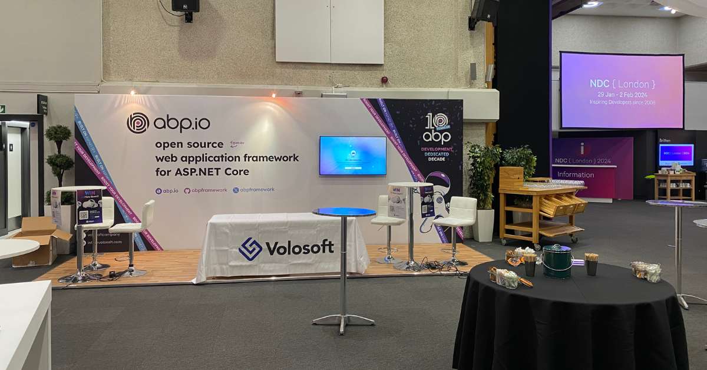

This year, we were there with Lead Developers of ABP.IO Platform [Halil Ibrahim Kalkan](https://community.abp.io/members/hikalkan) and [Alper Ebicoglu](https://community.abp.io/members/alper) -as usual- and also ABP.IO Core team members, [Engincan Veske](https://community.abp.io/Members/EngincanV) and [Bige Besikci Yaman](https://community.abp.io/Members/bigebesikci).



These 3 days with the team was all about chatting and having fun with amazing attendees and speakers. We met with talented and passionate software developers and introduced the [open source ABP Framework](https://github.com/abpframework/abp) - web application framework built on ASP.NET Core and [ABP Commercial](https://commercial.abp.io/) - the complete web application development platform built on open source ABP Framework to them. We also had a chance to reunite with some of the regulars as us and talked about the latest updates on .NET and ABP.IO Platform.

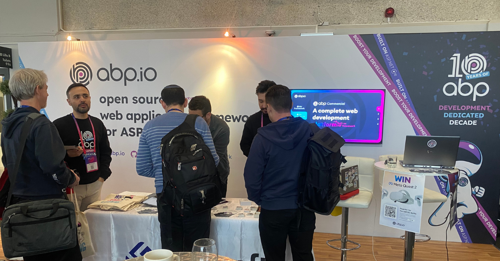

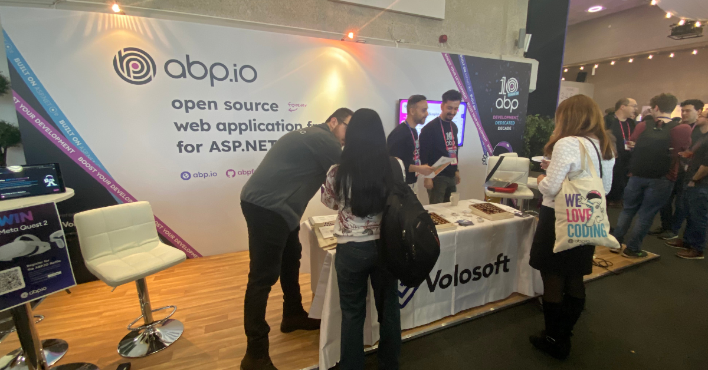

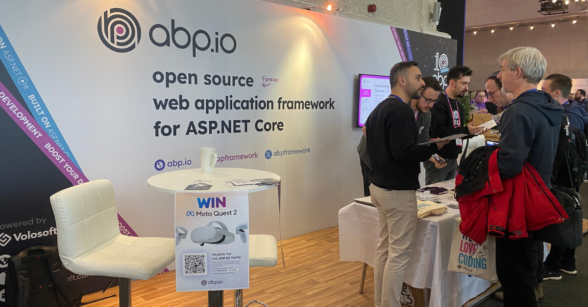

It wasn't all about learning but always fun and games with all the attendees. We love to show our hospitality with hand-made chocolates; enjoy the small-but-useful gadgets as well as the beneficial items such as books and of course the funny stickers. This year was no different.
We had delicious hand-made chocolates we brought all the way to London as always and didn't forget to enjoy them as we go through the days!
Attendees got to test their .NET knowledge with an easy quiz and left our booth with their TWS earphones.
As for the benefits and efficiency, we gave [Implementing DDD e-book](https://abp.io/books/implementing-domain-driven-design)'s paperback written by the Lead Architecture of ABP Framework - Halil Ibrahim Kalkan to the .NET developers. Because, what better gift than a book?

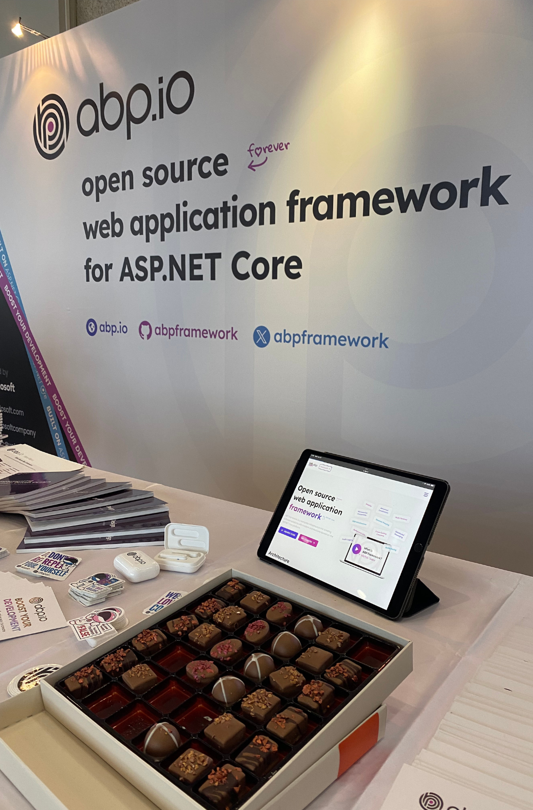

As usual, we draw a raffle on the last day for Meta Quest 2 prize. Congratulations to our winner, Christian Wattengard.

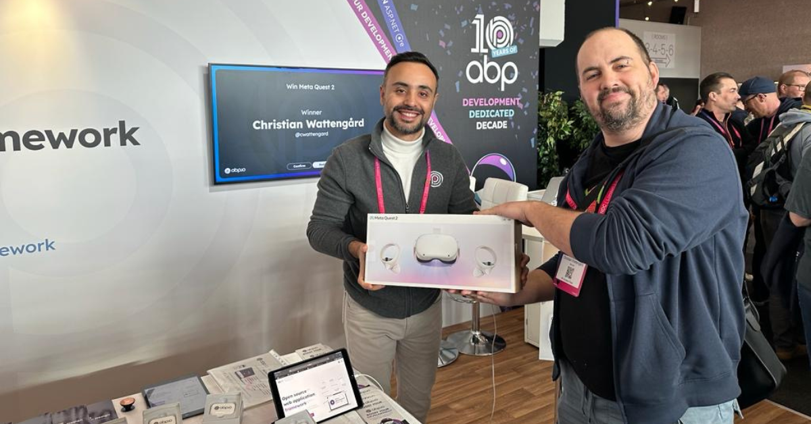

 <iframe width="560" height="315" src="https://www.youtube.com/embed/rsSQI8iJEgY?si=LdO7PwgYeiB4MTTG" title="YouTube video player" frameborder="0" allow="accelerometer; autoplay; clipboard-write; encrypted-media; gyroscope; picture-in-picture; web-share" allowfullscreen></iframe>


NDC London was - once again - full of insightful talks with 110 sessions and 100+ speakers. You can find some highlights from those talks below.

## First Day of NDC London
#### "Keynote: Debug your thinking" by [Laila Bougria](https://twitter.com/noctovis)
She showed how crucial it is to make good decisions in software development, more than just picking the right tech. She set an example of how she improved her way of thinking, pushing for a methodical way to make decisions that result in better, more well-rounded solutions. She encouraged everyone to think deeply and improve their problem-solving skills to come up with better software solutions.

#### "Real-Time Connected Apps with .NET MAUI, Blazor, and SignalR" by [Gerald Versluis](https://twitter.com/jfversluis)
He kicked off one of the first sessions by talking on how to build apps that update instantly using SignalR, .NET MAUI, and Blazor. He broke down the basics of SignalR and showed off its capabilities with some cool demos, showing how apps on phones and the web can work together in real time. His talk was all about making apps that work together smoothly and keep users engaged.

#### "You are doing logging in .NET wrong. Let’s fix it" by [Nick Chapsas](https://twitter.com/nickchapsas)
He talked about how important logging is for finding and fixing problems in apps that are already out there. He pointed out the usual mistakes people make when logging in .NET and showed how to fix them. His advice aimed to make logging more effective.

#### "Architecture Modernization: Aligning Software, Strategy, and Structure" by [Nick Tune](https://twitter.com/ntcoding)
He  warned about the dangers of sticking with old software architectures, which can stop a business from growing. He argued for updating software architectures to stay competitive, helping businesses move faster and grow bigger.

## Second Day of NDC London
#### "Distribu-ready with the Modular Monolith" by [Layla Porter](https://twitter.com/laylacodesit)
She tackled the excitement and problems with distributed systems and microservices. She introduced the Modular Monolith as a smarter way to prepare for growth without making things too complicated. She explained how this approach keeps things simpler but still ready for the future.

#### "How to effectively spy on your systems" by [Laila Bougria](https://twitter.com/noctovis)
In her second talk of NDC London after the Keynote on the first day, she explained how to keep an eye on complex systems using OpenTelemetry. She talked about the hurdles of making sure you can watch over your systems effectively and shared tips on picking the right tools, keeping costs down, and setting up your system for the best oversight. Her talk aimed to give a full picture of how to monitor systems well.

#### "Tales from the .NET 8 Migration Trenches" by [Jimmy Bogard](https://twitter.com/jbogard)
He shared his experience with updating a .NET 4.8 app to .NET 8, without starting from scratch. He gave advice on how to move parts of an app to newer versions bit by bit, while still keeping everything running. His focus was on how to update common parts of apps, like databases and messaging, with practical tips from real projects.

#### "CS Fundamentals: Why SSL and SSH are Secure" by [Jon Skeet](https://twitter.com/jonskeet) and [Rob Conery](https://twitter.com/robconery)
They took a close look at the RSA algorithm, a key piece of technology that keeps online communication secure and talked about why it's so important as well as its history, and even showed how it works, all while sharing interesting stories.

## Third and the Last Day of NDC London
#### "How GitHub delivers GitHub using GitHub" by [April Edwards](https://twitter.com/TheAprilEdwards)
She shared how Microsoft's engineering teams have become more agile, going from releasing new versions every three years to every three weeks. She also explained how GitHub uses its own tools to build and improve itself. In her talk, she compared the agile journeys of Microsoft and GitHub, showing how they deliver software quickly and efficiently.

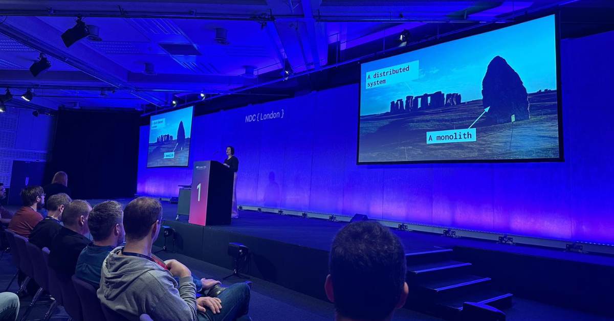

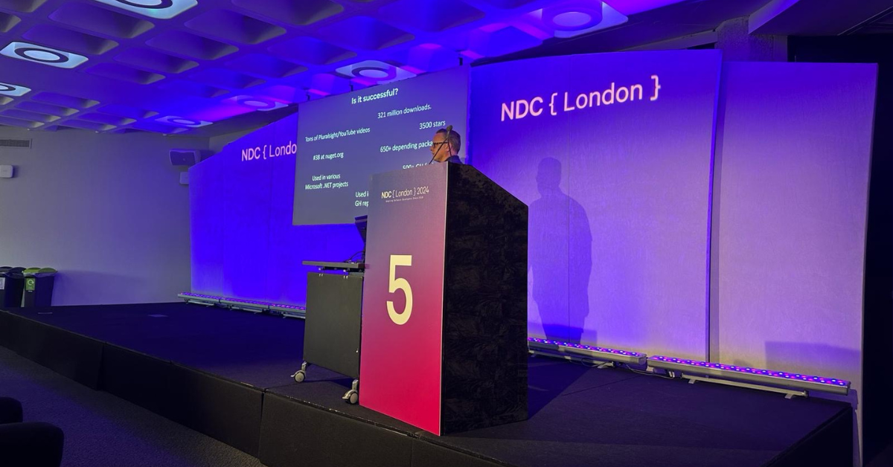

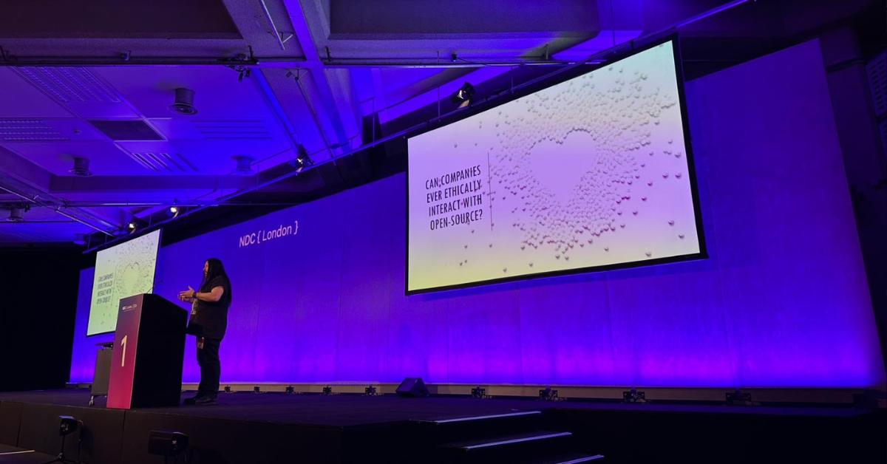

## The fun part of the NDC London
The expo area on the third floor of Queen Elizabeth II Centre was also full of fun in all aspects. There were a variety of delicious food and the place hosted a yet another great party with delicious cocktails. We didn't forget to have fun and had our bellies full at all times!

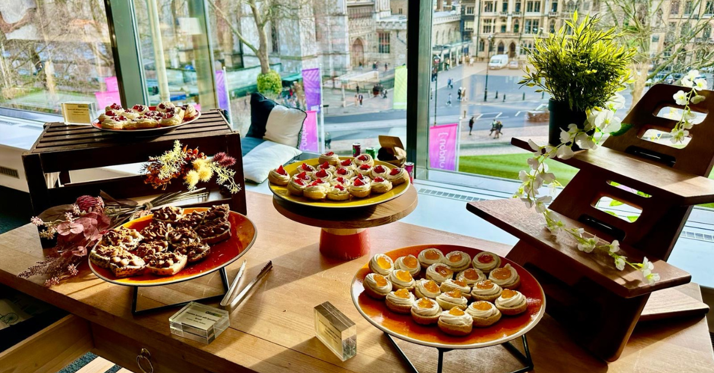
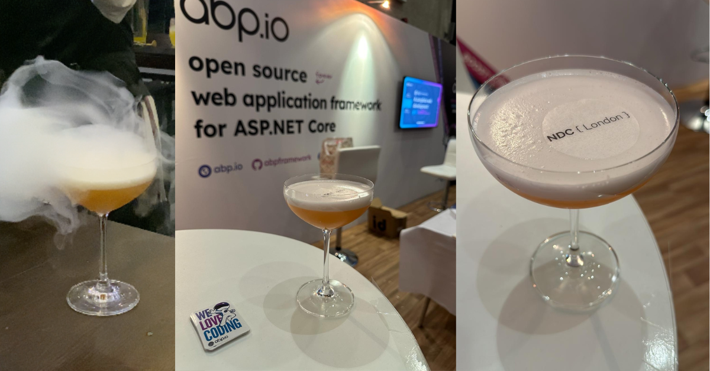

Last but not least, let's take a look around in Queen Elizabeth II Centre and re-live the expo area of NDC London atmosphere.

 <iframe width="560" height="315" src="https://www.youtube.com/embed/pzHYHJR6Sm8?si=LL0xVvYSOF3vhLQc" title="YouTube video player" frameborder="0" allow="accelerometer; autoplay; clipboard-write; encrypted-media; gyroscope; picture-in-picture; web-share" allowfullscreen></iframe> 


Thank you all for visiting our booth and the amazing chat you cherished our 3 days with.
We will see you all on the next one! :)

To see how the past 4 NDC London sponsorships went, check out:
* [NDC London 2023 - Sponsored for the 4th time](https://volosoft.com/blog/NDC-London-2018-Impressions)
* [Recap: NDC {London} 2020 Software Developers Conference](https://volosoft.com/blog/Recap-NDC-London-2020-Software-Developers-Conference)
* [Impressions of NDC London 2019](https://volosoft.com/blog/Impressions-of-NDC-London-2019)
* [NDC London 2018 Impressions](https://volosoft.com/blog/NDC-London-2018-Impressions)