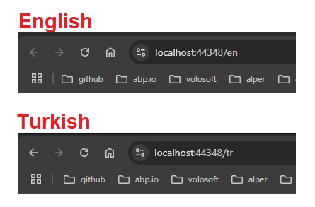

# URL-Based Localization

In this article I'll show you how to optimize your ABP website localization with a URL parameter. URL Paths are commonly being used to change the current UI culture. This method makes our website SEO-Friendly as you structuring the URLs for multiple languages. And you can also share the link of your website with a specific language. Let's see implementing multi-language support with URL parameters in an ABP project.




## Mastering Website Localization: Language Codes in URLs Explained

Enhancing UX with URL-Based website localization is mainly done with ASP.NET Core's routing system. Also we need to automatically redirect the links without language code parameter. Our URL structures for the localization will be as following:

- https://mywebsite.com/en/dashboard  (English)
- https://mywebsite.com/tr/dashboard (Turkish)


## Routing

Before starting to explain how to do this, you can see [this commit](https://github.com/salihozkara/MultiLangRoute/commit/09e40cfd751562dec0dab890e54e0c5ca9ee256c) which implements this functionality. The routing module consists of these fundamental classes:

### 1. **MultiLanguageSupportMetaData.cs**

This class is used to add a language parameter to route templates. For example, it changes the `/about` route to `/language/about`.

### 2. **MultiLanguageRedirectRequiredMetaData.cs**

This class is used to redirect users to the correct language version. If a user visits the `/about` page and the current culture is `"tr-TR"`, this class will redirect them to `/tr-TR/about`.

### 3. **UrlNormalizer.cs**

This static class is used to normalize URLs by adding language information and improving performance using caching.

```csharp
public static string NormalizeUrl(EndpointDataSource endpointDataSource, HttpContext httpContext, string url)
{
    // Normalize the URL and cache it
    return Cache.GetOrAdd(url, (key) =>
    {
        var absoluteUrl = GetAbsoluteUrl(key);
        var multiLanguageRedirectRequiredMetaData =
            GetMultiLanguageRedirectRequiredMetaData(endpointDataSource, absoluteUrl);
        return multiLanguageRedirectRequiredMetaData?.ReBuildUrl(httpContext, key) ?? key;
    });
}
```

### 4. **MyLinkGenerator.cs**

This class extends ASP.NET Core’s `LinkGenerator` class to automatically add language information to all generated links.

### 5. **MyRouteDataRequestCultureProvider.cs**

This class determines the current culture using the language parameter in the URL. For example, it extracts the `"tr-TR"` culture from the `/tr-TR/about` URL.

### 6. **RoutingMiddleware.cs**

This middleware processes HTTP requests and redirects users to the correct language version when necessary.

```csharp
public override Task InvokeAsync(HttpContext context, RequestDelegate next)
{
    var endpoint = context.GetEndpoint();
    if(endpoint is not RouteEndpoint)
    {
        return next(context);
    }
    
    // Redirect if necessary
    var redirectMetaData = endpoint.Metadata.GetMetadata<IRedirectMetaData>();
    if (redirectMetaData is not null)
    {
        redirectMetaData.Redirect(context);
        return Task.CompletedTask;
    }

    // ...
}
```


## CultureAnchorTagHelper.cs

This **Tag Helper** processes `<a>` tags in a Razor page and automatically adds language information to URLs if it's missing.

```csharp
[HtmlTargetElement("a", Attributes = "href", TagStructure = TagStructure.NormalOrSelfClosing)]
public class CultureAnchorTagHelper(EndpointDataSource endpointDataSource, IHttpContextAccessor contextAccessor)
    : TagHelper, ITransientDependency
{
    public override void Process(TagHelperContext context, TagHelperOutput output)
    {
        var href = output.Attributes["href"].Value.ToString();
        if (href != null)
        {
            output.Attributes.SetAttribute("href",
                UrlNormalizer.NormalizeUrl(endpointDataSource, contextAccessor.HttpContext!, href));
        }
    }
}
```

**How This Tag Helper Works:**

- Finds all `<a href="...">` tags within your Razor pages.
- Retrieves the `href` attribute of each link.
- Uses the `UrlNormalizer.NormalizeUrl()` method to normalize the URL with the current culture information.
- Replaces the original URL with the normalized one.

For example, if the current culture is `"tr"` and a page contains `<a href="/about">`, this Tag Helper will transform it into `<a href="/tr-TR/about">`.


## Sample Project

Salih Özkara from ABP team created a sample working project which implements URL localization. He used ABP free tier MVC template and MongoDB. You can check out the related commit which implements URL localization: 

https://github.com/salihozkara/MultiLangRoute/commit/09e40cfd751562dec0dab890e54e0c5ca9ee256c

And full working demo is available at: 

https://github.com/salihozkara/MultiLangRoute

You can download the demo project at:

[UrlLocalizationSampleProject.zip](https://github.com/abpframework/abp/blob/634ff52fb07d0b1281640695dbeffccdc943ca53/docs/en/Community-Articles/2024-03-05-URL-Based-Localization/UrlLocalizationSampleProject.zip)


## Summary

This implementation extends ASP.NET Core’s routing mechanism and utilizes caching for improved performance. It ensures multilingual support by normalizing URLs, redirecting users to the appropriate language version, and automatically handling language-specific links.

