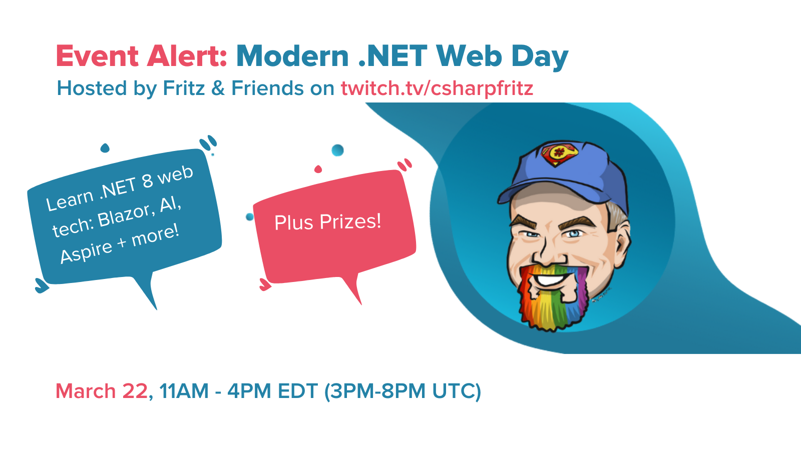

**[ABP.IO](https://www.abp.io/)** is proud to announce our sponsorship of the upcoming **"Modern .NET Day"** event hosted by **[Jeff Fritz](https://twitter.com/csharpfritz)** and Friends, set to take place on Twitch. As one of the sponsors, we are excited to contribute to this enriching experience for .NET fellows worldwide.

### Exclusive Offer

As a swag bag sponsor, ABP.IO is delighted to give away 15 FREE tickets to the highly anticipated **[ABP Dotnet Conf’24](https://abp.io/conference/2024)**, scheduled on ***May 8-9***. Sign up for "Modern .NET Web Day" and enter for a chance to win this valuable ticket, paving the way for your next fun journey in the world of dotnet.


### Topics to be Discussed

Join us dive into the magic of .NET 8 at the community live stream event, "Modern .NET Web Day." Prepare to immerse yourself in the latest advancements, from the new Blazor features to revolutionary AI-driven productivity boosts in web development projects. 
Topics that will be covered include:

* *ASP.NET Core*: Crafting Maintainable Microservices
* *Cloud Native development with .NET Aspire*
* *Developer Productivity with Visual Studio and .NET*
* *GitHub Copilot configuration, extension, tips and tricks*
* *User Experience and Front-End Development*: Delve into responsive design, accessibility, and performance optimization. Discuss modern front-end frameworks (Blazor, React, Angular, etc.) in the .NET ecosystem. Share strategies for creating delightful user interfaces.

Don't miss out on this opportunity to gain invaluable insights and strategies for creating exceptional user interfaces. Mark your calendars for "Modern .NET Web Day" and join us for an unforgettable experience!

***

📌 **Date:** March 22nd

⏰ **Time:** 11 AM - 4 PM ET ( 3 - 8 PM UTC )

📺 **Where:** [Twitch (twitch.tv/csharpfritz)](https://www.twitch.tv/csharpfritz)

***

[Register now ](https://www.mobilize.net/modern-dotnet-web-day)to join us. We look forward to seeing you there!