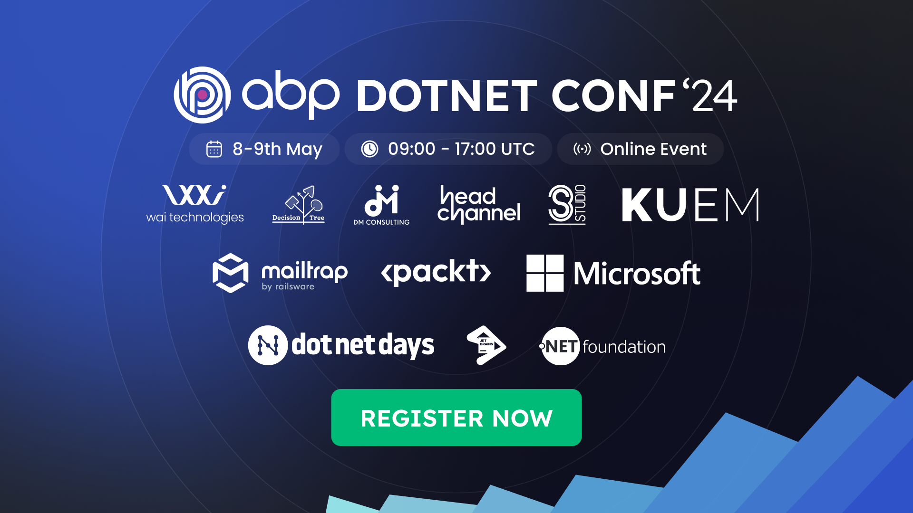

🌟Hey .NET community!

We are excited to invite you to join us for the **[ABP Dotnet Conference 2024](https://abp.io/conference/2024)**, taking place online on **May 8-9, 2024**! As we celebrate the 10th anniversary of the **[ABP.IO](https://www.abp.io/)**, sign up for an expanded two-day event packed with even more engaging workshops & talks that promises to deepen your expertise and expand your connections within the .NET ecosystem.

Building on the success of last year’s event [ABP Dotnet Conf'23](https://abp.io/conference/2023), we are more than excited to bring together passionate developers, renowned speakers, and industry leaders from across the globe once again, for industrial knowledge, inspiration, and networking opportunities.



## Why Attend?

**[ABP Dotnet Conf'24](https://abp.io/conference/2024)** offers a unique blend of learning and networking opportunities tailored for the .NET community.

**Industry-Leading Speakers:** Gain insights from pioneers and innovators in the .NET landscape. Expect practical advice, forward-thinking strategies, and inspiring stories that can move your projects and career forward.

  
**Engaging Formats:** From engaging workshops to enlightening keynote & insightful talks, experience a variety of session formats designed to fit in all levels of expertise. Special highlights include workshops on modern .NET technologies and a keynote that explores career growth through creative practices.

**Interactive Networking:** Embrace the full conference experience online with features designed to reach the most aspects of in-person events. Engage with experts and peers through live Q&As, virtual meet-ups, and interactive chat rooms.




## Speakers & Agenda

As we always be careful with topics we choose on our regular **[ABP Community Talks](https://community.abp.io/events)**, to ensure a great experience for our audience, the same effort behind, for our **[ABP Dotnet Conf’24](https://abp.io/conference/2024)**, we have thoughtfully selected topics and expert speakers to deliver sessions filled with deep insights and inspiration. Our speakers for the **[ABP Dotnet Conference 2024](https://abp.io/conference/2024)**, chosen for their deep expertise, are set to deliver sessions that promise both inspiration and in-depth knowledge to all our attendees. See the crafted **Workshops & Talks** agenda overview:


📌 **Day 1 Workshops - May 8th** 📌

* 🎙️[Johan Smarius](https://abp.io/conference/2024/speakers/johan-smarius), Building a GraphQL Server in .NET 8
* 🎙️[Wojciech Krasa](https://abp.io/conference/2024/speakers/wojciech-krasa), Testing framework with PostgreSQL and Testcontainers for .NET
* 🎙️[Ahmet Faruk Ulu](https://abp.io/conference/2024/speakers/ahmet-faruk-ulu), ABP Framework Essentials: Crafting Your SaaS Success Story 
* 🎙️[Alberto Acerbis](https://abp.io/conference/2024/speakers/alberto-acerbis) &  [Ferdinando Santacroce](https://abp.io/conference/2024/speakers/ferdinando-santacroce), Tackling Chaos, Resilience & Metrics in the heart of your Application
* 🎙️[Omkar Choudhari](https://abp.io/conference/2024/speakers/omkar-choudhari) & [Aman Sharma](https://abp.io/conference/2024/speakers/aman-sharma), Building your own copilot with ABP chat module
* 🎙️[Stefan Pölz](https://abp.io/conference/2024/speakers/stefan-polz), Let's Build an incremental source generator with Roslyn
* 🎙️[Ryan Niño Dizon](https://abp.io/conference/2024/speakers/ryan-nino-dizon), Building a Serverless Backend API with Azure Functions
* 🎙️[Kaushik Gokhale](https://abp.io/conference/2024/speakers/kaushik-gokhale) & Omkar Choudhari, React ♥ ABP: Next-Level Frontend Workshop for 3x Acceleration
* 🎙️[Rebai Hamida](https://abp.io/conference/2024/speakers/rebai-hamida), Build containerized application using Docker and Azure



📌 **Day 2 Talks - May 9th** 📌

* 🎙️[Hannes Lowette](https://abp.io/conference/2024/speakers/hannes-lowette), Keynote: Manage your career, the Mario Kart way
* 🎙️[Engincan Veske](https://abp.io/conference/2024/speakers/engincan-veske), Sentiment Analysis in .NET
* 🎙️[Jessica Engström](https://abp.io/conference/2024/speakers/jessica-engstrom), Practical tips to improve your UX and accessibility
* 🎙️[Irina Scurtu](https://abp.io/conference/2024/speakers/irina-scurtu), .NET gRPC - deep dive
* 🎙️[Dino Esposito](https://abp.io/conference/2024/speakers/dino-esposito), In Defense of ASP.NET and Server-side Web
* 🎙️[Alexej Sommer](https://abp.io/conference/2024/speakers/alexej-sommer), Security for ASP.NET developers
* 🎙️[Adora Nwodo](https://abp.io/conference/2024/speakers/adora-nwodo), Designing Secure Cloud Native Apps with .NET and Azure
* 🎙️[Nicola Iarocci](https://abp.io/conference/2024/speakers/nicola-iarocci), C# 12 What's new and interesting
* 🎙️[Jimmy Engström](https://abp.io/conference/2024/speakers/jimmy-engstrom), Connecting gadgets to Blazor
* 🎙️[Juergen Gutsch](https://abp.io/conference/2024/speakers/juergen-gutsch), Building cloud native applications with .NET Aspire
* 🎙️[Halil Ibrahim Kalkan](https://abp.io/conference/2024/speakers/halil-ibrahim-kalkan), Designing Modular Monolith for Microservice Architecture
* 🎙️[Shaun Lawrence](https://abp.io/conference/2024/speakers/shaun-lawrance), Building games in .NET MAUI
* 🎙️[Jamie Taylor](https://abp.io/conference/2024/speakers/jamie-taylor), Empathy, Sympathy and Compassion
* 🎙️[Cecil Phillip](https://abp.io/conference/2024/speakers/cecil-phillip), Building Microservices with Dapr and .NET
* 🎙️[Rebai Hamida](https://abp.io/conference/2024/speakers/rebai-hamida), Embracing .NET 8.0: Leveraging New Features for Modern Application Development
* 🎙️[Sergei Gorlovetsky](https://abp.io/conference/2024/speakers/sergei-gorlovetsky), Optimizing ABP Deployments: Strategies and Best Practices with Helm and Kubernetes
* 🎙️[Todd Gardner,](https://abp.io/conference/2024/speakers/todd-gardner) Success On Your Own Terms
* 🎙️[Brian Gorman](https://abp.io/conference/2024/speakers/brian-gorman), Protecting Your Secrets using Azure Key Vault, Azure App Configuration, GitHub and C# MVC
* 🎙️[Mitchel Sellers](https://abp.io/conference/2024/speakers/mitchel-sellers), Architecting ASP.NET Core for Geo-Distributed Deployment




## What's New This Year?

* **Enhanced Community Interaction:** An open attendee hub to join a chat with others at the event, or meet in video discussion groups.

* **Instant Networking:** Meet other people one-on-one at the event in 5-minute video calls from the comfort of where you are during the whole live event, Wednesday 8 May - Thursday 9 May.

* **Raffles & Giveaways & Gifts:** Stay connected with us, participate actively and stand a chance to win surprising prizes from us & our sponsors.








**[ABP Dotnet Conf'24](https://abp.io/conference/2024)** goes beyond just-a-conference. It’s a fun meet-up for the .NET community, fostering collaboration and growth. It's absolutely great for anyone passionate about .NET. Don't miss out on this landmark conference that celebrates a decade of ABP and the vibrant growth of the .NET community. 


**🚨 Registration Ends:** May 9, 2024 at 5:00 PM (UTC +0)

**🗓 Event Dates:** May 8-9, 2024

**⏰ Event Times:** Sessions will run from 09:00 AM to 5:00 PM (UTC +0)


### >  **[REGISTER NOW](https://web-eur.cvent.com/event/181460e1-5a3e-4dd6-9bbd-2b900050e01d/regProcessStep1?environment=production-eu)**
###  
### 








Special thanks to our sponsors [WAi Technologies](https://waiin.com/),[ Decision Tree](https://decisiontree.tech/), [DM Consulting](https://www.dmconsulting.it/en/), [HeadChannel](https://headchannel.co.uk/), [3S Studio](https://3sstudio.com/), [Kuem](https://www.kuem.si/en/), [Mailtrap](https://mailtrap.io/), and event partners [Microsoft](https://www.microsoft.com/), [.NET Foundation](https://dotnetfoundation.org/), [JetBrains](https://www.jetbrains.com/), [Packt Publishing](https://www.packtpub.com/), [dotnetdays](https://dotnetdays.ro/),[ International Conference Alerts](https://internationalconferencealerts.com/) who make this event possible and more impactful.



See you there at #abpconf24 and celebrate a decade of ABP with the global .NET community! 