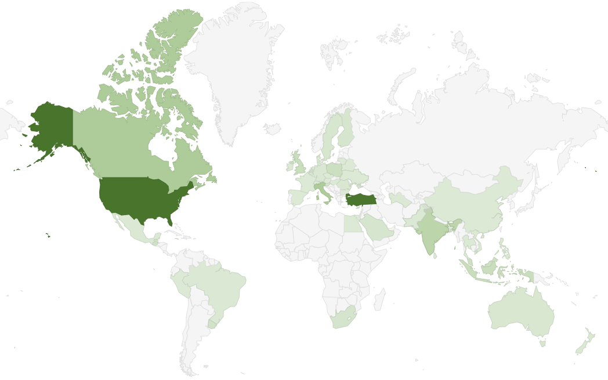

Hello and gratitude, ABP.IO Community!

It was an absolute blast to upgrade ABP Dotnet Conference with a 1-day of workshops and an additional parallel session of talks! With ABP Dotnet Conference 2024, we marked a decade of innovation and community engagement. This year's event, besides being our second full-day(for both days!) ABP Community event, it has another special significance as we celebrated the 10th anniversary of ABP this year. The overwhelming interest and participation of live viewers and speakers from all around the world made this milestone truly memorable. 

From the nature of virtual conference, once again we were able to transcend geographical boundaries, uniting .NET developers from diverse cultures and 52 different countries. The map below showcases the countries of our live viewers, with darker shades indicating higher minutes viewed. Witnessing the global reach and impact of our conference fills us with immense pride and joy. We are grateful to each live viewer who dedicated their time and actively participated in the ABP Dotnet Conference 2024. Your presence and engagement played a crucial role in the success of the event.



The success of ABP Dotnet Conference 2024 would not have been possible without the contributions of our talented speakers. This year, we featured an impressive lineup of 29 speakers from all over the world, including .NET experts and Microsoft MVPs, who delivered captivating talks that resonated with our audience. Each session sparked curiosity and generated numerous questions, leading to enriching discussions. We extend our deepest appreciation to each speaker for their valuable insights and for sharing their knowledges with the attendees. Here’s a reminder of our speakers and their talk titles:

📌 **Day 1 Workshops - May 8th, 2024** 📌

* 🎙️[Johan Smarius](https://abp.io/conference/2024/speakers/johan-smarius), Building a GraphQL Server in .NET 8
* 🎙️[Wojciech Krasa](https://abp.io/conference/2024/speakers/wojciech-krasa), Testing framework with PostgreSQL and Testcontainers for .NET
* 🎙️[Ahmet Faruk Ulu](https://abp.io/conference/2024/speakers/ahmet-faruk-ulu), ABP Framework Essentials: Crafting Your SaaS Success Story 
* 🎙️[Alberto Acerbis](https://abp.io/conference/2024/speakers/alberto-acerbis) &  [Ferdinando Santacroce](https://abp.io/conference/2024/speakers/ferdinando-santacroce), Tackling Chaos, Resilience & Metrics in the heart of your Application
* 🎙️[Omkar Choudhari](https://abp.io/conference/2024/speakers/omkar-choudhari) & [Aman Sharma](https://abp.io/conference/2024/speakers/aman-sharma), Building your own copilot with ABP chat module
* 🎙️[Stefan Pölz](https://abp.io/conference/2024/speakers/stefan-polz), Let's Build an incremental source generator with Roslyn
* 🎙️[Ryan Niño Dizon](https://abp.io/conference/2024/speakers/ryan-nino-dizon), Building a Serverless Backend API with Azure Functions
* 🎙️[Kaushik Gokhale](https://abp.io/conference/2024/speakers/kaushik-gokhale) & [Omkar Choudhari](https://abp.io/conference/2024/speakers/omkar-choudhari), React ♥ ABP: Next-Level Frontend Workshop for 3x Acceleration
* 🎙️[Rebai Hamida](https://abp.io/conference/2024/speakers/rebai-hamida), Build containerized application using Docker and Azure



📌 **Day 2 Talks - May 9th, 2024** 📌

* 🎙️[Hannes Lowette](https://abp.io/conference/2024/speakers/hannes-lowette), Keynote: Manage your career, the Mario Kart way
* 🎙️[Engincan Veske](https://abp.io/conference/2024/speakers/engincan-veske), Sentiment Analysis in .NET
* 🎙️[Jessica Engström](https://abp.io/conference/2024/speakers/jessica-engstrom), Practical tips to improve your UX and accessibility
* 🎙️[Irina Scurtu](https://abp.io/conference/2024/speakers/irina-scurtu), .NET gRPC - deep dive
* 🎙️[Dino Esposito](https://abp.io/conference/2024/speakers/dino-esposito), In Defense of ASP.NET and Server-side Web
* 🎙️[Alexej Sommer](https://abp.io/conference/2024/speakers/alexej-sommer), Security for ASP.NET developers
* 🎙️[Adora Nwodo](https://abp.io/conference/2024/speakers/adora-nwodo), Designing Secure Cloud Native Apps with .NET and Azure
* 🎙️[Nicola Iarocci](https://abp.io/conference/2024/speakers/nicola-iarocci), C# 12 What's new and interesting
* 🎙️[Jimmy Engström](https://abp.io/conference/2024/speakers/jimmy-engstrom), Connecting gadgets to Blazor
* 🎙️[Juergen Gutsch](https://abp.io/conference/2024/speakers/juergen-gutsch), Building cloud native applications with .NET Aspire
* 🎙️[Halil Ibrahim Kalkan](https://abp.io/conference/2024/speakers/halil-ibrahim-kalkan), Designing Modular Monolith for Microservice Architecture
* 🎙️[Shaun Lawrence](https://abp.io/conference/2024/speakers/shaun-lawrance), Building games in .NET MAUI
* 🎙️[Jamie Taylor](https://abp.io/conference/2024/speakers/jamie-taylor), Empathy, Sympathy and Compassion
* 🎙️[Cecil Phillip](https://abp.io/conference/2024/speakers/cecil-phillip), Building Microservices with Dapr and .NET
* 🎙️[Rebai Hamida](https://abp.io/conference/2024/speakers/rebai-hamida), Embracing .NET 8.0: Leveraging New Features for Modern Application Development
* 🎙️[Sergei Gorlovetsky](https://abp.io/conference/2024/speakers/sergei-gorlovetsky), Optimizing ABP Deployments: Strategies and Best Practices with Helm and Kubernetes
* 🎙️[Todd Gardner,](https://abp.io/conference/2024/speakers/todd-gardner) Success On Your Own Terms
* 🎙️[Brian Gorman](https://abp.io/conference/2024/speakers/brian-gorman), Protecting Your Secrets using Azure Key Vault, Azure App Configuration, GitHub and C# MVC
* 🎙️[Mitchel Sellers](https://abp.io/conference/2024/speakers/mitchel-sellers), Architecting ASP.NET Core for Geo-Distributed Deployment

 We are humbled by all ABP Community Members', conference attendees', speakers' and sponsors' support and inspired by the connections forged through shared knowledge.

The  ABP Dotnet Conference 2024 platform's interactive strucutre provided an ideal environment for attendees to engage with the speakers as well as with themselves. The depth of the talks and workshops presented and the multitude of questions asked during the Q&A sessions highlighted the intellectual curiosity of our audience. Each question laid the foundation for engaging discussions, enriching the experience for everyone involved. The exchange of ideas and diverse perspectives showcased the beauty of inclusiveness at the ABP Dotnet Conference 2024.

Of course, our valuable sponsors deserves a huge special thanks to encourage us to make ABP Dotnet Conference 2024 happen again! Thanks to our sponsors [WAi Technologies](https://waiin.com/), [Decision Tree](https://decisiontree.tech/), [DM Consulting](https://www.dmconsulting.it/en/), [HeadChannel](https://headchannel.co.uk/blog/community-abp.10-posts-submit/), [3S Studio](https://3sstudio.com/), [Kuem](https://www.kuem.si/en/), [Mailtrap](https://mailtrap.io/), and event partners [Microsoft](https://www.microsoft.com/), [.NET Foundation](https://dotnetfoundation.org/), [JetBrains](https://www.jetbrains.com/), [Packt Publishing](https://www.packtpub.com/), [dotnetdays](https://dotnetdays.ro/),[ International Conference Alerts](https://internationalconferencealerts.com/) who make this event possible and more impactful.

Thank you all for making the ABP Dotnet Conference 2024 great again! We look forward to many more years of innovation and community collaboration. Here’s to another decade of growth and learning together!

Hope to see you all and more on the next one!

[Visit ABP Dotnet Conference 2024's website for more information](https://abp.io/conference/2024)