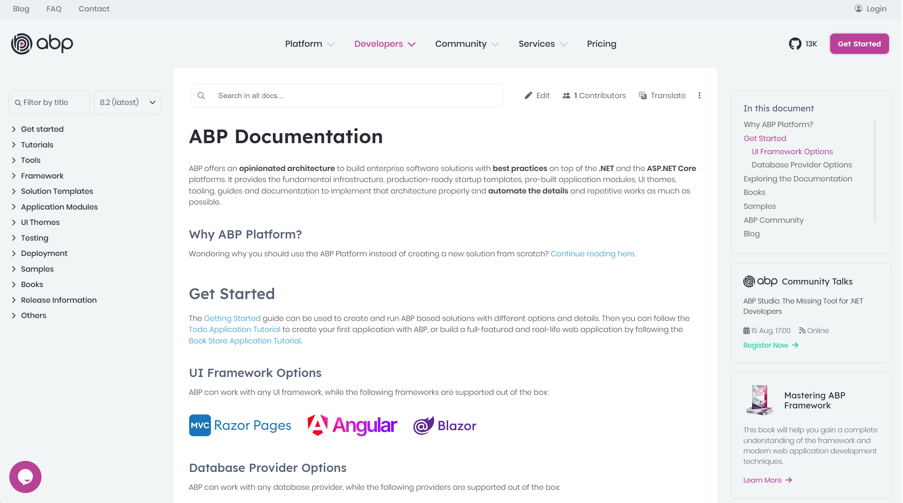
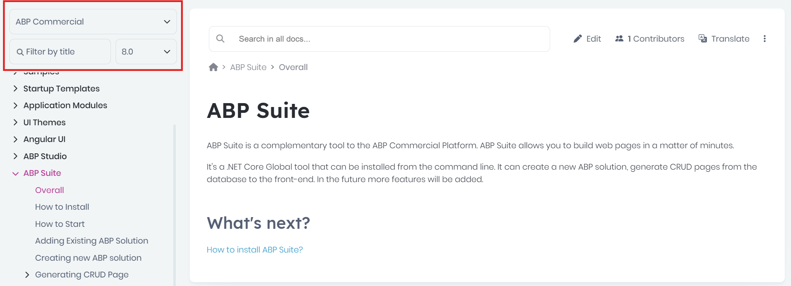
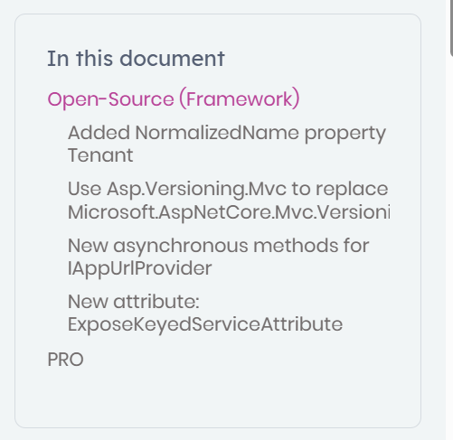
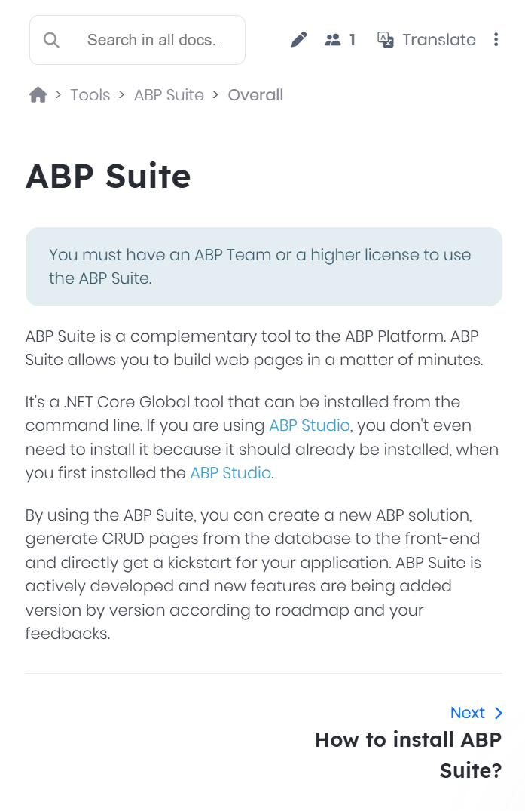
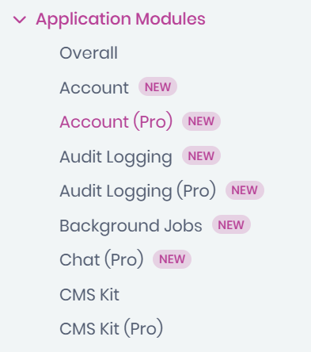
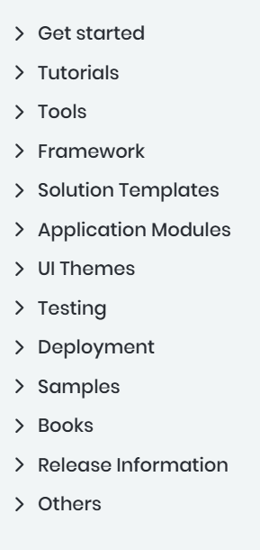
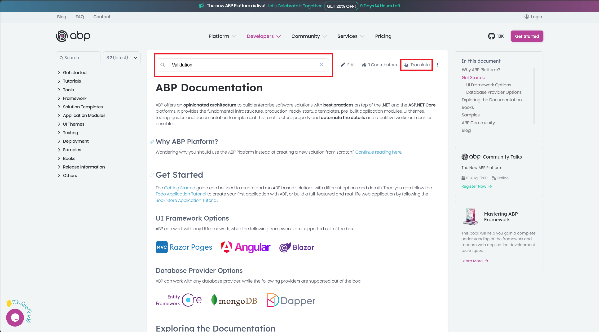
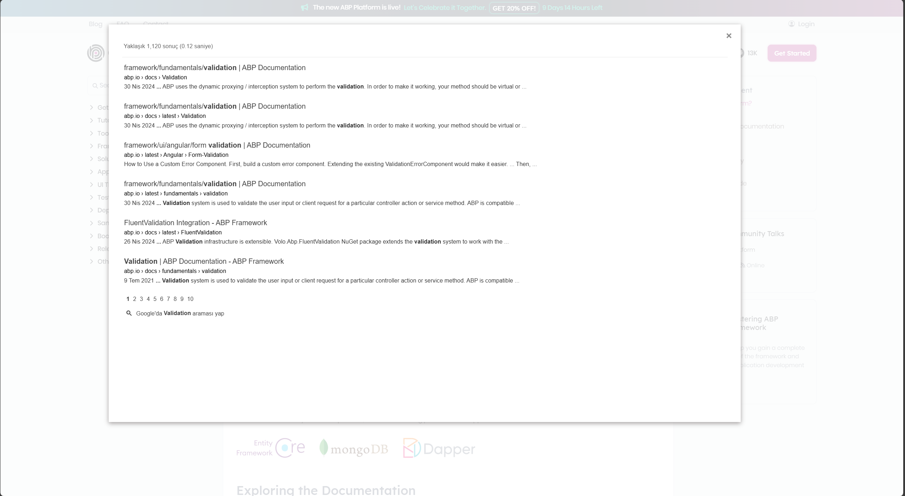
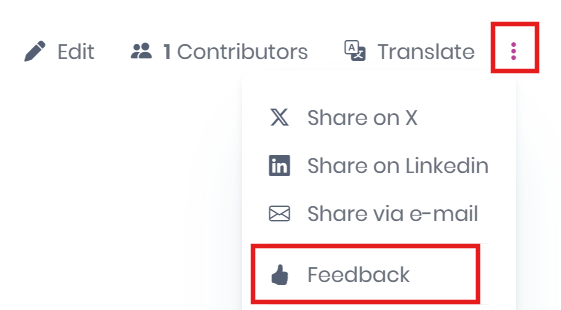
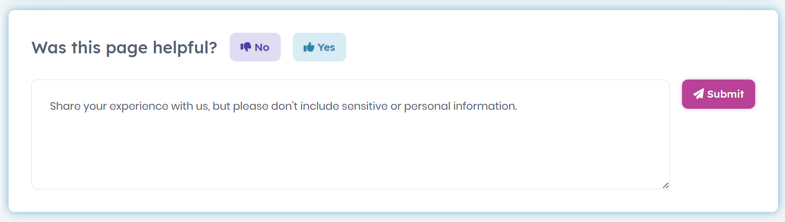

We have combined the ABP (open-source) and ABP Commercial (paid) documents into a single, comprehensive resource. This unification brings you a better experience in the documentation system, helps you find what you're looking for more easily, allows you to read the documents that are related to each other one after the other, and also provides Google Search and Google Translation support for the documents. 

Let's see what's new with the unified documentation system in detail:

## All Documentation In One Place 📃

We decided to combine the ABP (open-source) and ABP Commercial (paid) documents into a single place, along with [the new ABP Platform Unification](https://abp.io/blog/new-abp-platform-is-live). 

The new documentation address is [abp.io/docs](https://abp.io/docs) and seen like below:



This unified documentation brings you a better search capability with Google Search support, allows you to not need to switch between documentation websites to read both framework and commercial features, look what you are looking for more easily from the unified menu structure, following new features and their documentation in a more stable and easier way.

## Accessing Documents with Older Versions🗃️

From v8.2, with the new documentation system, since we merged all documents into a single place, you don't need to select if you want to show a framework or commercial document. However, if you want to access an old document, for example, if you are using an older version of ABP or don't want to create the solutions from ABP Studio and instead prefer ABP CLI (in the getting started and startup template docs, ABP Studio is shown for project creation and other features, for instance), you can change the version from the version select-box (prior to v8.2), and select which document type (framework or commercial) you want to read and then find/choose the document that you want:



You can access any old-version document as you would before, by specifying the version. But we suggest you update your solution to v8.2+ and start using ABP Studio! By doing that, you can get more benefits from the new features, and edge-cutting features of ABP Studio and easily manage your application from development to production!

## Documentation Updates 🚀

With the [announcement of ABP Studio (beta) General Availability](https://abp.io/blog/announcing-abp-studio-general-availability), we made some improvements in our documents. Starting from v8.2, since ABP Studio is the suggested way to create and manage your applications, we updated the [Get started](https://abp.io/docs/latest/get-started) documentation and some other documents along with, and explained project creation via ABP Studio. If you prefer [creating a new solution with the ABP CLI](https://abp.io/docs/latest/cli), you can use the new ABP CLI as you did the old one before. 

Besides that, we revised all of our documents, updated most of them according to the [new ABP Platform unification](https://abp.io/blog/new-abp-platform-is-live). For example, we merged our migration guide documents into single documents for each version and categorized the related topics you need to do when updating your solutions under the **open-source** and **pro** sections, so either you are an open-source template user or a license owner, you can easily jump to the related section and read them easily and accordingly:



Since we combined ABP (framework) and ABP Commercial documents, we added information notes in each document that indicate if the related feature is in your license plan or not. An example screenshot from ABP Suite documentation can be seen as follow:



Also, for the application modules, we added **(PRO)** postfixes in the navigation menu for you to easily understand if the module is for license owners or open-source users. Thanks to that you can easily distinguish the related application modules and read the related module documentation to understand it:



## New Navigation Tree 📚

With the documentation unification, we re-structured the navigation tree of the documents:



The new navigation tree allows you to find any document you want in a more desired way, in the related sub-menu. For example, if you want to learn more about *modularity*, you can find under the **Framework > Architecture > Modularity** menu items, or if you want to learn more about the ABP Studio, you can find the all related docs under the root **Tools** menu.

## Google Translate & Search Capabilities 🔎

In ABP v8.3, we made some improvements in the [Docs Module](https://abp.io/docs/8.3/modules/docs), added Google Search support for better findings in the documentation, and introduced Google Translation for the documentation system. After implementing these features, we integrated them into our documentation system and removed the languages select box from the menu:



From now on, we will provide documents in English only. The reason behind that is, that with the new Google Translate support, you can directly translate any documentation to the desired language (of course, must be one of the supported languages). Thanks to the Google Translate feature, you can read the official documentation in your own language, and we as the core team, don't need to synchronize the documentation between different languages, it was really hard to keep them up to date, and now they all will be available all the time in the all supported languages.



Also, thanks to Google Search, now you can search specific keywords to easily find the related topic in the documentation. For example, if you search the **Validation** keyword, Google will list all related documents according to their importance and relevancy:

## Feedbacks 📝

Besides all changes, we also added a **feedback section** at the end of each document. You can share your thoughts, suggestions, or criticism for specific documentation. We would like to hear more from you about our documentation quality and get suggestions from each one of you to improve our documents and platform, so it will be much appreciated if you share your feedback for any documentation you want, please don't hesitate!



You can either directly scroll down to the bottom directly for a certain document, or click the **Feedback** action button to navigate to the feedbacks section, and provide feedback:



## Conclusion 🎯

To see the new ABP documentation system, please visit the [abp.io/docs](https://abp.io/docs/latest/) website. Check out the new navigation tree, read the documents you want, provide feedback to help us improve our documents and more...

We look forward to your feedback and continued support as we grow together! Thanks in advance 🙏
