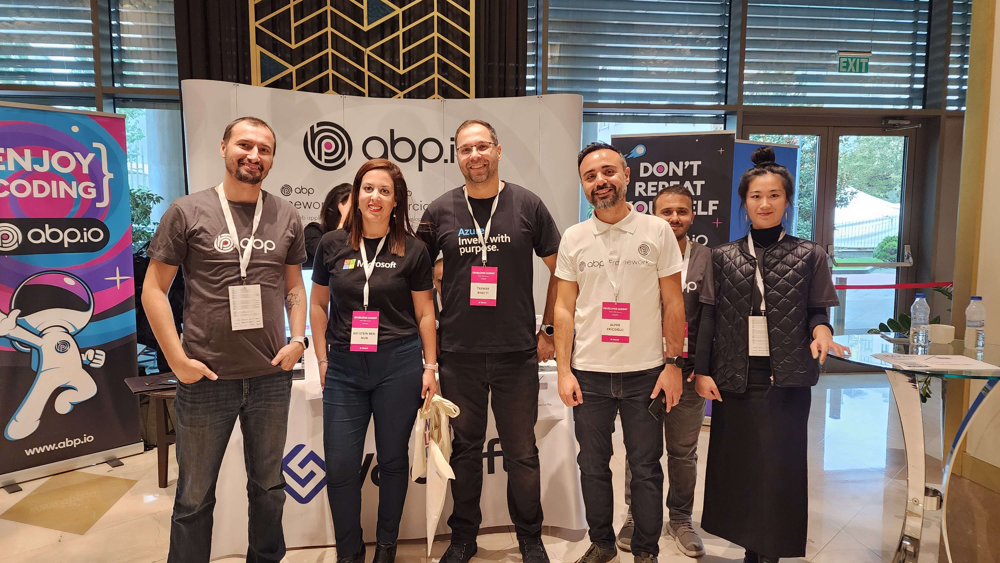

We are excited to announce that ABP will participate in the upcoming .NET DeveloperDays 2024, which will take place on **October 22-23** in beautiful Warsaw, Poland. As a **gold sponsor** of the event, we invite you to visit our booth and discover our latest innovations and solutions.

## Event Highlights
.NET Developer Days is one of the premier conferences for .NET developers, featuring:
* **Over 1,000 attendees** from around the globe, including developers, engineers, and industry leaders.
* **50+ expert speakers** sharing insights on the latest trends and technologies in .NET development.
* **40+ sessions and workshops** covering various topics ensure something for everyone.

## About .NET DeveloperDays
For those new to the scene, .NET DeveloperDays is a premier conference where software developers come together to explore various topics in the .NET ecosystem. This event actively brings together experts worldwide to share their knowledge on the latest technologies and best practices. Organized by a dedicated team passionate about advancing the .NET community, it’s a fantastic opportunity to learn, network, and connect with like-minded professionals in the software development field.

## What to Expect at Our Booth
At our booth, you'll have the opportunity to:
* Engage with the ABP team and discuss how the ABP Framework can enhance your development projects.
* Discover exclusive surprises and experiences tailored for attendees.
* Network with fellow developers and share insights into best practices in .NET development.
The ABP.IO team is eager to connect with the community and explore the latest insights from the conference. Stay tuned for more updates as we prepare for this exciting event!

Here are some previews from the events we sponsored before, so you know what to expect in .NET DeveloperDays 2024 in Warsaw:

#### NDC London 2023:


#### DevNot Summit 2022:


## Connect with Us
We look forward to meeting you at our booth! Make sure to stop by to learn more about our solutions and participate in the exciting surprises we have planned.

## See You There!
Don’t miss this incredible opportunity to connect with the .NET community. Mark your calendars for **October 22-23**, and we hope to see you in **Warsaw**!
For more details about the event, visit the official .NET DeveloperDays website [here](https://developerdays.eu/warsaw/).