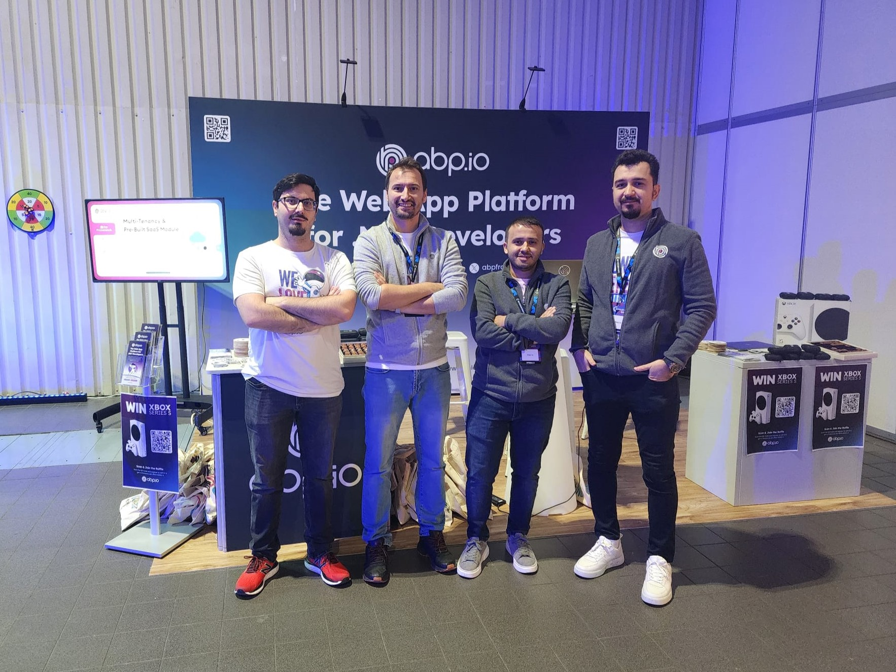
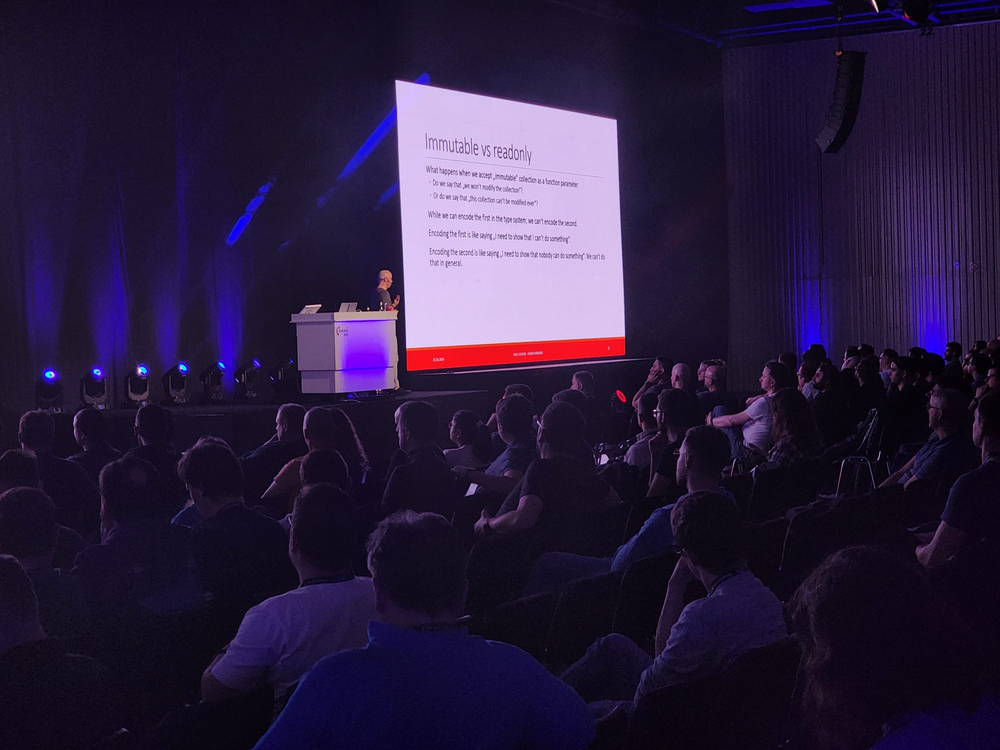
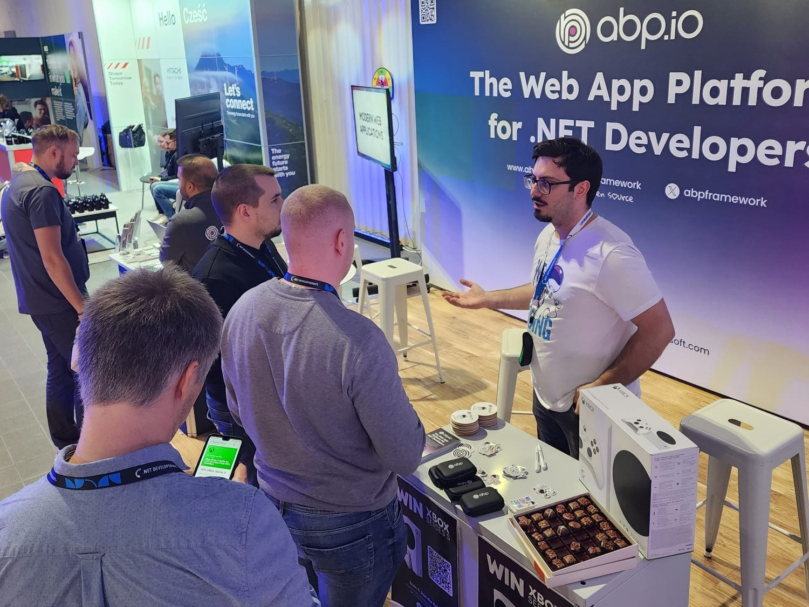
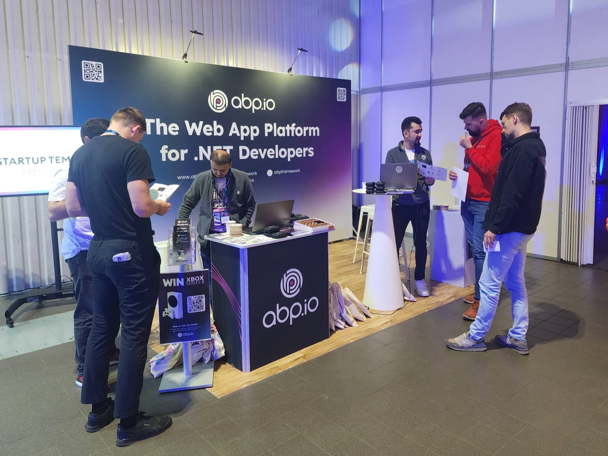
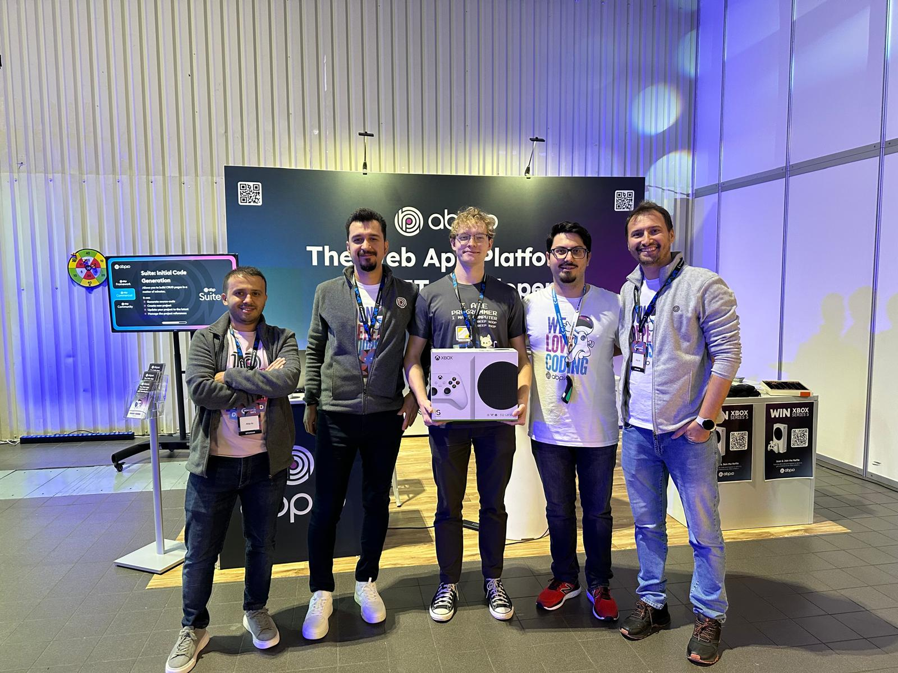

The ABP team has just returned from an incredible experience at .NET DeveloperDays 2024, and we’re thrilled to share the highlights of this fantastic event! In past years, we attended the conference as participants and had such a great time that we decided to take it a step further by sponsoring this year. As a gold sponsor for 2024, it was an unforgettable experience to engage with the vibrant .NET community in Warsaw. The energy at the event was terrific, and the opportunity to connect with developers, engineers, and industry leaders made it truly special.



## Event Highlights

With over 800 attendees and more than 30 inspiring speakers, .NET DeveloperDays 2024 was a hub of knowledge-sharing, innovation, and networking. The two-day main conference focused entirely on .NET, providing a unique space for developers from around the world to come together, share insights, and grow collectively.



.NET DeveloperDays 2024 showcased an outstanding lineup of speakers, offering a well-balanced mix of both advanced and foundational topics for .NET developers. Attendees had the chance to dive deep into cutting-edge advancements in .NET and C# with Johnny Hooyberghs, explore the curious and often tricky aspects of C# in Nick Chapsas’ engaging session, "Cursed C#," and discover best practices for clean microservices communication using CQRS and event sourcing with Oliver Sturm. These sessions, along with over 30 others, offered invaluable learning and networking opportunities for developers eager to stay ahead in the fast-moving .NET ecosystem.



We were fortunate to engage with developers from diverse backgrounds, discuss the exciting work we do at ABP, and exchange ideas. This conference has reinforced the importance of learning and growing together with the community.



The experience was inspiring, not only because of the innovative sessions but also because of the amazing people we met.

## Raffle Tradition
As is tradition, we held a raffle at the event. Congratulations to the lucky winner, and thank you to everyone who participated!



## A Special Thank You
A huge thank you to everyone who stopped by our booth, and spent time with our amazing team. We look forward to continuing this journey with the .NET community!
