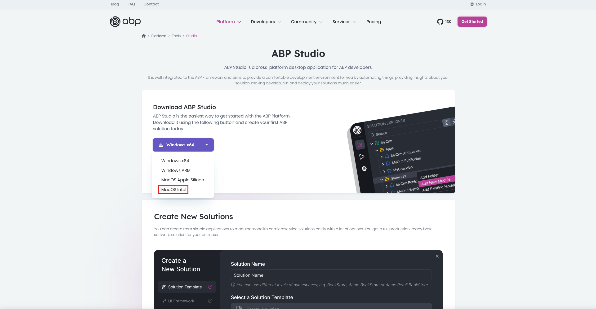

We are excited to announce that [ABP Studio, our cross-platform desktop application for ABP developers](https://abp.io/studio), now supports Intel-based Mac computers! 

This addition expands our platform compatibility, ensuring that developers using Intel-powered Macs can also benefit from the powerful features of ABP Studio.

## What is ABP Studio?

For those who aren't familiar with it, [ABP Studio](https://abp.io/studio) is a powerful desktop application that makes ABP development faster and easier. It offers:

* Easy creation of new solutions (from simple applications to microservices)
* Visual architecture management for modular-monolith and microservice solutions
* Solution exploration tools for entities, services, and HTTP APIs
* Simplified running, debugging, and monitoring of multi-application or microservice solutions
* Kubernetes cluster integration capabilities
* and more...

## Extended Platform Support

ABP Studio has been proudly supporting multiple platforms, and we're excited to add MacOS Intel to our list of supported architectures. You can now use ABP Studio on:

* Windows x64
* Windows ARM
* MacOS Apple Silicon (M1/M2/M3)
* MacOS Intel **(New!)**

## Why This Matters

This update is particularly important for developers who are using Intel-based Mac computers. Previously, ABP Studio was only available for Apple Silicon Macs (for MacOS), but we understand that many developers are still using Intel-based Macs. With this release, we're ensuring that all Mac users can access our development tools, regardless of their processor architecture.

## Getting Started

Installing ABP Studio on your Intel-based Mac is straightforward:

1. Go to [abp.io/studio](https://abp.io/studio)
2. Click on the download button and select "MacOS Intel" from the dropdown menu
3. Once downloaded, open the installer package
4. Follow the installation wizard to complete the setup



## Conclusion

As the ABP team, we're always looking for ways to improve the developer experience. By supporting Intel-based Macs, we're ensuring that all Mac users can access our development tools, regardless of their processor architecture.

Stay tuned for more updates and enhancements as we continue to optimize ABP Studio and please provide us with your invaluable feedback. Thanks in advance!
