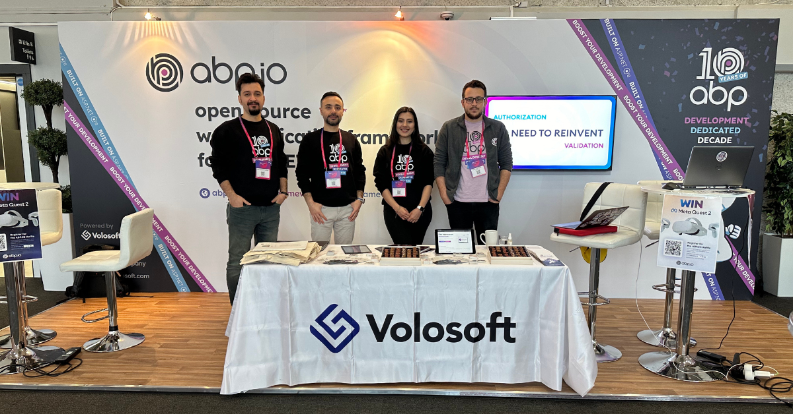
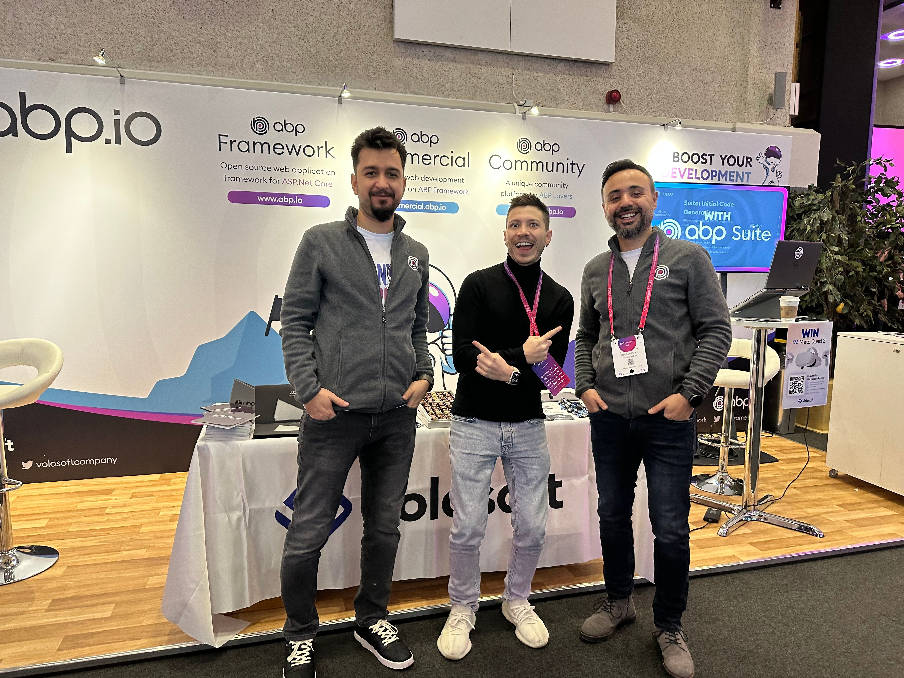
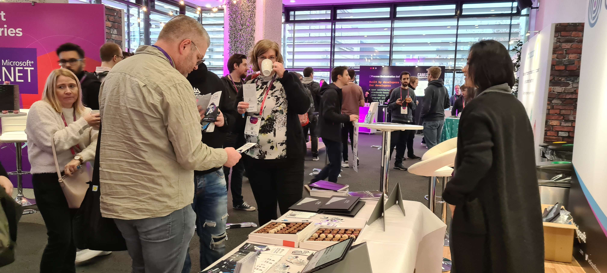
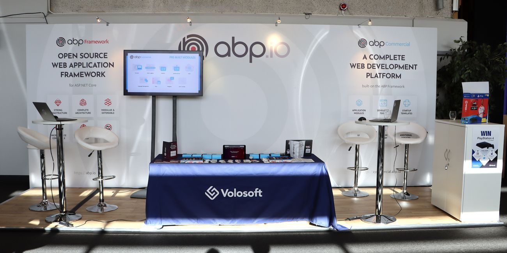
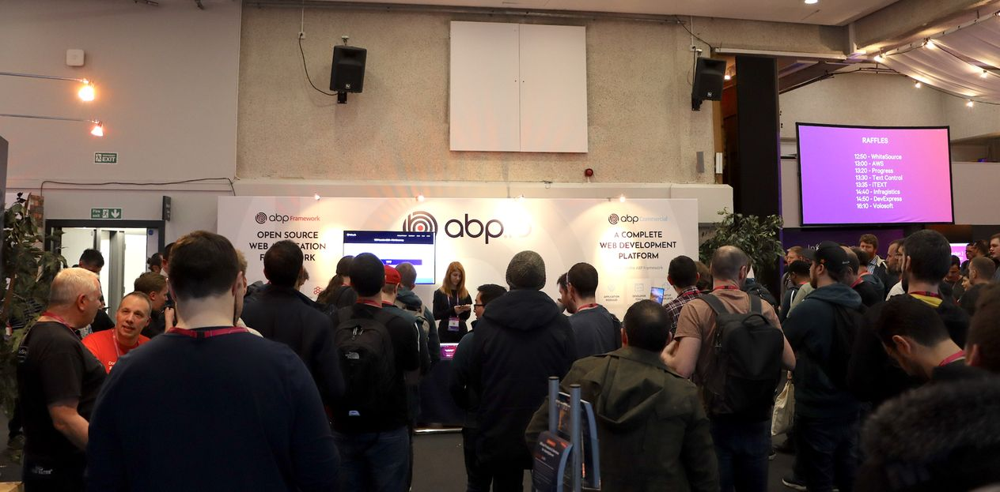


We are starting the new year fast, and as usual, we’re proud to announce that ABP.IO is sponsoring NDC London 2025! This marks the sixth consecutive year that ABP.IO has supported this important conference for software developers.


## About NDC London 2025 📅

The Norwegian Developers Conference (NDC) is one of the biggest conferences in Europe for .NET and Agile development. NDC London 2025 will be a 5-day event held from January 27-31 at the Queen Elizabeth II Centre in London.

The event will cover a wide range of topics, including .NET, Agile, C++, Cloud, DevOps, JavaScript, Security, UX, Mobile, and more. With over 100 speakers and sessions, it’s a great chance to learn about the latest technologies and best practices. Well-known speakers such as Scott Hanselman, Laila Bougria, Scott Hunter, and Nick Chapsas will share their knowledge.

The conference includes 2 days of workshops and 3 days of sessions, giving developers the chance to learn, meet experts, and explore the future of software development.


## ABP.IO at NDC London 2025 💻

ABP.IO is excited to be part of NDC London 2025 and connect with developers in the .NET ecosystem. As a platform built to simplify software development, ABP.IO provides a range of tools, templates, and modules to help you build modern applications faster.

### Visit our booth to discover:

* **Full Source Code:** Complete control for tailored, maintainable solutions.
* **Startup Templates:** Ready-made for microservices, modular monoliths, and simple monoliths.
* **Pre-Built Modules:** Save time with Identity, CMS Kit, Audit Logging, Blogging, Chat, Payment, and more.
* **Customizable UI Themes:** Modern designs with LeptonX and Basic Theme.
* **Powerful Tools:** Streamline workflows with ABP Studio and ABP Suite.

Don’t miss the chance to explore ABP,  a SaaS product built on the open-source ABP Framework, and learn how it can accelerate your development.

Here are some previews from the events we sponsored before!

### NDC London 2024:



### NDC London 2023:





### NDC London 2020:





## Join Us! 🤝
Mark your calendars for NDC London 2025 from January 27-31! Come meet the ABP team, connect with fellow developers, and explore the future of software development.

Don’t miss out on our exciting raffle and promotions! Stay tuned for more updates! 🎁
