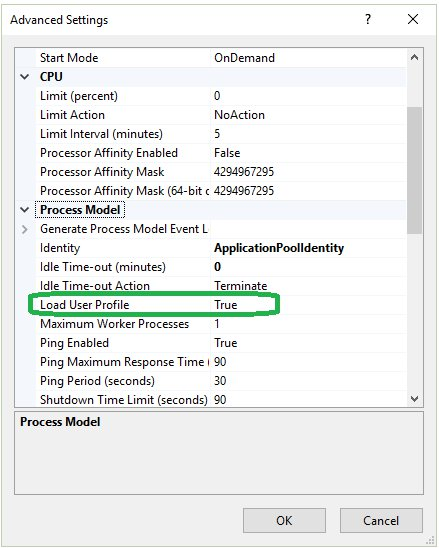

# Fixing OpenIddict Certificate Issues in IIS or Azure

When deploying an ABP application with OpenIddict to IIS or Azure, you may encounter issues with loading PFX/PKCS12 certificates. This article explains how to properly configure certificate loading to ensure it works correctly in these environments.

## The Problem

When running under IIS or Azure, the application pool identity may not have sufficient permissions to access certificate private keys. This commonly results in errors such as:

- `System.Security.Cryptography.CryptographicException: Access denied.`
- `WindowsCryptographicException: Access is denied.`
- `System.Security.Cryptography.CryptographicException: The system cannot find the file specified.`

## The Solution

### Using AddDevelopmentEncryptionAndSigningCertificate

For development environments using `DevelopmentEncryptionAndSigningCertificate`, you must configure the application pool to load a user profile.

> Note: We strongly recommend using `DevelopmentEncryptionAndSigningCertificate` only in development environments. For production, always create and use a separate certificate.



### Using AddProductionEncryptionAndSigningCertificate

The ABP OpenIddict module provides an `AddProductionEncryptionAndSigningCertificate` extension method. By default, the template project attempts to load an `openiddict.pfx` certificate in production environments.

To ensure proper certificate loading in IIS or Azure, you need to specify appropriate `X509KeyStorageFlags` when calling this method:

```csharp
public override void PreConfigureServices(ServiceConfigurationContext context)
{
    var hostingEnvironment = context.Services.GetHostingEnvironment();

    if (!hostingEnvironment.IsDevelopment())
    {
       PreConfigure<AbpOpenIddictAspNetCoreOptions>(options =>
       {
          options.AddDevelopmentEncryptionAndSigningCertificate = false;
       });

       PreConfigure<OpenIddictServerBuilder>(serverBuilder =>
       {
         var flag = X509KeyStorageFlags.MachineKeySet | X509KeyStorageFlags.EphemeralKeySet;
         serverBuilder.AddProductionEncryptionAndSigningCertificate("openiddict.pfx", "YourCertificatePassword", flag);
       });
    }
}
```

## Understanding X509KeyStorageFlags

The configuration uses two important flags:

* `X509KeyStorageFlags.MachineKeySet`: Specifies that the key belongs to the local computer key store, binding the key pair's lifecycle to the computer rather than a specific user.
* `X509KeyStorageFlags.EphemeralKeySet`: Indicates that the key will be stored only in memory and not persisted to disk or key store, enhancing security for runtime-only certificate requirements.

Using these flags in combination helps prevent permission-related issues in IIS and Azure environments.

## Troubleshooting Guide

If you continue to experience issues, verify the following:

* Confirm that the certificate password is correct
* Verify that the `openiddict.pfx` file exists in your deployment
* Ensure the certificate is valid - you can generate a new one using:
  ```bash
  dotnet dev-certs https -v -ep openiddict.pfx -p YourCertificatePassword
  ```
* Check the stdout logs for related errors (See [how to get stdout-log](https://abp.io/docs/latest/solution-templates/layered-web-application/deployment/deployment-iis?UI=Blazor&DB=EF&Tiered=No#how-to-get-stdout-log))

## References

- [ABP OpenIddict Deployment](https://abp.io/docs/latest/solution-templates/layered-web-application/deployment/openiddict-deployment)
- [ABP IIS Deployment](https://abp.io/docs/latest/solution-templates/layered-web-application/deployment/deployment-iis)
- [ABP Azure Deployment](https://abp.io/docs/latest/solution-templates/layered-web-application/deployment/azure-deployment/azure-deployment)
- [How to Generate a New Certificate](https://learn.microsoft.com/en-us/dotnet/core/tools/dotnet-dev-certs#how-to-generate-a-new-certificate)
- [Load User Profile in IIS](https://learn.microsoft.com/en-us/iis/manage/configuring-security/application-pool-identities#load-user-profile-for-an-application-pool)
