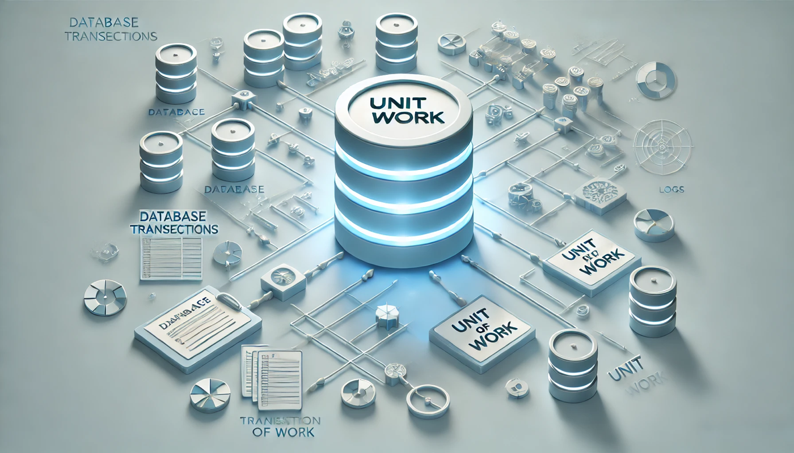

# Understanding Transactions in ABP Unit of Work

[The Unit of Work](https://en.wikipedia.org/wiki/Unit_of_work) is a software design pattern that maintains a list of objects affected by a business transaction and coordinates the writing out of changes and the resolution of concurrency problems to ensure that all changes are made within a single transaction. 



## Transaction Management Overview

One of the primary responsibilities of the Unit of Work is managing database transactions. It provides the following transaction management features:

- Automatically manages database connections and transaction scopes, eliminating the need for manual transaction control
- Ensures business operation integrity by making all database operations within a unit of work either succeed or roll back completely
- Supports configuration of transaction isolation levels and timeout periods
- Supports nested transactions and transaction propagation

## Transaction Behavior

### Default Transaction Settings

You can modify the default behavior through the following configuration:

```csharp
Configure<AbpUnitOfWorkDefaultOptions>(options =>
{
    /*
        Modify the default transaction behavior for all unit of work:
        - UnitOfWorkTransactionBehavior.Enabled: Always enable transactions, all requests will start a transaction
        - UnitOfWorkTransactionBehavior.Disabled: Always disable transactions, no requests will start a transaction
        - UnitOfWorkTransactionBehavior.Auto: Automatically decide whether to start a transaction based on HTTP request type
    */
    options.TransactionBehavior = UnitOfWorkTransactionBehavior.Disabled;
    
    // Set default timeout
    options.Timeout = TimeSpan.FromSeconds(30);
    
    // Set default isolation level
    options.IsolationLevel = IsolationLevel.ReadCommitted;
});
```

### Automatic Transaction Management

ABP Framework implements automatic management of Unit of Work and transactions through middlewares, MVC global filters, and interceptors. In most cases, you don't need to manage them manually

### Transaction Behavior for HTTP Requests

By default, the framework adopts an intelligent transaction management strategy for HTTP requests:
- `GET` requests won't start a transactional unit of work because there is no data modification
- Other HTTP requests (`POST/PUT/DELETE` etc.) will start a transactional unit of work

### Manual Transaction Control

If you need to manually start a new unit of work, you can customize whether to start a transaction and set the transaction isolation level and timeout:

```csharp
// Start a transactional unit of work
using (var uow = _unitOfWorkManager.Begin(
    isTransactional: true,
    isolationLevel: IsolationLevel.RepeatableRead,
    timeout: 30
))
{
    // Execute database operations within transaction
    await uow.CompleteAsync();
}
```

```csharp
// Start a non-transactional unit of work
using (var uow = _unitOfWorkManager.Begin(
    isTransactional: false
))
{
    // Execute database operations without transaction
    await uow.CompleteAsync();
}
```

### Configuring Transactions Using `[UnitOfWork]` Attribute

You can customize transaction behavior by using the `UnitOfWorkAttribute` on methods, classes, or interfaces:

```csharp
[UnitOfWork(
    IsTransactional = true,
    IsolationLevel = IsolationLevel.RepeatableRead,
    Timeout = 30
)]
public virtual async Task ProcessOrderAsync(int orderId)
{
    // Execute database operations within transaction
}
```

### Non-Transactional Unit of Work

In some scenarios, you might not need transaction support. You can create a non-transactional unit of work by setting `IsTransactional = false`:

```csharp
public virtual async Task ImportDataAsync(List<DataItem> items)
{
    using (var uow = _unitOfWorkManager.Begin(
        isTransactional: false
    ))
    {
        foreach (var item in items)
        {
            await _repository.InsertAsync(item, autoSave: true);
            // Each InsertAsync will save to database immediately
            // If subsequent operations fail, saved data won't be rolled back
        }

        await uow.CompleteAsync();
    }
}
```

Applicable scenarios:
- Batch import data scenarios where partial success is accepted
- Read-only operations, such as queries
- Scenarios with low data consistency requirements

### Methods to Commit Transactions

#### In Transactional Unit of Work

A Unit of Work provides several methods to commit changes to the database:

1. **IUnitOfWork.SaveChangesAsync**

```csharp
await _unitOfWorkManager.Current.SaveChangesAsync();
```

2. **autoSave parameter in repositories**

```csharp
await _repository.InsertAsync(entity, autoSave: true);
```

Both `autoSave` and `SaveChangesAsync` commit changes in the current context to the database. However, these are not applied until `CompleteAsync` is called. If the unit of work throws an exception or `CompleteAsync` is not called, the transaction will be rolled back. It means all the DB operations will be reverted back. Only after successfully executing `CompleteAsync` will the transaction be permanently committed to the database.

3. **CompleteAsync**

```csharp
using (var uow = _unitOfWorkManager.Begin())
{
    // Execute database operations
    await uow.CompleteAsync();
}
```

When you manually control the Unit of Work with `UnitOfWorkManager`, the `CompleteAsync` method is crucial for transaction completion. The unit of work maintains a `DbTransaction` object internally, and the `CompleteAsync` method invokes `DbTransaction.CommitAsync` to commit the transaction. The transaction will not be committed if `CompleteAsync` is either not executed or fails to execute successfully.

This method not only commits all database transactions but also:

- Executes and processes all pending domain events within the Unit of Work
- Executes all registered post-operations and cleanup tasks within the Unit of Work
- Releases all DbTransaction resources upon disposal of the Unit of Work object

> Note: `CompleteAsync` method should be called only once. Multiple calls are not supported.

#### In Non-Transactional Unit of Work

In non-transactional  Unit of Work, these methods behave differently:

Both `autoSave` and `SaveChangesAsync` will persist changes to the database immediately, and these changes cannot be rolled back. Even in non-transactional Unit of Work, calling the `CompleteAsync` method remains necessary as it handles other essential tasks.

Example:
```csharp
using (var uow = _unitOfWorkManager.Begin(isTransactional: false))
{
    // Changes are persisted immediately and cannot be rolled back
    await _repository.InsertAsync(entity1, autoSave: true);
    
    // This operation persists independently of the previous operation
    await _repository.InsertAsync(entity2, autoSave: true);
    
    await uow.CompleteAsync();
}
```

### Methods to Roll Back Transactions

#### In Transactional Unit of Work

A unit of work provides multiple approaches to roll back transactions:

1. **Automatic Rollback**

For transactions automatically managed by the ABP Framework, any uncaught exceptions during the request will trigger an automatic rollback.

2. **Manual Rollback**

For manually managed transactions, you can explicitly invoke the `RollbackAsync` method to immediately roll back the current transaction.

> Important: Once `RollbackAsync` is called, the entire  Unit of Work transaction will be rolled back immediately, and any subsequent calls to `CompleteAsync` will have no effect.

```csharp
using (var uow = _unitOfWorkManager.Begin(
    isTransactional: true,
    isolationLevel: IsolationLevel.RepeatableRead,
    timeout: 30
))
{
    await _repository.InsertAsync(entity);
    
    if (someCondition)
    {
        await uow.RollbackAsync();
        return;
    }
    
    await uow.CompleteAsync();
}
```

The `CompleteAsync` method attempts to commit the transaction. If any exceptions occur during this process, the transaction will not be committed.

Here are two common exception scenarios:

1. **Exception Handling Within Unit of Work**

```csharp
using (var uow = _unitOfWorkManager.Begin(
    isTransactional: true,
    isolationLevel: IsolationLevel.RepeatableRead,
    timeout: 30
))
{
    try
    {
        await _bookRepository.InsertAsync(book);
        await uow.SaveChangesAsync();
        await _productRepository.UpdateAsync(product);
        await uow.CompleteAsync();
    }
    catch (Exception)
    {
        // Exceptions can occur in InsertAsync, SaveChangesAsync, UpdateAsync, or CompleteAsync
        // Even if some operations succeed, the transaction remains uncommitted to the database
        // While you can explicitly call RollbackAsync to roll back the transaction,
        // the transaction will not be committed anyway if CompleteAsync fails to execute
        throw;
    }
}
```

2. **Exception Handling Outside Unit of Work**

```csharp
try
{
    using (var uow = _unitOfWorkManager.Begin(
        isTransactional: true,
        isolationLevel: IsolationLevel.RepeatableRead,
        timeout: 30
    ))
    {
        await _bookRepository.InsertAsync(book);
        await uow.SaveChangesAsync();
        await _productRepository.UpdateAsync(product);
        await uow.CompleteAsync();
    }
}
catch (Exception)
{
    // Exceptions can occur in UpdateAsync, SaveChangesAsync, UpdateAsync, or CompleteAsync
    // Even if some operations succeed, the transaction remains uncommitted to the database
    // Since CompleteAsync was not successfully executed, the transaction will not be committed
    throw;
}
```

#### In Non-Transactional Unit of Work

In non-transactional units of work, operations are irreversible. Changes saved using `autoSave: true` or `SaveChangesAsync()` are persisted immediately, and the `RollbackAsync` method has no effect.

## Transaction Management Best Practices

### 1. Remember to Commit Transactions

When manually controlling transactions, remember to call the `CompleteAsync` method to commit the transaction after operations are complete.

### 2. Pay Attention to Context

If a unit of work already exists in the current context, `UnitOfWorkManager.Begin` method and` UnitOfWorkAttribute` will **reuse it**. Specify `requiresNew: true` to force create a new unit of work.

```csharp
[UnitOfWork]
public async Task Method1()
{
    using (var uow = _unitOfWorkManager.Begin(
        requiresNew: true, 
        isTransactional: true,
        isolationLevel: IsolationLevel.RepeatableRead,
        timeout: 30
    ))
    {
        await Method2();
        await uow.CompleteAsync();
    }
}
```

### 3. Use `virtual` Methods

To be able to use Unit of Work attribute, you must use the `virtual` modifier for methods in dependency injection class services, because ABP Framework uses interceptors, and it cannot intercept non `virtual` methods, thus unable to implement  Unit of Work functionality.

### 4. Avoid Long Transactions

Enabling long-running transactions can lead to resource locking, excessive transaction log usage, and reduced concurrent performance, while rollback costs are high and may exhaust database connection resources. It's recommended to split into shorter transactions, reduce lock holding time, and optimize performance and reliability.

## Transaction-Related Recommendations

- Choose appropriate transaction isolation levels based on business requirements
- Avoid overly long transactions, long-running operations should be split into multiple small transactions
- Use the `requiresNew` parameter reasonably to control transaction boundaries
- Pay attention to setting appropriate transaction timeout periods
- Ensure transactions can properly roll back when exceptions occur
- For read-only operations, it's recommended to use non-transactional  Unit of Work to improve performance

## References

- [ABP Unit of Work](https://abp.io/docs/latest/framework/architecture/domain-driven-design/unit-of-work)
- [EF Core Transactions](https://docs.microsoft.com/en-us/ef/core/saving/transactions)
- [Transaction Isolation Levels](https://docs.microsoft.com/en-us/dotnet/api/system.data.isolationlevel)
