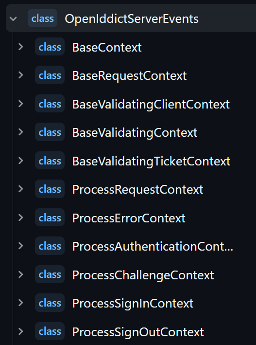

# Customizing Authentication Flow with OpenIddict Events in ABP Framework

[ABP's OpenIddict Module](https://abp.io/docs/latest/modules/openiddict) provides an integration with the [OpenIddict](https://github.com/openiddict/openiddict-core) library,  which provides advanced authentication features like **single sign-on**, **single log-out**, and **API access control**.

OpenIddict provides an event-driven model ([event models](https://documentation.openiddict.com/introduction#events-model)) that allows developers to customize authentication and authorization processes. This event model enables handling actions such as user **sign-in**, **sign-out**, **token validation**, and **request handling** dynamically.

In this article, we will explore OpenIddict event models, their key use cases, and how to implement them effectively.

## Understanding OpenIddict Event Model

OpenIddict events are primarily used within the OpenIddict server component. These events provide hooks into the OpenID Connect flow, allowing developers to modify behavior at different stages of authentication & authorization processes.

They are triggered during critical moments such as:

* User authentication (sign-in)
* Session termination (sign-out)
* Token validation and generation
* Request processing
* Error handling

OpenIddict provides multiple server events, under the `OpenIddictServerEvents` static class to make them easier to find (also provides additonal validation events under the `OpenIddictValidationEvents` static class). 

Here are some of the pre-defined `OpenIddictServerEvents`:



Each event represents a specific checkpoint in the **request processing pipeline**, such as validating an OpenID Connect request, extracting request parameters, processing the request, or generating a response. As an application developer, you simply need to create event handlers that subscribe to these predefined events to implement your custom logic at the desired pipeline stage.

## Example: How to add custom logic when a user signs out?

Let's walkthrough a practical example of implementing custom sign-out logic using OpenIddict events.

### Step 1: Create a Custom Event Handler

First, create a handler that implements `IOpenIddictServerHandler<OpenIddictServerEvents.ProcessSignOutContext>`:

```csharp
using System.Threading.Tasks;
using OpenIddict.Server;

namespace MySolution;

public class SignOutEventHandler : IOpenIddictServerHandler<OpenIddictServerEvents.ProcessSignOutContext>
{
    public static OpenIddictServerHandlerDescriptor Descriptor { get; }
        = OpenIddictServerHandlerDescriptor.CreateBuilder<OpenIddictServerEvents.ProcessSignOutContext>()
            .UseSingletonHandler<SignOutEventHandler>()
            .SetOrder(100_000)
            .SetType(OpenIddictServerHandlerType.Custom)
            .Build();
    
    public ValueTask HandleAsync(OpenIddictServerEvents.ProcessSignOutContext context)
    {
        // Implement your custom sign-out logic here

        // Examples:
        // - Clear custom session data
        // - Perform audit logging
        // - Notify other services
        // - Clean up user-specific resources
        
        return ValueTask.CompletedTask;
    }
}
```

The handler configuration includes several important components:

* `Descriptor` - Defines how the handler should be registered and executed
* `SetOrder` - Determines the execution order when multiple handlers exist
* `SetType` - Specifies this as a custom handler implementation
* `UseSingletonHandler` - Sets lifetime of the class as _Singleton_

### Step 2: Register the Event Handler

Register your custom handler in your application's module configuration:

```csharp
//...

public class MySolutionAuthServerModule : AbpModule
{
    public override void PreConfigureServices(ServiceConfigurationContext context)
    {
        PreConfigure<OpenIddictServerBuilder>(serverBuilder =>
        {
            serverBuilder.AddEventHandler(SignOutEventHandler.Descriptor);
        });
    }

    //...
}
```

That's it! After these steps, your `SignOutEventHandler.HandleAsync()` method should be triggered after each signout request. You can also use other pre-defined server events for other stages of the authentication & authorization processes such as;

* `OpenIddictServerEvents.ProcessSignInContext` -> after each sign-in,
* `OpenIddictServerEvents.ProcessErrorContext` -> when an error occurs in the authentication,
* `OpenIddictServerEvents.ProcessChallengeContext` -> called when processing a challenge operation,
* and other 40+ server events...

Each event provides access to the relevant context, allowing you to access and modify the authentication flow's behavior.

## Conclusion

ABP Framework integrates OpenIddict as its authentication and authorization module. OpenIddict provides an event-driven model that allows developers to customize authentication and authorization processes within their ABP applications. It's pre-installed & pre-configured in the ABP's startup templates.

OpenIddict provides a powerful and flexible way to customize authentication flows. By leveraging these events, developers can implement complex authentication scenarios while maintaining clean, maintainable code.

## References

* [OpenIddict Documentation](https://documentation.openiddict.com/introduction#events-model)
* [ABP OpenIddict Module Documentation](https://abp.io/docs/latest/modules/openiddict)
* [Advanced OpenIddict Scenarios](https://kevinchalet.com/2018/07/02/implementing-advanced-scenarios-using-the-new-openiddict-rc3-events-model/)