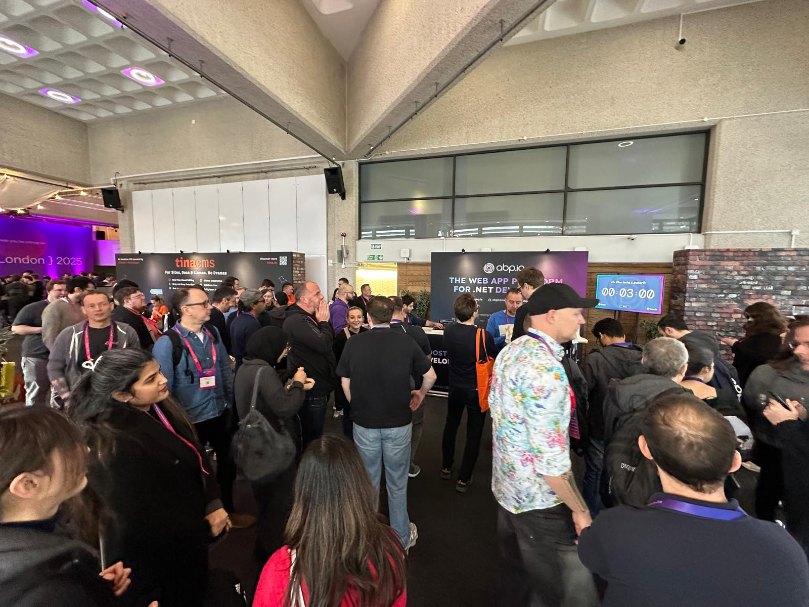

The ABP team recently returned from an exhilarating week at NDC London 2025, held from January 27 to 31 at the Queen Elizabeth II Centre in Westminster. As a proud sponsor, we were thrilled to engage with the global developer community at this premier software development conference.



#### Event Highlights

NDC London 2025 featured a comprehensive agenda, including two days of deep-dive workshops followed by three days of insightful conference sessions. The event covered a wide array of topics such as .NET, cloud computing, AI, microservices, and more. Notable sessions included “AI without the BS, for humans” by Scott Hanselman and “C#’s Functional Journey” by Mads Torgersen.  







#### ABP’s Presence

[Our booth became a hub for meaningful interactions](https://www.youtube.com/shorts/9y7PYyvq-9k), where we showcased the latest features of the ABP Framework and received invaluable feedback from the developer community. We were delighted to see a significant number of attendees expressing interest in our platform and its capabilities.





#### Networking and Community Engagement

The conference provided ample opportunities for networking, including the NDC Party, which was a fantastic occasion to connect with fellow developers and industry leaders in a relaxed setting.  

[**As is tradition**, we held a raffle at the event with an **Xbox Series X** as the prize]. Congratulations to the lucky winner, and thank you to everyone who participated!





#### Looking Ahead

Our participation in NDC London 2025 has further strengthened our commitment to supporting and advancing the developer community. We are excited to implement the insights gained and continue our journey of innovation and collaboration.

We extend our heartfelt thanks to the organizers, speakers, and attendees for making NDC London 2025 an unforgettable experience. We look forward to participating in future events and continuing to contribute to the vibrant developer ecosystem.

Stay tuned for more updates and see you at the next event!

**The ABP Team**