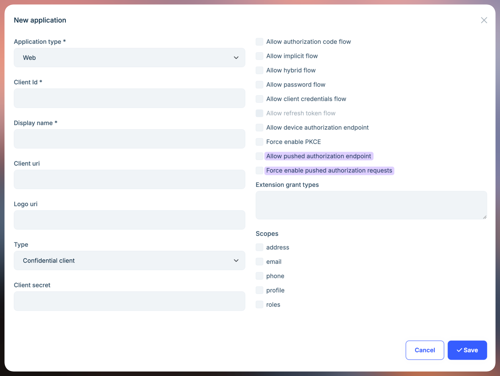

# Using Pushed Authorization Requests In ABP Framework

`Pushed Authorization Requests (PAR)` is a new `OAuth 2.0` feature that allows clients to push the payload of an `OAuth 2.0` authorization request to the authorization server via a direct request and provides them with a request URI that is used as reference to the data in a subsequent call to the authorization endpoint. This feature is defined in [RFC 9156](https://tools.ietf.org/html/rfc9156).

## Authorization Code Flow

Let's examine the current `Code Flow` in the ABP Framework project.

A typical ABP layered architecture usually includes the following projects:

- `Acme.AuthServer`: OAuth 2.0 authorization server integrated with `OpenIddict`.
- `Acme.HttpApi.Host`: API project that uses the `JWT Bearer` authentication scheme and authenticates through the `Acme.AuthServer` project.
- `Acme.Web`: An UI project configured with an `OpenID Connect` authentication scheme to authenticate through the `Acme.AuthServer` project.

When we attempt to use `OpenID Connect` authentication in the `Acme.Web` project, it constructs an authorization request and redirects the browser to the `Acme.AuthServer` project.

```csharp
GET https//auth-server.acme.com/connect/authorize

Query String Parameters:

client_id: AbpApp
redirect_uri: https://web.acme.com/signin-oidc
response_type: code
scope: openid profile email roles phone AbpAPI
response_mode: form_post
nonce: YzVkMj...
state: CfDJ8N...
```

> If you have enabled `Pkce`, the `code_challenge` and `code_challenge_method` parameters will also appear in the request.

```csharp
code_challenge: mJxMdU...
code_challenge_method: S256
```

After the user successfully authenticates on the `Acme.AuthServer` project (via username/password or social login providers) and approves the requested permissions on the consent screen/page, it returns a `code` to the `Acme.Web` project.

The `Acme.AuthServer` project will construct either a `POST` or `GET` request to the `Acme.Web` project.

```csharp
POST https://web.acme.com/signin-oidc

Form Data Parameters(application/x-www-form-urlencoded):

code: LPjZ6C...
state: state: CfDJ8N...
iss: https://auth-server.acme.com/
```

When the `Acme.Web` project receives the `code`, it sends an HTTP request from the application (**not the browser**) to `Acme.AuthServer` to request an `access token` using the received `code`.

```csharp
POST https://auth-server.acme.com/connect/token

Form Data Parameters(application/x-www-form-urlencoded):

client_id: AbpApp
client_secret: secret
code: LPjZ6C...
grant_type: authorization_code
```

At this point, the `Code Flow` authentication process is complete, and we can use the `access token` to access APIs on the `Acme.HttpApi.Host` project.

> The `Hybrid Flow` and `Implicit Flow` are similar to `Code Flow`. We'll focus on `Code Flow` in this discussion.

However, `Code Flow` may have the following issues:

* The authorization request can be altered. Usually, the client application redirects the user's browser to the authorization server with the authorization URL. Nothing prevents a malicious actor from changing one or more parameters of this request before sending it to the authorization server.
* No guarantee of the request's provenance. The authorization request is normally built by the client application, and the user's browser is in charge of sending it to the authorization server. However, there is no guarantee that the request has been built by the client application. Anyone can build an authorization request once they know a few data, such as the client ID and the redirect URI.
* No guarantee of confidentiality. Although the browser sends the authorization request via HTTPS, the request parameters can be intercepted by third-party applications, such as a proxy, a load balancer, or even a browser plugin. A malicious network component of this type can inject or change the request parameters, not to mention that the request itself can be logged.
* Browser limitations. Finally, a very complex query string in the authorization request may incur possible browser limitations on URL length.

OAuth 2.0 defined `Pushed Authorization Requests (PAR)` to address these issues.

## Pushed Authorization Requests (PAR)

[OpenIdDict 6.1.0](https://documentation.openiddict.com/configuration/pushed-authorization-requests) started supporting `Pushed Authorization Requests (PAR)`. The ABP Framework(`>=9.2.0`) promptly upgraded its `OpenIddict` version and added PAR configuration in the [Volo.OpenIddict.Pro module](https://abp.io/modules/Volo.OpenIddict.Pro).

You can configure `Pushed Authorization Requests (PAR)` when `creating/updating` an `Application`.



Let's examine the authentication flow using `Pushed Authorization Requests (PAR)`.

When we attempt to use OpenID Connect authentication in the `Acme.Web` project, it sends an HTTP request from the application (**not the browser**) to the authorization server's `par` endpoint.

```csharp
POST https://auth-server.acme.com/connect/par

Form Data Parameters:

client_id: AbpApp
client_secret: secret
redirect_uri: https://web.acme.com/signin-oidc
response_type: code
scope: openid profile email roles phone AbpAPI
response_mode: form_post
nonce: YzVkMjZmN...
state: CfDJ8NwA4...
```

> If you have enabled `Pkce`, the code_challenge and code_challenge_method parameters will also appear in the `POST` request.

```csharp
code_challenge: mJxMdULFXnvdWfaDUfyDIb77IFlMpGyKkHN1_UWYKDk
code_challenge_method: S256
```

After successful verification and validation, the authorization server returns a `request_uri` to the `Acme.Web` application.

```json
{
    "request_uri": "urn:ietf:params:oauth:request_uri:1FPVWnrwFAesetV-r-66_b7BAF_vCQm7UmPWfBqRENg",
    "expires_in": 3599
}
```

Upon receiving a successful response, the `Acme.Web` project constructs an authorization request and redirects the browser to the authorization server.

```csharp
GET https//auth-server.acme.com/connect/authorize

Query String Parameters:
client_id: AbpApp
request_uri: urn:ietf:params:oauth:request_uri:1FPVWnrwFAesetV-r-66_b7BAF_vCQm7UmPWfBqRENg
```

Similarly, after the user authorizes on the `Acme.AuthServer` project, it returns a `code` to the `Acme.Web` project, which can then be used to request an `access token`, just like in the standard `Code Flow` described above.

## Configuring and Enabling PAR in ABP Application

The ABP [OpenIddict module](https://abp.io/modules/Volo.OpenIddict) enables the `PAR` feature by default.

In ASP.NET Core 9.0, the [OpenIdConnect authentication handler](https://www.nuget.org/packages/Microsoft.AspNetCore.Authentication.OpenIdConnect)'s [OpenIdConnectOptions](https://learn.microsoft.com/en-us/dotnet/api/microsoft.aspnetcore.authentication.openidconnect.openidconnectoptions) includes a new [PushedAuthorizationBehavior](https://learn.microsoft.com/en-us/dotnet/api/microsoft.aspnetcore.authentication.openidconnect.openidconnectoptions.pushedauthorizationbehavior) parameter that you can configure in your application.

| Name | Description|
|-|-|
| UseIfAvailable  | Use Pushed Authorization (PAR) if the PAR endpoint is available in the identity provider's discovery document or the explicit OpenIdConnectConfiguration. **This is the default value.** |
| Disable| Never use Pushed Authorization (PAR), even if the PAR endpoint is available in the identity provider's discovery document or the explicit OpenIdConnectConfiguration. If the identity provider's discovery document indicates that it requires Pushed Authorization (PAR), the handler will fail. |
| Require | Always use Pushed Authorization (PAR), and emit errors if the PAR endpoint is not available in the identity provider's discovery document or the explicit OpenIdConnectConfiguration. |

```csharp
AddAbpOpenIdConnect("oidc", options =>
{
    //...
    options.PushedAuthorizationBehavior = PushedAuthorizationBehavior.Require;
    //...
});
```

The `UseIfAvailable` value is the default behavior, and ABP has enabled the `PAR` endpoint globally. Make sure all your web applications have been granted the `OpenIddictConstants.Permissions.Endpoints.PushedAuthorization` permission to use the PAR endpoint. If not, you should disable the `PushedAuthorizationBehavior` in the `OpenIdConnectOptions`.

```csharp
AddAbpOpenIdConnect("oidc", options =>
{
    //...
    options.PushedAuthorizationBehavior = PushedAuthorizationBehavior.Disable;
    //...
});
```

> Not all authentication clients support PAR. For example, Blazor WASM does not yet support it.

## Summary

`Pushed Authorization Requests (PAR)` is a security enhancement for `OAuth 2.0` that significantly improves the security and reliability of the `authorization code flow`. Given its security benefits, we strongly recommend implementing `PAR` in your production applications.

## References

- [Volo.OpenIddict.Pro module](https://abp.io/modules/Volo.OpenIddict.Pro)
- [What Are OAuth Pushed Authorization Requests (PAR)?](https://auth0.com/blog/what-are-oauth-push-authorization-requests-par/)
- [OpenIddict Pushed Authorization Requests (PAR)](https://documentation.openiddict.com/configuration/pushed-authorization-requests)
- [Support for Pushed Authorization (PAR) in OIDC Handler](https://github.com/dotnet/aspnetcore/pull/55069)
- [RFC 9156](https://tools.ietf.org/html/rfc9156)
