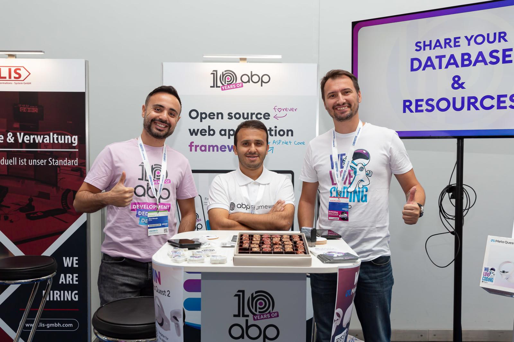

We are excited to share some fantastic news with our community! We are proud to announce that ABP.IO is going to be at the BASTA! Conference on March 03-07, 2025 in Frankfurt and İsmail Çağdaş from our dev team is going to be a speaker on March 04!

#### **About BASTA!**
For those who don’t know, BASTA! is the leading independent conference for Microsoft technologies in the German-speaking world. For over 20 years, it has been setting standards in the areas of C#, .NET and cloud and web technologies and is considered a must-attend event for Microsoft, cloud, web developers and key players in the software industry. BASTA! is a conference for developers and IT professionals who want to stay up to date with the latest technologies.

#### **ABP at [BASTA! Mainz 2023](https://abp.io/blog/BASTA-Mainz-2023-What-a-Blast-in-Germany)**





##### 
#### **What to Expect at [BASTA! 2025](https://basta.net/frankfurt-en/)**
The most exciting part is İsmail Çağdaş from the ABP developer team will be speaking at the conference on March 04 about the concepts of monoliths and microservices will be briefly explored, along with how modular monoliths bring together the advantages of these two architectures. Using the ABP Framework as an example, the session will highlight its modularity features and demonstrate how it can assist in creating and developing a modular monolith application. Finally, best practices for developing modular monoliths will be discussed, showing how these practices can pave the way for transitioning to a microservice-based architecture when necessary.

If you want to find out more information about İsmail Çağdaş's session, [check here](https://basta.net/microservices-apis/modular-monoliths-architecture-abp/?loc=ffm): 

#### **Connect with Us**
We have exciting raffles and surprises planned at our booth and look forward to sharing more information about our solutions with you there.

#### **Join Us Online**
Don't worry if you can't join us in person, our online booth is going to be there for you! The Expo of the online version of BASTA! is open for the main conference days.

Tuesday, March 4, 2025: 9:00 am – approx. 6:00 pm

Wednesday, March 5, 2025: 9:00 am – approx. 6:00 pm

Thursday, March 6, 2025: 9:00 am – approx. 5:45 pm
